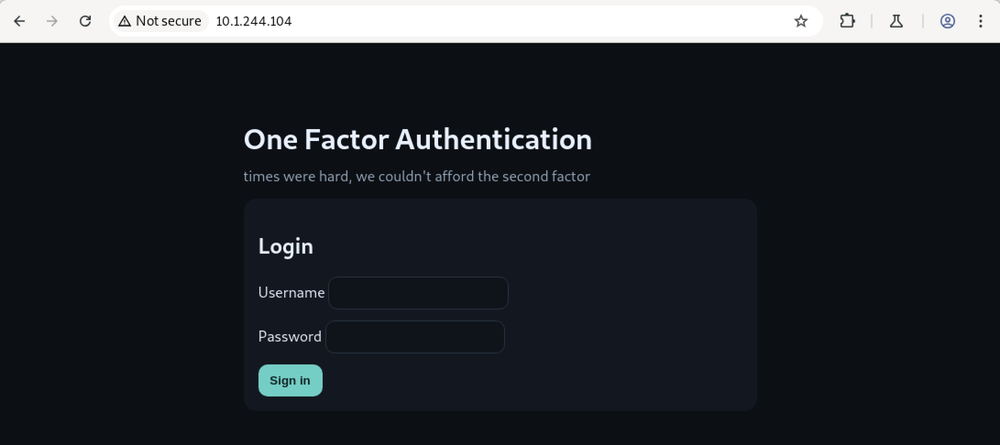
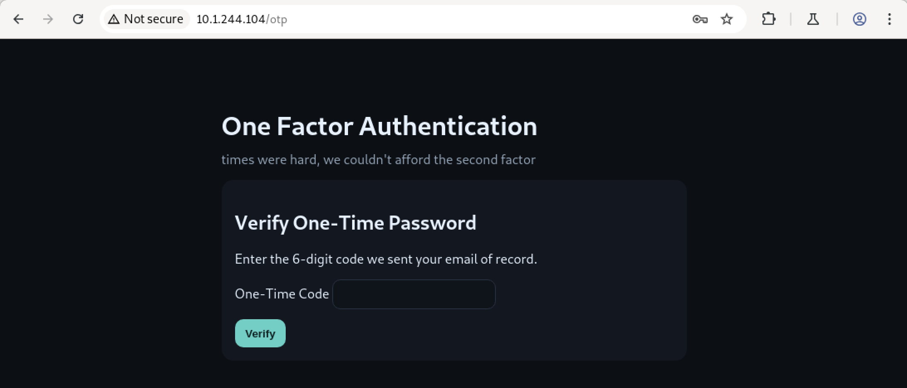
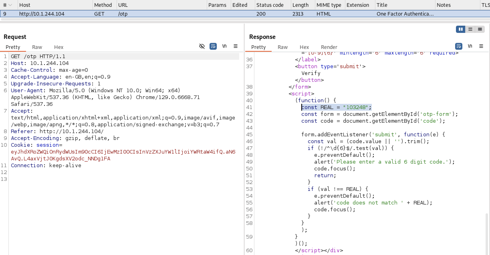
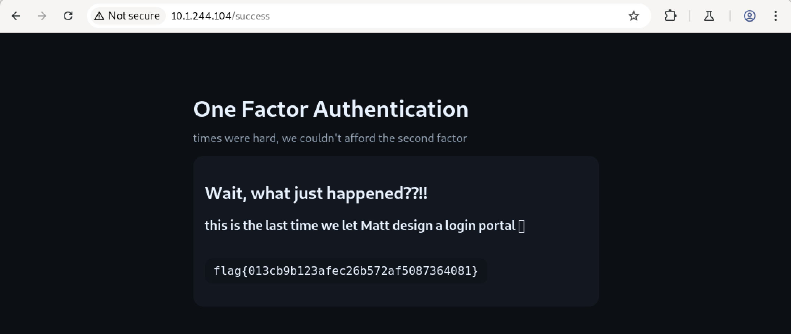

# Huntress CTF 2025 - 👶 OFA  

**CTF Name:** Huntress CTF 2025  
**Challenge name:** 👶 OFA  
**Challenge prompt:**  
> Two factors? In this economy??!!  

**Challenge category:** Warmups  
**Challenge points:** 10  

* * *  

## Steps to solve  

In this challenge, I was presented with the below visible login form (accessible from the deployed CTF web-instance):  

  

I tried `admin:admin` and next step was launched - asking for OTP code:  

  

Of course, I did not know the OTP code, but in the website source code I found hardcoded value:  

  

Once entered, flag was printed out on the screen:  

  

**FLAG:** flag{013cb9b123afec26b572af5087364081}  
