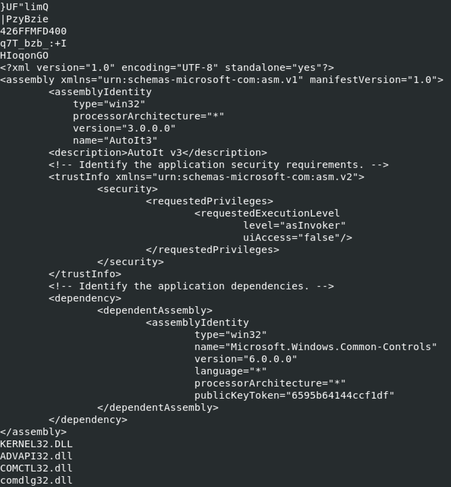
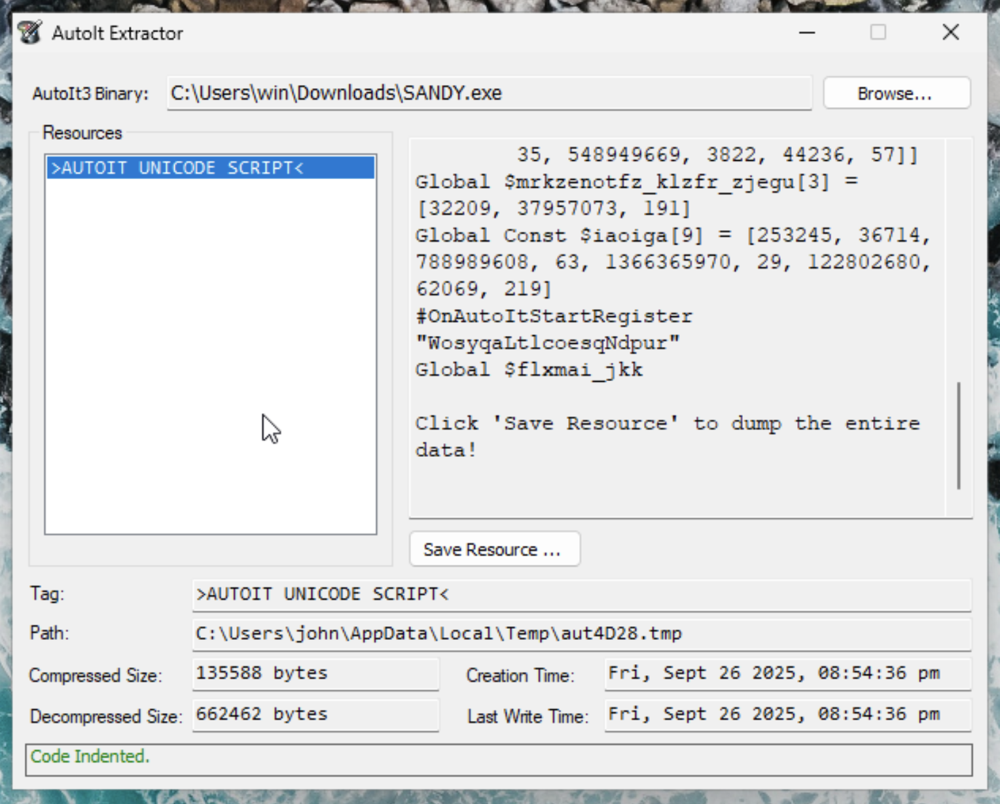
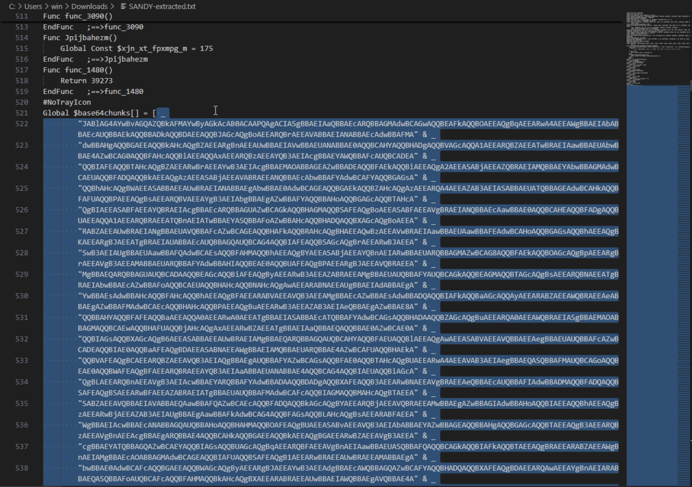

# Huntress CTF 2025 - 🐞 SANDY  

**CTF Name:** Huntress CTF 2025  
**Challenge name:** 🐞 SANDY  
**Challenge prompt:**  
> My friend Sandy is really into cryptocurrencies! She's been trying to get me into it too, so she showed me a lot of Chrome extensions I could add to manage my wallets. Once I got everything sent up, she gave me this cool program!
> She says it adds better protection so my wallets can't get messed with by hackers.
> Sandy wouldn't lie to me, would she...? Sandy is the best!

```
CAUTION

This is the Malware category, and as such, includes malware. Please be sure to analyze these files within an isolated virtual machine.
```

The password to the archive is "infected".

**Challenge category:** Malware  
**Challenge points:** 10  

* * *  

## Steps to solve  

In this challenge, I downloaded and extracted SANDY.zip archive. As a result, I was left with SANDY.exe

First recon step was to identify, what this file really is:


As it can be seen above, the binary is UPX compressed. To proceed further, I used `upx -d SANDY.exe` command to decompress:


Next, I used `strings -n 8 SANDY.exe` to verify, whether there are any interesting fragments:



I found this fragment above, it briefly mentioned `AutoIt v3` - I browsed the internet in search for this program and found out that AutoIt extractor is available: https://github.com/digitalsleuth/autoit-extractor

I used it to extract from SANDY.exe:



In the extracted code I found an array of base64 chunks:



I decoded all of them using `base64 -d SANDY-base64.txt > SANDY-base64-decoded.txt`:


Decoded file contained more base64 - I was especially interested in the part, which was longer than the other ones (`$encodedJson`). It was a good call, as after another round of decoding, I found the flag:

```
 base64 -d SANDY-base64-interesting.txt 
$pathdata = 
@'
[
    {
        "root": "%appdata%",
        "targets": [
            {
                "name": "Exodus-A",
                "path": "Exodus"
            },
            {
                "name": "Atomic-A",
                "path": "Atomic Wallet"
            },
            {
                "name": "Electrum-A",
                "path": "Electrum"
            },
            {
                "name": "Ledger-A",
                "path": "Ledger Live"
            },
            [...]
            {
                "name": "mexc-A",
                "path": "mexc"
            }
        ]
    },
    [...]
    {
        "root": "%localappdata%\\Google\\Chrome\\User Data\\Default\\Extensions",
        "targets": [
            {
                "name": "Metamask-C",
                "path": "nkbihfbeogaeaoehlefnkodbefgpgknn"
            },
            [...]
             {
                "name": "Flag",
                "path": "flag{27768419fd176648b335aa92b8d2dab2}"
             }
        ]
    },
    [...]
]
'@;
```

**FLAG:** flag{27768419fd176648b335aa92b8d2dab2}  
