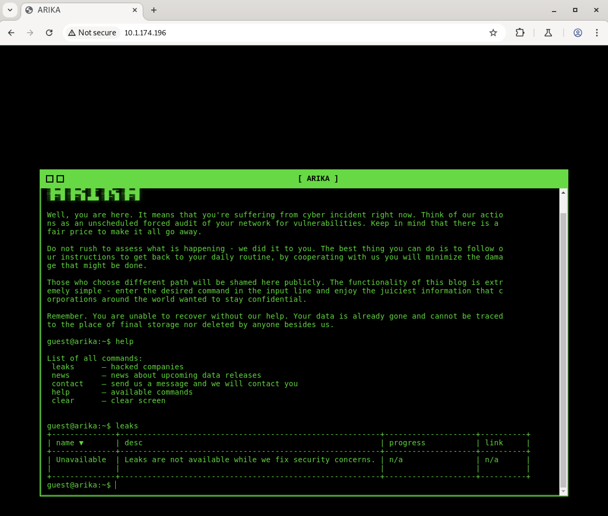
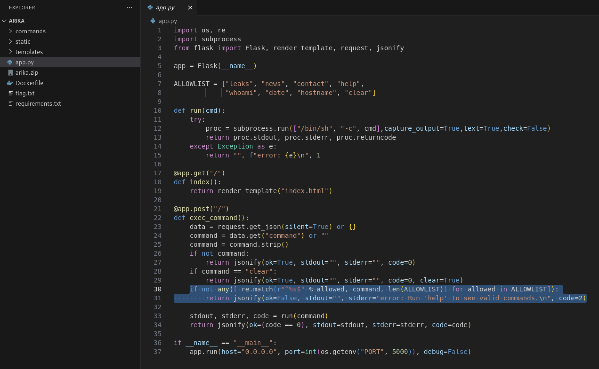
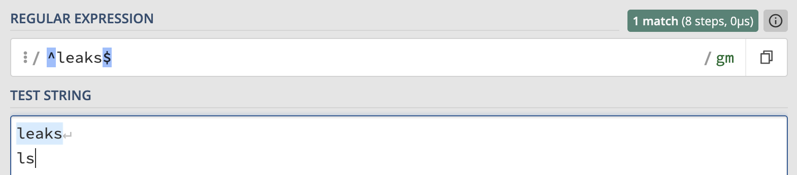
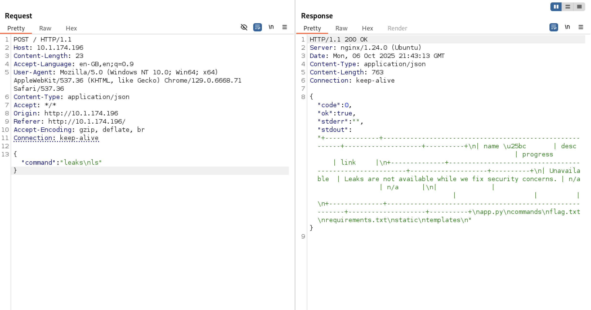
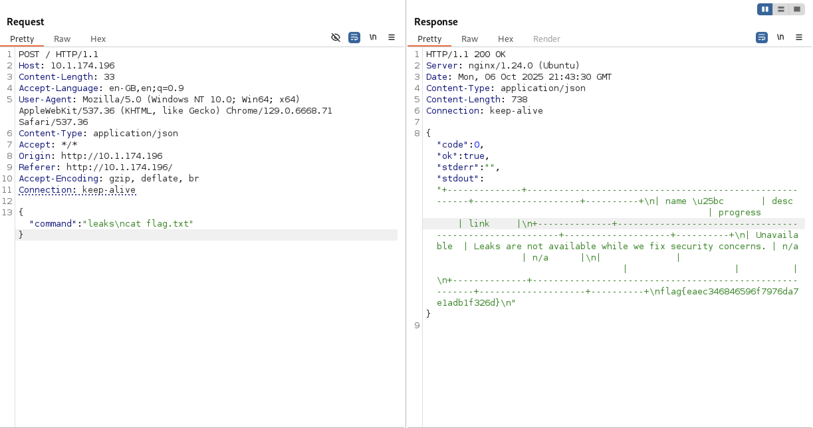

# Huntress CTF 2025 - 🌐 ARIKA

**CTF Name:** Huntress CTF 2025
**Challenge name:** 🌐 ARIKA
**Challenge prompt:**
> The Arika ransomware group likes to look slick and spiffy with their cool green-on-black terminal style website... but it sounds like they are worried about some security concerns of their own!

```
NOTE

The password for the ZIP archive below is "arika".
```

**Challenge category:** Web
**Challenge points:** 10

* * *

## Steps to solve

In this challenge, we were provided with both website and source code of the Arika ransomware group. Their website was meant to work like a linux terminal, where each typed-in command executed different logic:



One line in the source code was of interest to me, as - when exploited (somehow bypassed), it would allow remote code execution:



At a first glance - everything seems correct with the logic of the selected `if` statement - if the provided (by the user) command is not found in the `ALLOWLIST`, the error would be returned.

However..., as always, understanding how RegEx matching works is crucial.

`^` matches start of the line,
`%s` is replaced with `allowed` variable,
`$` matches end of the line

Is the vulnerability visible clearly now? No? Then let me ask a question: "what about the newlines?":



We have a match (`if` condition is satisfied), and additionally - we were able to inject extra command `ls`.

To check the results, the following POST request was sent to the server:



Thanks to that, existence of `flag.txt` was discovered, so similarly we could leak its contents:



**FLAG:** flag{eaec346846596f7976da7e1adb1f326d}
