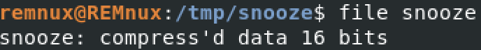
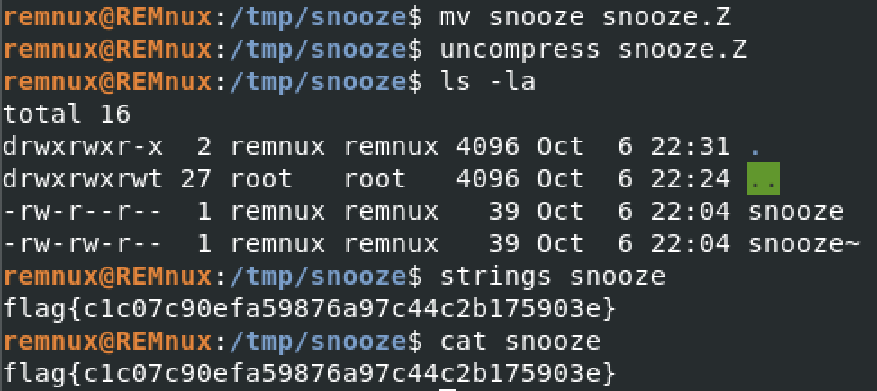

# Huntress CTF 2025 - 👶 Snooze  

**CTF Name:** Huntress CTF 2025  
**Challenge name:** 👶 Snooze  
**Challenge prompt:**  
> Don't bug me, I'm sleeping! Zzzz... zzz... zzzz....  
> Uncover the flag from the file presented.  

**Challenge category:** Warmups  
**Challenge points:** 10  

* * *  

## Steps to solve  

In this challenge, we were given `snooze` file. First of all, it was crucial to gather some information about it:  

  

That means this is UNIX "compress" format, using LZW compression (.Z format).  

Next, I changed the name of the file (for the sake of completeness) and used `uncompress`:  

  

Inside of the directory, extracted `snooze` file can be found. To discover the flag - we can simply use `cat` or `strings` command.  

**FLAG:** flag{c1c07c90efa59876a97c44c2b175903e}  
