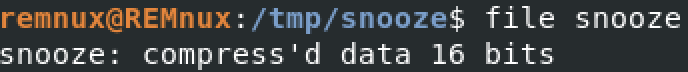
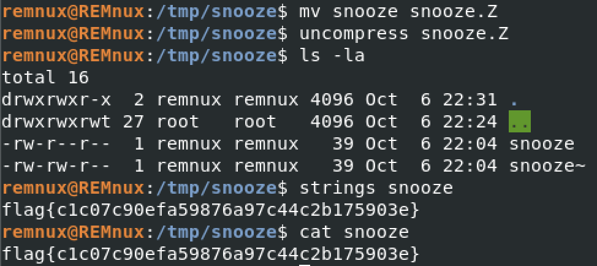

# Snooze

That means this is UNIX "compress" format, using LZW compression (.Z format).

Next, I changed the name of the file (for the sake of completeness) and used `uncompress`:

Inside of the directory, extracted `snooze` file can be found. To discover the flag - we can simply use `cat` or `strings` command.