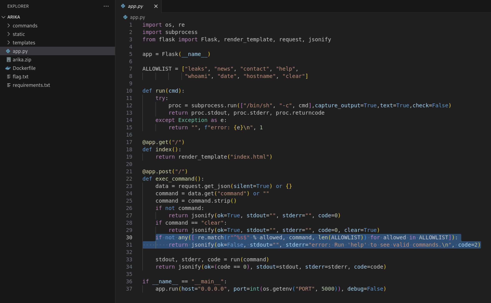
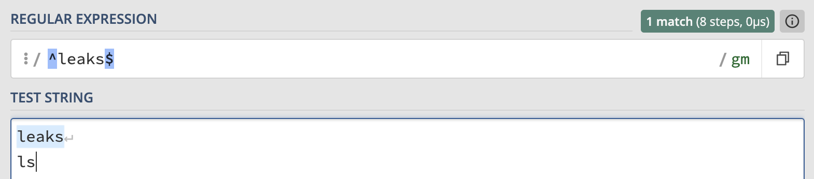
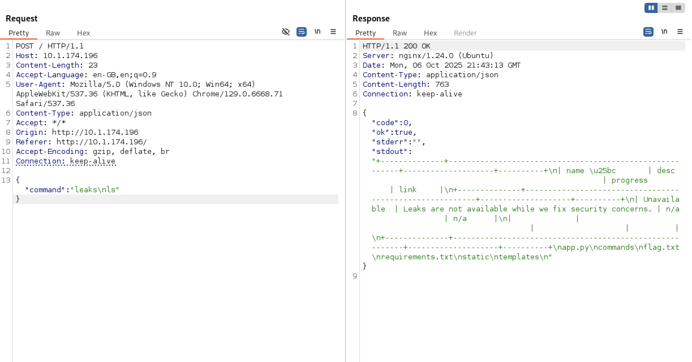
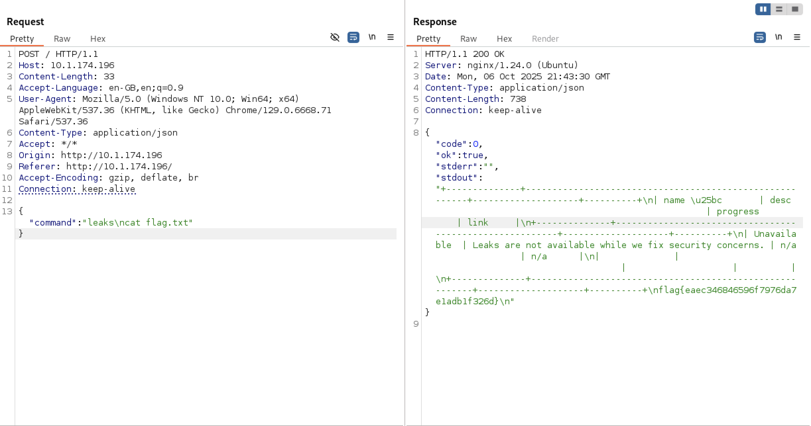

# ARIKA

In this challenge, we were provided with both website and source code of the Arika ransomware group. Their website was meant to work like a linux terminal, where each typed-in command executed different logic:

One line in the source code was of interest to me, as - when exploited (somehow bypassed), it would allow remote code execution:

At a first glance - everything seems correct with the logic of the selected `if` statement - if the provided (by the user) command is not found in the `ALLOWLIST`, the error would be returned.

However..., as always, understanding how RegEx matching works is crucial.

`^` matches start of the line,
`%s` is replaced with `allowed` variable,
`$` matches end of the line

Is the vulnerability visible clearly now? No? Then let me ask a question: "what about the newlines?":

We have a match (`if` condition is satisfied), and additionally - we were able to inject extra command `ls`.

To check the results, the following POST request was sent to the server:

Thanks to that, existence of `flag.txt` was discovered, so similarly we could leak its contents:

# Snooze

That means this is UNIX "compress" format, using LZW compression (.Z format).

Next, I changed the name of the file (for the sake of completeness) and used `uncompress`:

Inside of the directory, extracted `snooze` file can be found. To discover the flag - we can simply use `cat` or `strings` command.
