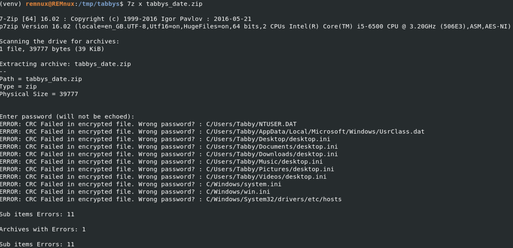
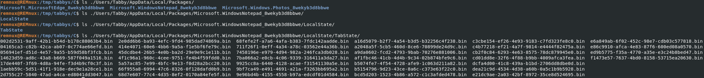
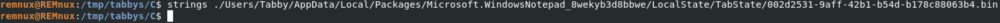
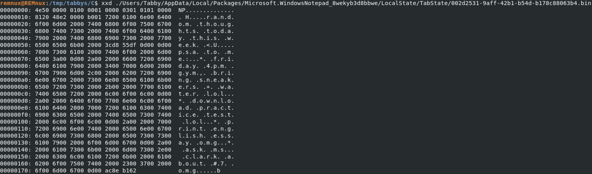
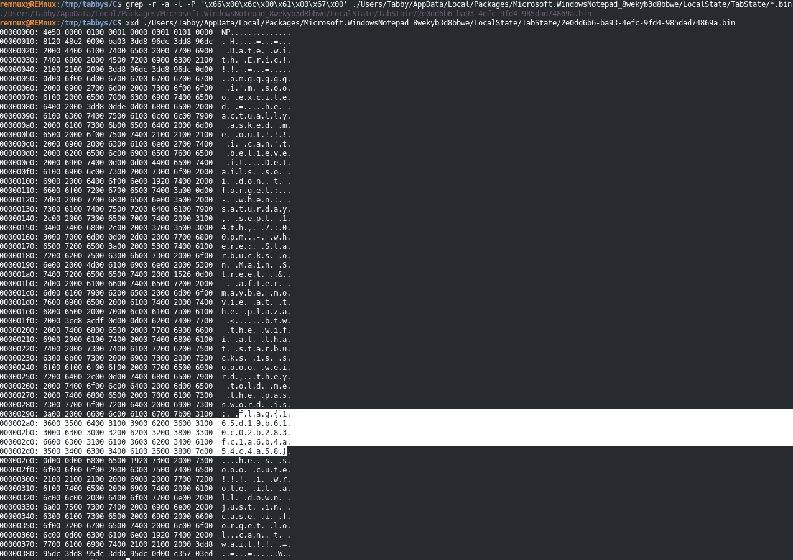

# Huntress CTF 2025 - 🔍 Tabby's Date  

**CTF Name:** Huntress CTF 2025  
**Challenge name:** 🔍 Tabby's Date  
**Challenge prompt:**  
> Ohhhh, Tab, Tab, Tab.... what has she done.  
> My friend Tabby just got a new laptop and she's been using it to take notes. She says she puts her whole life on there!  
> She was so excited to finally have a date with a boy she liked, but she completely forgot the details of where and when. She told me she remembers writing it in a note... but she doesn't think she saved it!!  
> She shared with us an export of her laptop files.  

```  
NOTE  

The password to the ZIP archive is "tabbys_date".  
```  

> Can you help us find the details of Tab's date?  

**Challenge category:** Forensics  
**Challenge points:** 10  

* * *  

## Steps to solve  

In this challenge, we were given access to the laptop files of Tabby, archive was extracted:  

  

  

Extracted files seem to be in a form of Windows backup. Based on the challenge prompt and my experience with OSCP, I was instantly able to tell, that the flag is likely to reside in the cache files of Windows Notepad:  

  

Indeed, there are some cached files from Windows Notepad. Further analysis is required to read them:  

  

  

As one can tell from the screenshots above - cat and strings are not the very best tools to use for this kind of analysis, but xxd on the other hand provides better outlook:  

```  
xxd ./Users/Tabby/AppData/Local/Packages/Microsoft.WindowsNotepad_8wekyb3d8bbwe/LocalState/TabState/2e0dd6b6-ba93-4efc-9fd4-985dad74869a.bin  
```  

  

Even though we could read all of the files in such a way, I value my time and came up with a way to grep by bytes that mean `flag`:  

```  
grep -r -a -l -P '\x66\x00\x6c\x00\x61\x00\x67\x00' ./Users/Tabby/AppData/Local/Packages/Microsoft.WindowsNotepad_8wekyb3d8bbwe/LocalState/TabState/*.bin  
```  

Options explained:  
- `-r` recursive search  
- `-a` treat binary as text  
- `-l` display filenames  
- `-P` use Perl regex for hex sequence matching  

Indeed, flag was found:  

  

Additionally strings could be used in combination with `-el` arguments:  

```  
strings -el ./Users/Tabby/AppData/Local/Packages/Microsoft.WindowsNotepad_8wekyb3d8bbwe/LocalState/TabState/*.bin | grep -i -H flag  
```  

`-el` tells `strings` to look for little-endian UTF-16 strings.  
This extracts UTF-16 strings in files so that they can be filtered using grep.  

  

**FLAG:** flag{165d19b610c02b283fc1a6b4a54c4a58}  
