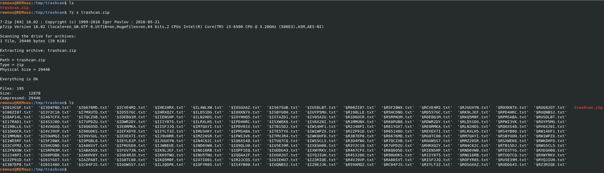
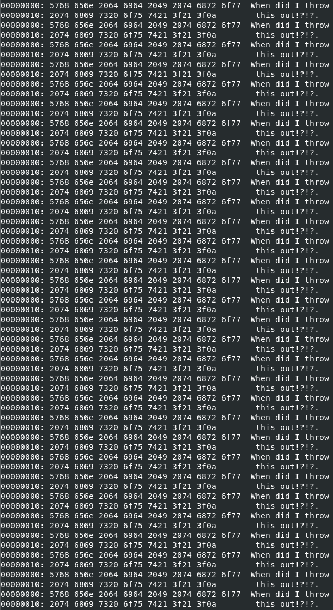
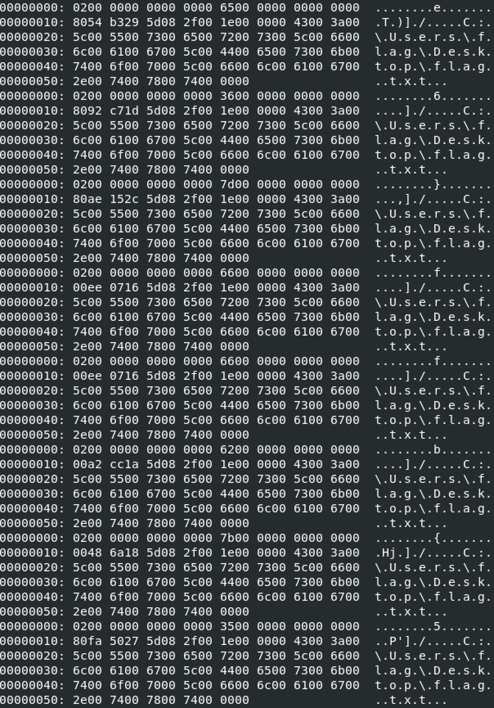
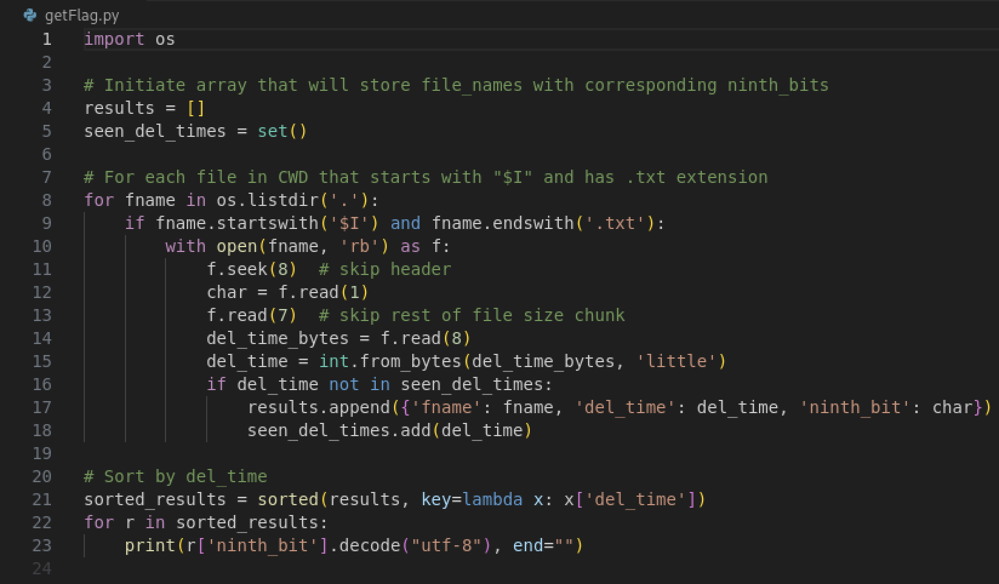
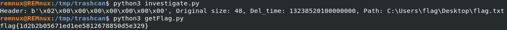

# Huntress CTF 2025 - 🔍 Trashcan  

**CTF Name:** Huntress CTF 2025  
**Challenge name:** 🔍 Trashcan  
**Challenge prompt:**  
> Have you ever done forensics on the Recycle Bin? It's... a bit of a mess. Looks like the threat actor pulled some tricks to hide data here though.  
> The metadata might not be what it should be. Can you find a flag?  

**Challenge category:** Forensics  
**Challenge points:** 10  

* * *  

## Steps to solve  

In this challenge, we were given `trashcan.zip` file. To proceed with analysis, I downloaded the file to my REMnux VM and extracted the contents:  

Next, I tried exiftool, strings, and finally xxd tools in order to gain some knowledge about these files. Files starting with "$R" did not result in anything special - each and every one of them had "When did I throw this out!?!?" inside:

Files that start with "$I" are metadata files used by Windows (Vista and newer) for files moved to the trash; read https://www.cyberengage.org/post/recycle-bin-forensic

Their format is as follows (info from http://www.csc.villanova.edu/~dprice/extra_handouts/forensic-analysis-vista-recycle-bin.pdf):

- 8 bytes: Header (0x01/0x02 for version)
- 8 bytes: Original file size (QWORD, little-endian)
- 8 bytes: FILETIME timestamp (when deleted)
- 520 bytes: Original filepath as UTF-16LE (max 260 chars, including null terminator)

When iterated over, they present like this:

Immediatelly, after I saw the above, I realized that this challenge hint "The metadata might not be what it should be[...]" relates to the malformed filesize 8-byte chunk of each file - we can see that each ninth byte is an ASCII-printable character, also `{` and `}` characters are displayed, potentially confirming my assumption.

But how to order these characters, so that they can create proper flag? I decided to extract ninth byte from each file starting with "$I" and order them according to the timestamp:

After the script was executed, the flag emerged:

**FLAG:** flag{1d2b2b05671ed1ee5812678850d5e329}  
