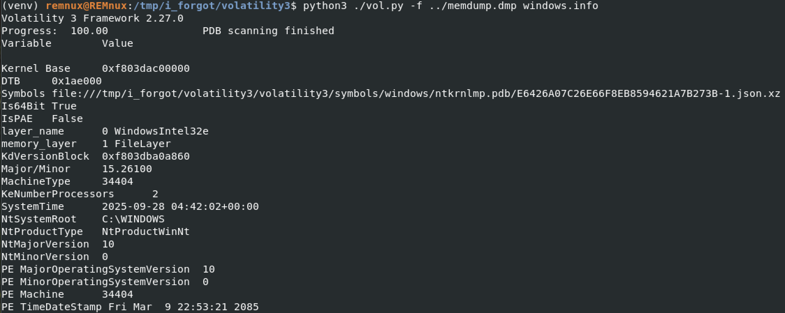
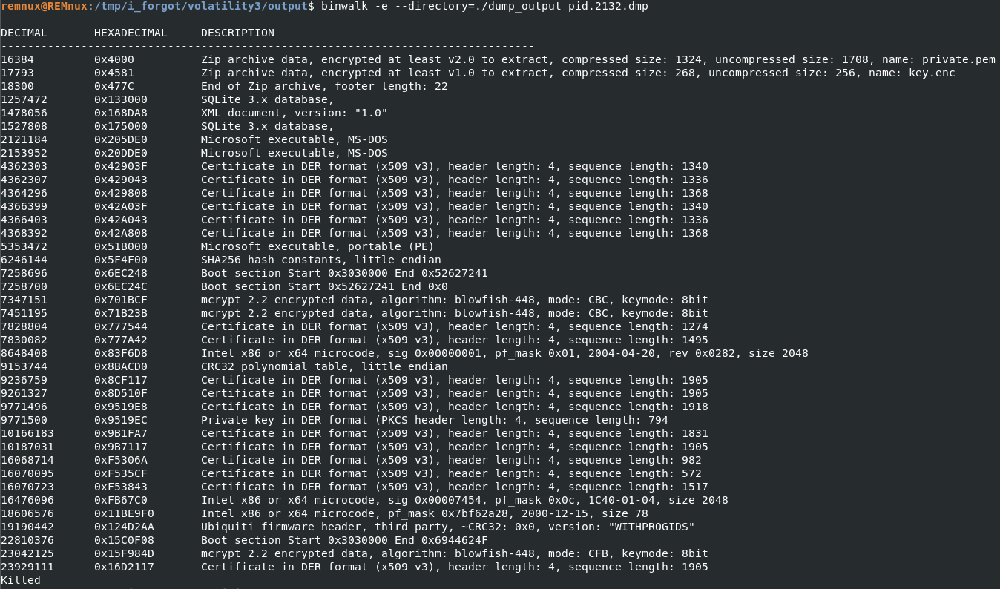
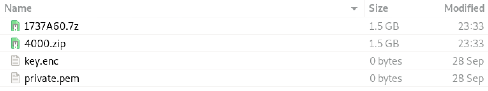
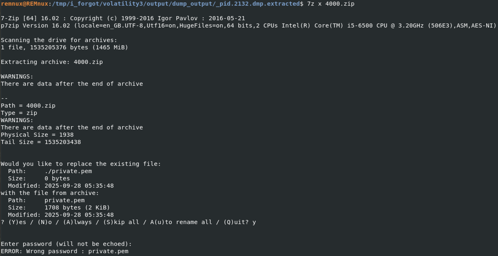
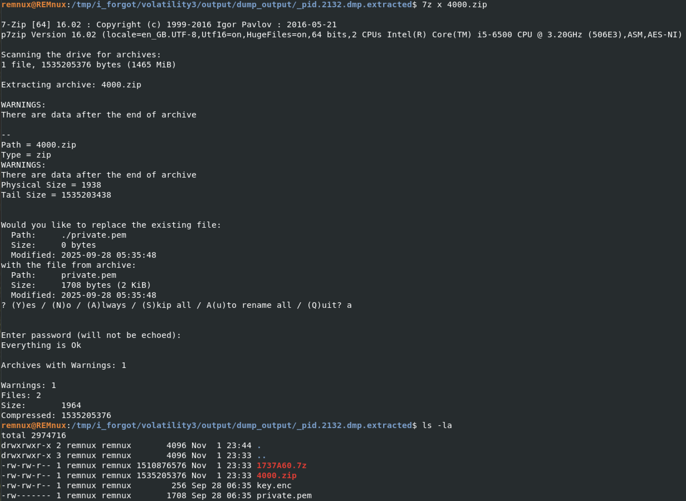
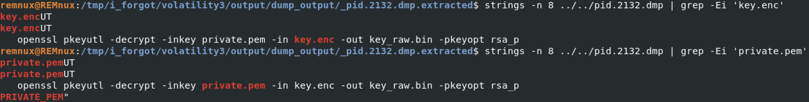
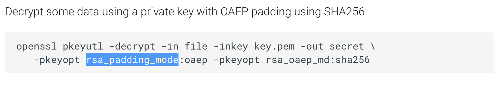
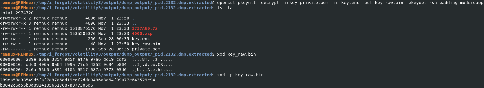
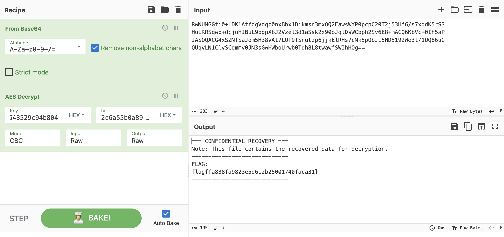

# Huntress CTF 2025 - 🔍 I Forgot

**CTF Name:** Huntress CTF 2025
**Challenge name:** 🔍 I Forgot
**Challenge prompt:**
> So.... bad news.
> We got hit with ransomware.
> And... worse news... we paid the ransom.
> After the breach we FINALLY set up some sort of backup solution... it's not that good, but, it might save our bacon... because my VM crashed while I was trying to decrypt everything.
> And perhaps the worst news... I forgot the decryption key.
> Gosh, I have such bad memory!!

```
CAUTION

⚠️ This file was produced from a fresh Windows installation. Included within that are some antivirus signature strings and artifacts that may include profanity or unsettling language. Please be advised these remnants exist, but they are not part of the challenge.
```

```
NOTE

The archive password is "i_forgot".
```

**Challenge category:** Forensics
**Challenge points:** 10

* * *

## Steps to solve

In this challenge, `i_forgot.zip` file was provided. Once extracted, two files emerged: `flag.enc` and `memdump.dmp`. The first one is potentially out flag, but encrypted. The other one - as the name suggests - memory dump.

I decided to use volatility3 to inspect `memdump.dmp` snapshot:



`python3 ./vol.py -f ../memdump.dmp windows.pstree` was executed to browse the processes that were running while the VM crashed:


From the list of the processes above - we can clearly see that the user was running `Powershell.exe`, `notepad.exe` and `BackupHelper.exe`. The last one was of great interest to me, thus I decided to dump its information based on the PID value:


Once dumped, I used `binwalk` to examine and extract:





I tried extracting `.7z` archive but it is malformed. `key.enc` and `private.pem` files are 0 bytes each. `4000.zip` archive is protected with password - but it may contain files that are necessary for `flag.enc` decryption:



Thus, I proceeded to look for the potential password in the memory dump again:


I found `ePDaACdOCwaMiYDG` - and it worked!





Information from the OpenSSL documentation about possible values of rsa_padding_mode:



I tried `openssl pkeyutl -decrypt -inkey private.pem -in key.enc -out key_raw.bin -pkeyopt rsa_padding_mode:oaep` and it worked:



To proceed with decryption, I base64 encoded contents of `flag.enc` and pasted them to cyberchef. Next I tried dividing key_raw.bin into 32 bytes key and 16 bytes IV:



**FLAG:** flag{fa838fa9823e5d612b25001740faca31}
