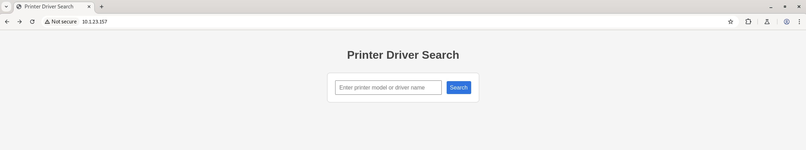
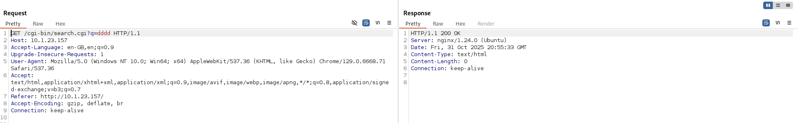
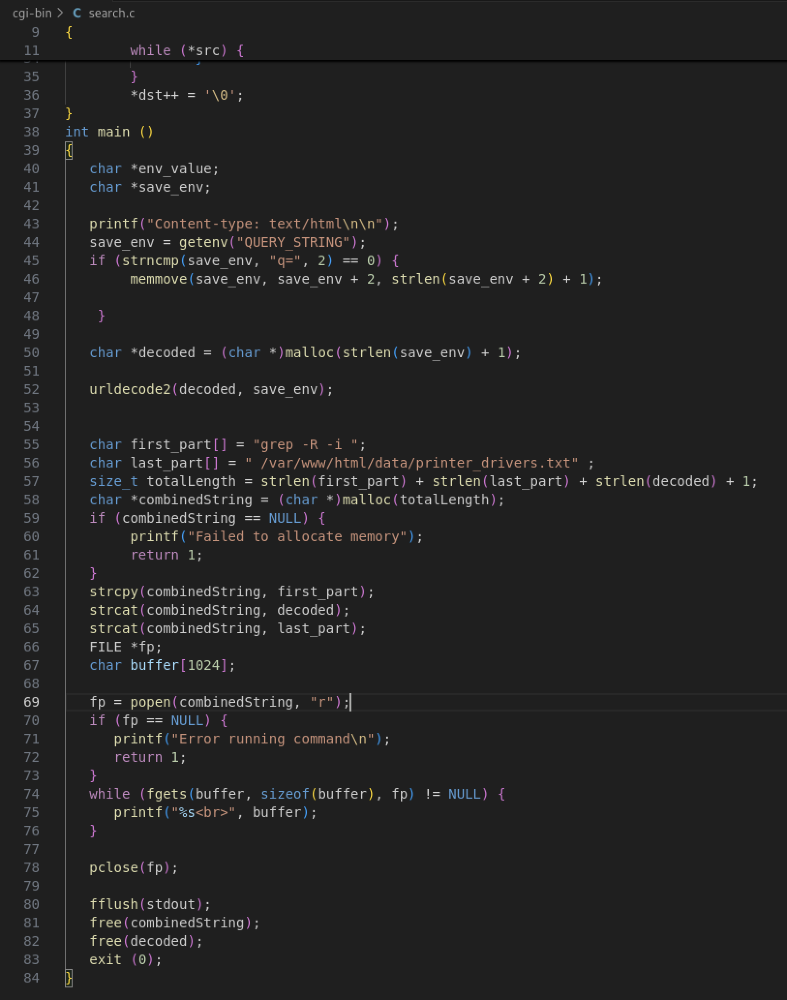
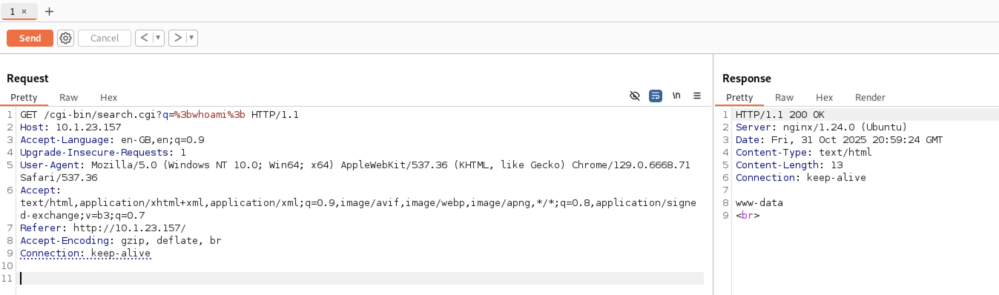
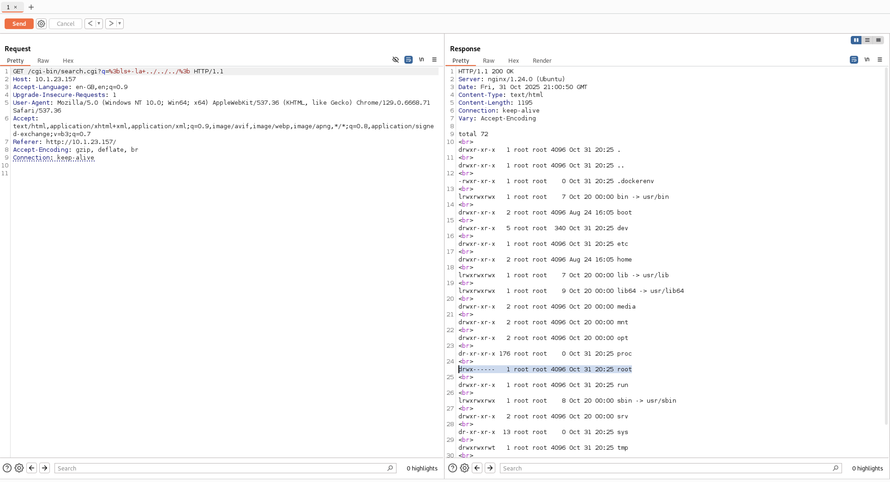
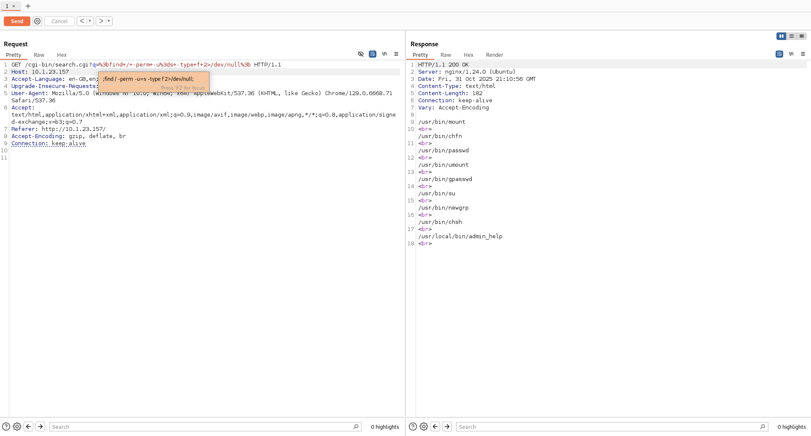
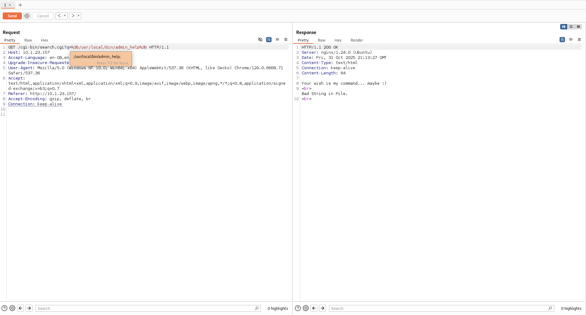
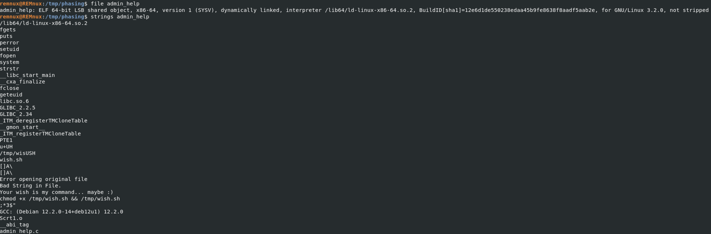
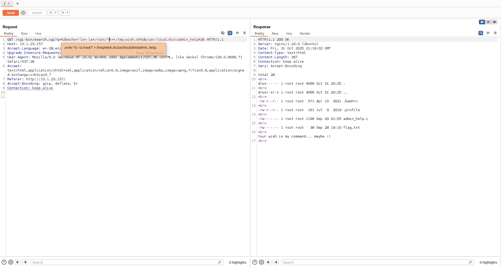
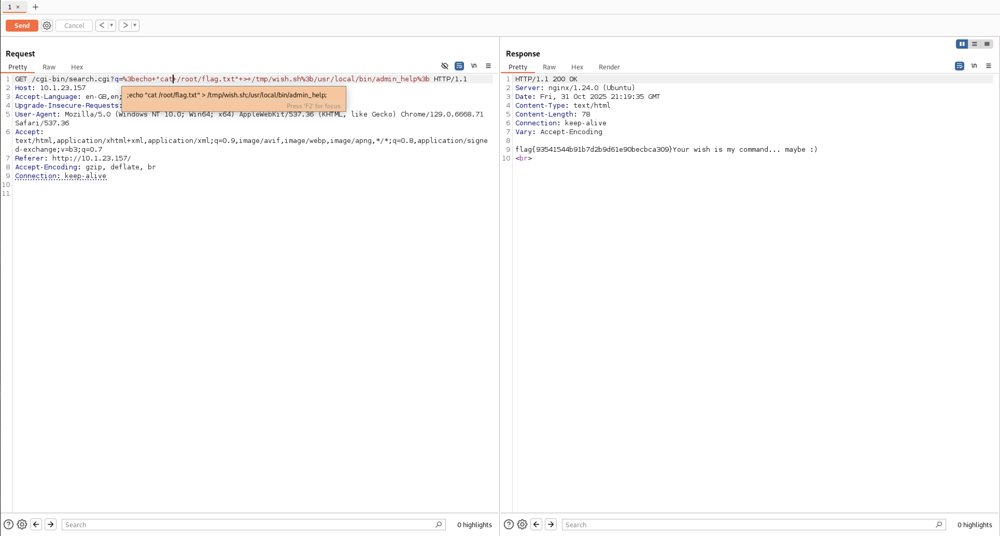

# Huntress CTF 2025 - 📦 Phasing Through Printers  

**CTF Name:** Huntress CTF 2025  
**Challenge name:** 📦 Phasing Through Printers  
**Challenge prompt:**  
> I found this printer on the network, and it seems to be running... a weird web page... to search for drivers?
> Here is some of the code I could dig up.

```
NOTE

Escalate your privileges and uncover the flag in the root user's home directory.
```

```
IMPORTANT

The password to the ZIP archive below is "phasing_through_printers".
```

**Challenge category:** Miscellaneous  
**Challenge points:** 10

* * *  

## Steps to solve  

In this challenge we were given both - archive containing source code of the web-application and web-instance running web-app used to find printer drivers.

Initial website load presented rather limited options:



Once user tries to find desired printer driver - in the background following request is sent:



Let's not forget that we have access to the source code of this web application - the logic presents itself as follows:



As it can be seen in the picture above, if we were to inject our own command between these two parts (`first_part` and `last_part`) - we would be able to execute any command.



However, we are not authorized to read contents of `/root` directory:



Thus privilege escalation is needed.

I proceeded to perform my standard routine of priv-esc recon in Linux and discovered following SUID binaries:



Especially interesting was `admin_help`:



I downloaded `admin_help` binary to my machine (base64 encode on target and decode on controlled-host) - it allowed me to analyse it. For example, using `strings` I found that this application expected `/tmp/wish.sh` file to run correctly:





I exploited this flaw to read `/root/flag.txt`:



**FLAG:** flag{93541544b91b7d2b9d61e90becbca309} 
