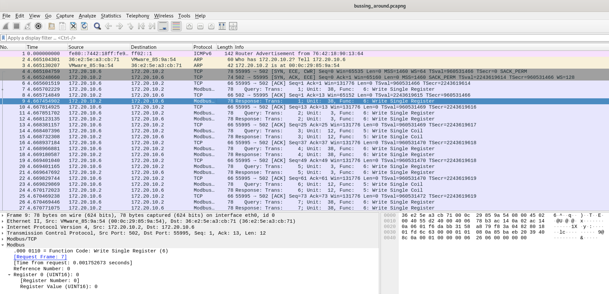
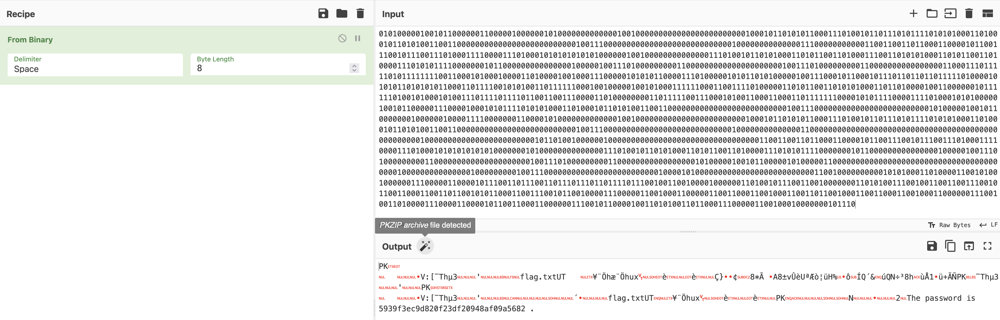
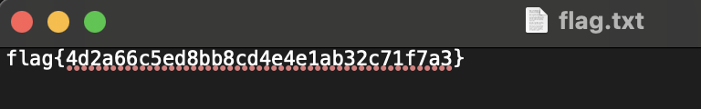

# Huntress CTF 2025 - 🔍 Bussing Around  

**CTF Name:** Huntress CTF 2025  
**Challenge name:** 🔍 Bussing Around  
**Challenge prompt:**  
> One of the engineers noticed that an HMI was going haywire.
> He took a packet capture of some of the traffic but he can't make any sense of it... it just looks like gibberish!
> For some reason, some of the traffic seems to be coming from someone's computer. Can you help us figure out what's going on?

**Challenge category:** Forensics  
**Challenge points:** 10

* * *  

## Steps to solve  

In this challenge we `bussing_around.pcapng` file.

After opening the `bussing_around.pcapng` file in Wireshark, I immediately saw that the capture was filled with Modbus protocol traffic:



A quick search online confirmed that this protocol is sometimes used in CTFs for data exfiltration, which validated my initial line of investigation.

While manually inspecting the packets, I started looking for anomalies or patterns. I noticed that Modbus packets with a `Unit Identifier = 38` contained a `UINT16` register value that was consistently either `1` or `0`. This pattern strongly suggested a binary data stream.

To efficiently extract this suspected binary data, I needed to isolate only the relevant packets and their values. I focused on the server's responses by filtering for the destination IP `172.20.10.6` and the specific unit ID `38`. I constructed a tshark command to automate this process and output the register values directly to a file:

```bash
tshark -r ./bussing_around.pcapng -Y "(mbtcp.unit_id == 38) && (ip.dst == 172.20.10.6)" -T fields -e modbus.regval_uint16 > modbus.txt
```

I took the resulting `modbus.txt` file and loaded it into CyberChef. Using the "From Binary" recipe, CyberChef correctly identified the "PK" magic bytes at the beginning of the data, confirming that the binary stream was, in fact, a ZIP archive:



Looking at the CyberChef output, I noticed a plain text string at the very end of the reconstructed file: `The password is 5939f3ec9d820f23df20948af09a5682`. I used this password to extract the contents of the ZIP archive (`download.zip`), which revealed the flag:



**FLAG:** flag{4d2a66c5ed8bb8cd4e4e1ab32c71f7a3} 
