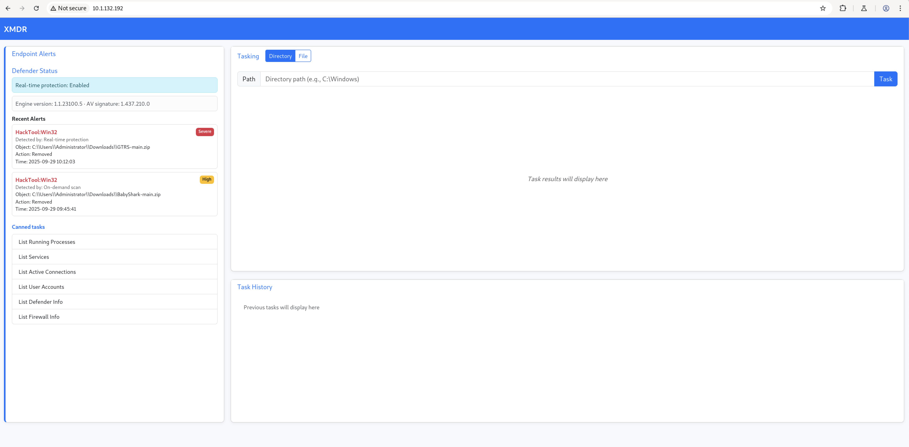
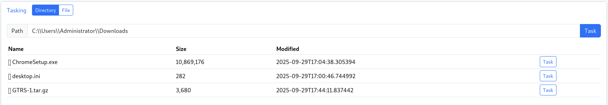
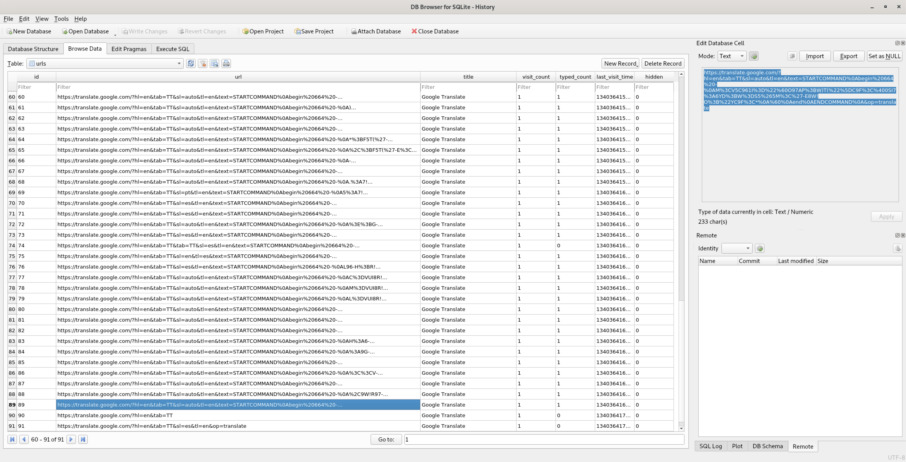
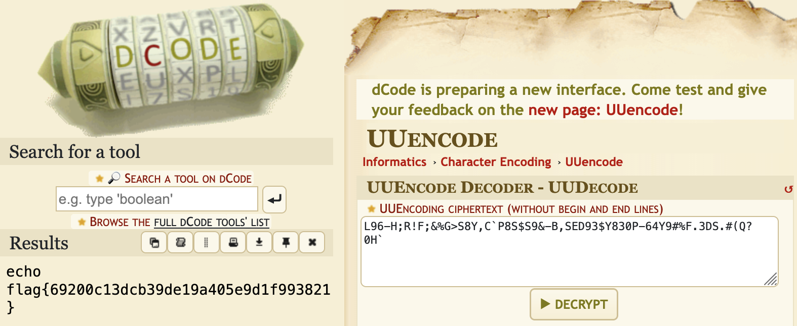

# Huntress CTF 2025 - 📦 XMDR

**CTF Name:** Huntress CTF 2025
**Challenge name:** 📦 XMDR
**Challenge prompt:**
> We had a lot of fun helping the Internet understand what MDRs are, but we thought of the next the best thing:
why not have you use one! 😄
> A host that you protect had some strange alerts fire off... can you analyze and triage to find other malicious activity?

**Challenge category:** Miscellaneous
**Challenge points:** 10

* * *

## Steps to solve

After connecting to the instance, I was presented with a custom dashboard:



This interface provided capabilities for system monitoring, allowing me to scan directories, download files, inspect running processes, network connections and so on.

On the left pane - Recent Alerts section can be seen. It briefly mentioned two removal actions that were taken against `GTRS-main.zip` and `BabyShark-main.zip` that were originally located in the Downloads directory of Administrator's account.

I decided to inspect this directory in depth - I found `ChromeSetup.exe` and a tool named GTRS (`GTRS-1.tar.gz`):



After downloading and analyzing the GTRS tool (also can be found at https://github.com/mthbernardes/GTRS), I discovered that it operated as a C2 client that communicated over Google Translate and required a secret key to function. This was a significant finding, as it suggested that the C2 commands would be present in the browser's history!

My new hypothesis was that I could recover the C2 communication by analyzing Chrome's browser history (Chrome was my guess, as we previously saw Chrome installer in Downloads directory). I navigated to the Chrome user data directory `C:\Users\Administrator\AppData\Local\Google\Chrome\User Data\Default\History` and located the history database.

I downloaded and opened this SQLite file using `sqlitebrowser` and began filtering the `urls` table. My search quickly paid off when I found numerous requests to Google Translate:



These URLs contained queries with a clear command structure, starting with the marker text=STARTCOMMAND[...]. This confirmed my theory about the C2 channel.

The data between the STARTCOMMAND and ENDCOMMAND markers was clearly encoded (beside URL encoding). After some investigation, the encoding was identified as uu-encoding.

The next step was to decode these payloads. I extracted the encoded strings and used an online decoder (https://www.dcode.fr/uu-encoding) to reveal their contents. After cleaning up one of the longer strings by removing the begin `begin 664 -` and `end` markers and URL-encoded newlines `%0A`, I was left with the following payload:

```
L96-H;R!F;&%G>S8Y,C`P8S$S9&-B,SED93$Y830P-64Y9#%F.3DS.#(Q?0H`
```

Decoding this string revealed the flag:



**FLAG:** flag{69200c13dcb39de19a405e9d1f993821}
