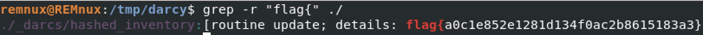
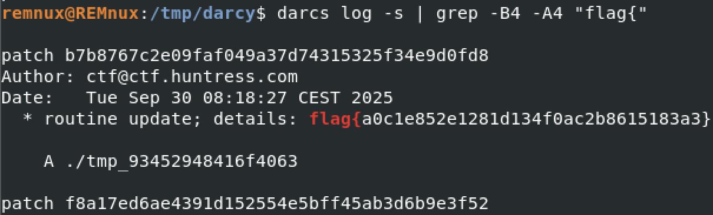

# Huntress CTF 2025 - 🔍 Darcy

**CTF Name:** Huntress CTF 2025
**Challenge name:** 🔍 Darcy
**Challenge prompt:**
> Darcy has apparently been having a lot of fun with a unique version control system.
> She told me she hid a flag somewhere with her new tool and wants me to find it... I can't make any sense of it, can you?

**Challenge category:** Forensics
**Challenge points:** 10

* * *

## Steps to solve

After downloading and unpacking the provided ZIP file, I was left with a directory containing numerous files. My first instinct for challenges like this is to perform a quick, broad search for the flag format itself. I ran a recursive grep command:



To my surprise, this initial command immediately found the flag...

However, I was feeling bad with this solution, and it was clear from the file structure that this was a shortcut and not the intended solution. The presence of a hidden .darcs directory indicated that this was a repository for Darcs (https://darcs.net/), a version control system (VCS) similar to Git. The challenge was designed to test familiarity with this specific tool.

To follow the intended path, I began interacting with the repository using the `darcs` command-line tool. The `darcs changes` command can be used to list all the patches (commits) made to the repository. While I could have manually scrolled through the history, a more efficient method was to pipe the output of `darcs log -s` (which displays the full content of the patches), into grep.

```bash
darcs log -s | grep -B4 -A4 "flag{"
```

This command combination instantly located the patch containing the flag and revealed the associated commit details:



This confirmed the flag found by the initial grep search and demonstrated the intended solution path for the challenge.

**FLAG:** flag{a0c1e852e1281d134f0ac2b8615183a3}
