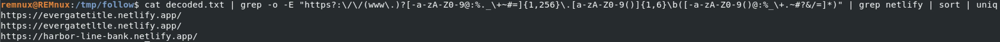
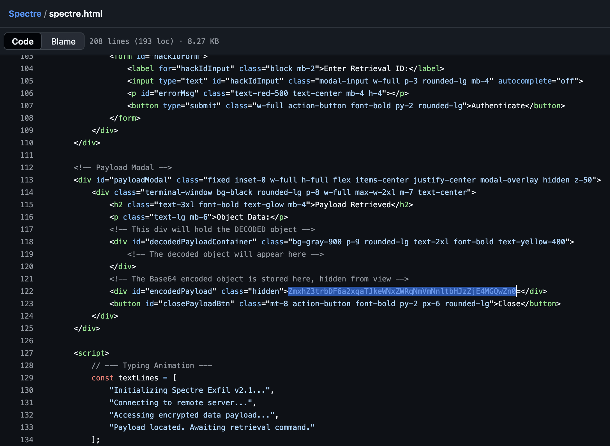
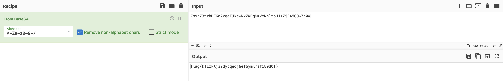

# Huntress CTF 2025 - 🕵️ Follow The Money  

**CTF Name:** Huntress CTF 2025  
**Challenge name:** 🕵️ Follow The Money  
**Challenge prompt:**  
> Hey Support Team,
> We had a bit of an issue yesterday that I need you to look into ASAP. There's been a possible case of money fraud involving our client, Harbor Line Bank. They handle a lot of transfers for real estate down payments, but the most recent one doesn't appear to have gone through correctly.
> Here's the deal, we need to figure out what happened and where the money might have gone. The titling company is looping in their incident response firm to investigate from their end. I need you to quietly review things on our end and see what you can find. Keep it discreet and be passive.
> I let Evelyn over at Harbor Line know that someone from our team might reach out. Her main email is offline right now just in case it was compromised, she's using a temporary address until things get sorted out: "evelyn.carter@51tjxh.onmicrosoft.com"

```
IMPORTANT

This challenge uses a non-standard flag format.
```

```
NOTE

The password to the ZIP archive below is "follow_the_money".
```

**Challenge category:** OSINT  
**Challenge points:** 10 (3 + 7)

* * *  

## Steps to solve  

In this challenge, we were given `follow_the_money.zip` archive file.

After extraction, a set of five `.eml` files emerged. Upon inspection, they appeared to be a chain of transaction approval emails. One particular email stood out as it mentioned a failed transaction and instructed the recipient to check a link in the signature for more details. This was the first breadcrumb.

My initial attempt to extract URLs with a simple grep resulted in a messy, unreadable output. I examined the raw source of one of the `.eml` files and discovered a critical header: `Content-Transfer-Encoding: quoted-printable`. This explained why the text was garbled; it needed to be decoded first.

I copied the garbled text containing the links and pasted it into CyberChef, applying the "From Quoted-Printable" recipe. The result was a clean, human-readable block of text containing the actual URLs. I saved this output to a file (`decoded.txt`) and ran a more refined grep command to isolate only the URLs, sort them, and remove duplicates:



```bash
cat decoded.txt | grep -o -E "https?:\/\/(www\.)?[-a-zA-Z0-9@:%._\+~#=]{1,256}\.[a-zA-Z0-9()]{1,6}\b([-a-zA-Z0-9()@:%_\+.~#?&/=]*)" | grep netlify | sort | uniq
```

This produced a short list of four netlify.app domains:

```
https://evergatetitle.netlify.app/
https://evergatetltle.netlify.app/
https://harbor-line-bank.netlify.app/
```

Looking closely at the results, I noticed a subtle but critical difference. The second URL, evergatetltle.netlify.app, was a clever case of typosquatting, where the letter `i` was replaced with an `l` to mimic the legitimate `evergatetitle.netlify.app` domain. This was clearly the malicious link.

Visiting the typosquatted URL led to a convincing clone of the legitimate website:


However, clicking the "Transfer Closing Funds" button revealed its true nature. The page changed to a Matrix-style scrolling text background:


In the website source-code, the following could be found:
```
Thanks for giving me your bank! Your friend, aHR0cHM6Ly9uMHRydXN0eC1ibG9nLm5ldGxpZnkuYXBwLw== Retrieval ID: 471082
```

Decoding this string revealed another URL `https://n0trustx-blog.netlify.app/`:


It led to the attacker's blog and exposed their username, which was the first expected flag.

**FLAG:** N0TrustX

The attacker's blog contained posts about a "Project Spectre" and included a link to their GitHub profile (https://github.com/N0TrustX). On GitHub, I found a single repository named Spectre. Investigating the source code of the project's webpage, I found the final, base64 encoded flag in line 122:



```html
<div id="encodedPayload" class="hidden">ZmxhZ3trbDF6a2xqaTJkeWNxZWRqNmVmNnltbHJzZjE4MGQwZn0=</div>
```

Decoding this payload revealed the flag:



**FLAG:** flag{kl1zklji2dycqedj6ef6ymlrsf180d0f}  
