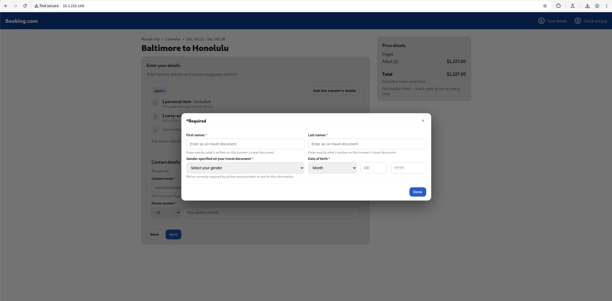
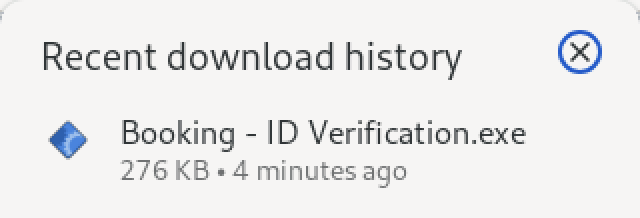
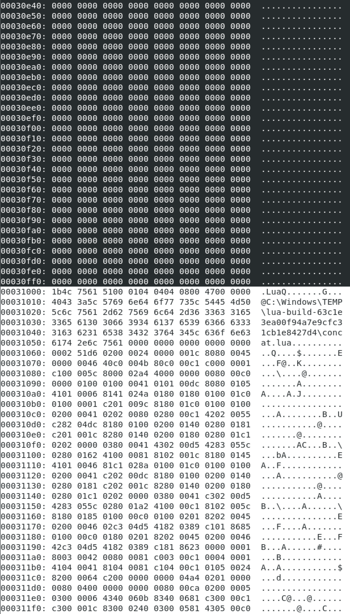
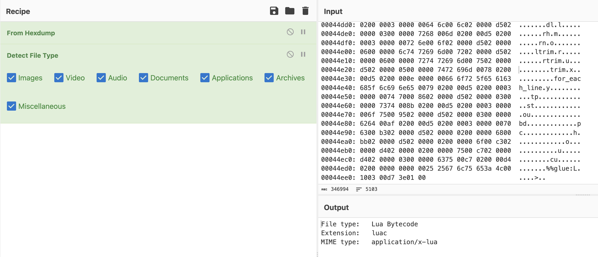
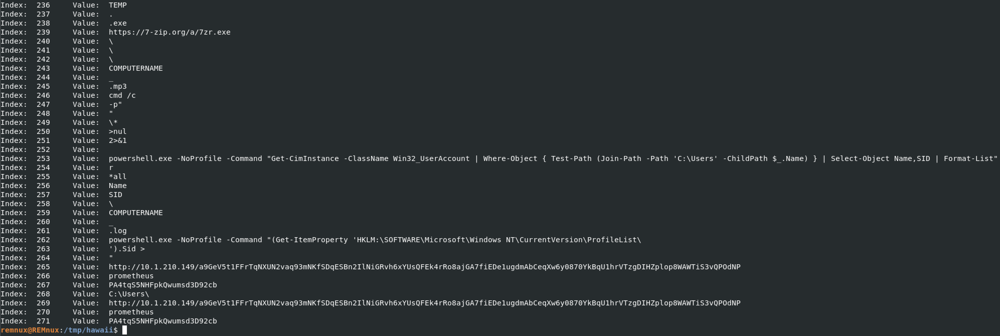
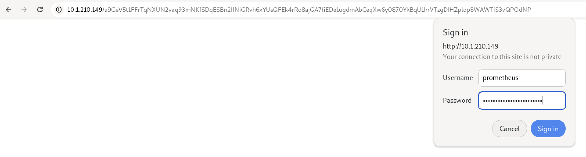
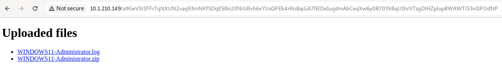
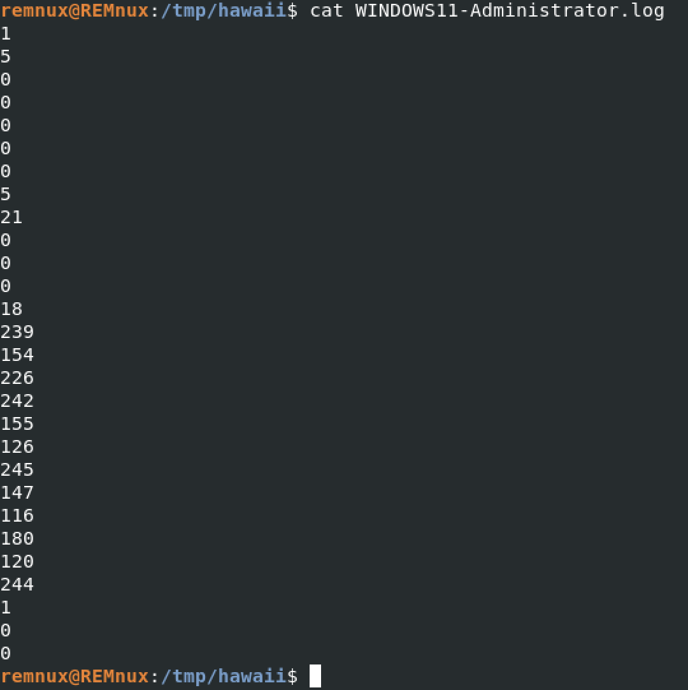
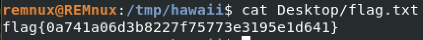

# Huntress CTF 2025 - 🐞 My Hawaii Vacation  

**CTF Name:** Huntress CTF 2025  
**Challenge name:** 🐞 My Hawaii Vacation  
**Challenge prompt:**  
> Oh jeeeez... I was on Booking.com trying to reserve my Hawaii vacation.
> Once I tried verifying my ID, suddenly I got all these emails saying that my password was changed for a ton of different websites!! What is happening!?!
> I had a flag.txt on my desktop, but that's probably not important...
> Anyway, I still can't even finish booking my flight to Hawaii!! Here is the site I was on... can you get this thing to work!??!

```
CAUTION

This is the Malware category, and as such, includes malware. Please be sure to analyze these files within an isolated virtual machine.
```

**Challenge category:** Malware  
**Challenge points:** 10

* * *  

## Steps to solve  

This challenge required connection to the CTF-provided web-instance.

Once we open given webpage, we can see a view that very much resembles Booking website:



Once we enter required data and press "Done" button - `.exe` file is downloaded onto the device:



I transferred this newly downloaded file for quick analysis:

```bash
$ file Booking\ -\ ID\ Verification.exe 
Booking - ID Verification.exe: PE32 executable (console) Intel 80386, for MS Windows
```

```bash
$ strings -n 8 Booking\ -\ ID\ Verification.exe 
!This program cannot be run in DOS mode.
T$$PRh`:@
L$$@WPQh
[...]
$Lua: Lua 5.1 Copyright (C) 1994-2006 Lua.org, PUC-Rio $
$Authors: R. Ierusalimschy, L. H. de Figueiredo & W. Celes $
$URL: www.lua.org $
[...]
LUA_CPATH
.\?.dll;!\?.dll;!\loadall.dll
LUA_PATH
.\?.lua;!\lua\?.lua;!\lua\?\init.lua;!\?.lua;!\?\init.lua
unable to get ModuleFileName
[...]
@C:\Windows\TEMP\lua-build-63c1e3ea00f94a7e9cfc31cb1e8427d4\concat.lua
init.lua
RR3IL6YJTKWSXB3I6KRTAAVBFXUV2Q5BBDNBH5UTPAPCHZXKTJNYG5PALFL5VXAS2OVF3IPATW223ITWHHYEFUAAYXFJLO6IN662OXG33IBFO5XORQJFW24PFIWF4BWMVAAZ3LW3VPPKZLI4DQBBHFI6NRF4X3TCWK2FUK7VQXBHOCAZNDKZNUNIPOD3YRBWZDRWBHKZGQFXNZ6274TMH3I5D6JXS4IZDS33AGD45AWXC4GLBPG4L2S57EQ5B2[...]
[...]
-w HTTPSTATUS:%{http_code}
^(.*)HTTPSTATUS:(%d%d%d)$
[...]
```

Based on the output above, we can tell that this application utilizes lua programming language. I decided to follow this path and try to extract lua bytecode from the `.exe`.

To accomplish this task, I used `xxd` tool, and copied everything after the address `00031000`:



I then pasted it to the CyberChef and used "From Hexdump" as a recipe - and downloaded file to `download.luac`. Additionally I used "Detect File Type" to confirm my assumption:



Then I executed `java -jar unluac_2025_10_20.jar download.luac > out.lua` to get the lua source code (out.lua). In the source code, I found many occurences of the following logic: `__D("\240\159\140\138\240\159\144\172", __K)`, where first argument is this Octal-like value, `__K` variable is most-likely key (declared in the source code) and `__D` is the decoding function.

Then I extracted all these Octal-like values from the `out.lua` source code using `grep -o -E '\"\\.+\",' out.lua > payloads_only.txt`

I extracted lines 0-148 from the `out.lua`, saved them to the `test.lua` and appended previously extracted payloads with the for loop (decoding logic) at the end.

I installed `lua5.2` and executed `test.lua`. The result was very rewarding:



```
261	.log
262	powershell.exe -NoProfile -Command "(Get-ItemProperty 'HKLM:\SOFTWARE\Microsoft\Windows NT\CurrentVersion\ProfileList\
263	').Sid > 
264	"
265	http://10.1.210.149/a9GeV5t1FFrTqNXUN2vaq93mNKfSDqESBn2IlNiGRvh6xYUsQFEk4rRo8ajGA7fiEDe1ugdmAbCeqXw6y0870YkBqU1hrVTzgDIHZplop8WAWTiS3vQPOdNP
266	prometheus
267	PA4tqS5NHFpkQwumsd3D92cb
268	C:\Users\
269	http://10.1.210.149/a9GeV5t1FFrTqNXUN2vaq93mNKfSDqESBn2IlNiGRvh6xYUsQFEk4rRo8ajGA7fiEDe1ugdmAbCeqXw6y0870YkBqU1hrVTzgDIHZplop8WAWTiS3vQPOdNP
270	prometheus
271	PA4tqS5NHFpkQwumsd3D92cb
```

Out of the lines above, one could only suspect that this URL with `prometheus` and string below create a set of credentials that were used to download/send resources.

I confirmed this finding and acquired access to two new files:





Once downloaded, `.log` file presented set of numbers that very much resembled SID Windows value:



The other file - `.zip` archive. Was password encrypted and contained Windows user files - with `flag.txt` located on the desktop.

To reconstruct SID value from the `.log` file, I used below Python code:

```python
import struct

byte_array = [
    1, 5, 0, 0, 0, 0, 0, 5, 21, 0, 0, 0, 18, 239, 154, 226, 242, 155,
    126, 245, 147, 116, 180, 120, 244, 1, 0, 0
]

# The first byte is the revision
revision = byte_array[0]

# Bytes 2-7 are the identifier authority (6 bytes), read as a big-endian integer
identifier_authority = int.from_bytes(byte_array[2:8], 'big')

sid = f"S-{revision}-{identifier_authority}"

# The remaining bytes are the sub-authorities, each is a 4-byte little-endian integer
sub_authorities = []
for i in range(8, len(byte_array), 4):
    sub_authority = struct.unpack('<I', bytes(byte_array[i:i+4]))[0]
    sub_authorities.append(str(sub_authority))

sid = sid + "-" + "-".join(sub_authorities)
print(sid)
```

Result of this python script execution was: `S-1-5-21-3801804562-4118715378-2025092243-500`

I used it as an archive password - and successfully accessed `flag.txt` contents:



**FLAG:** flag{0a741a06d3b8227f75773e3195e1d641}  
