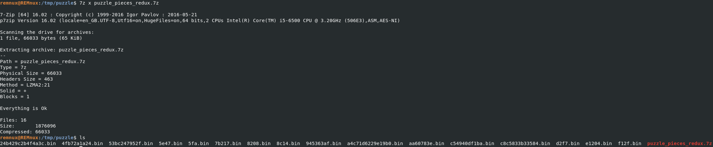
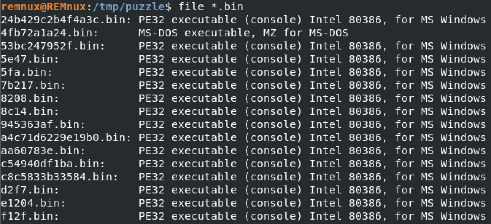
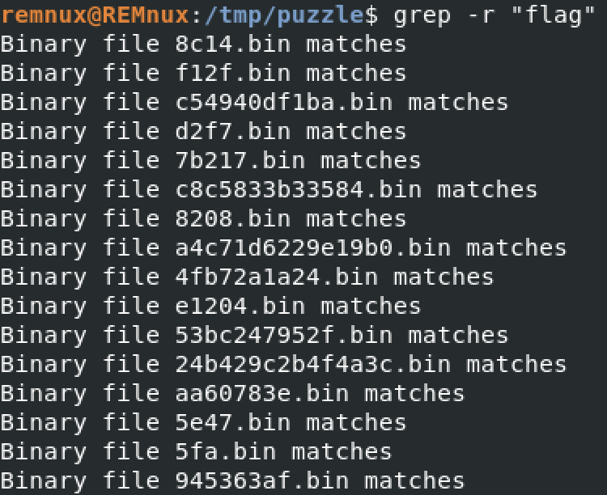
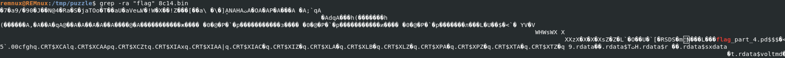
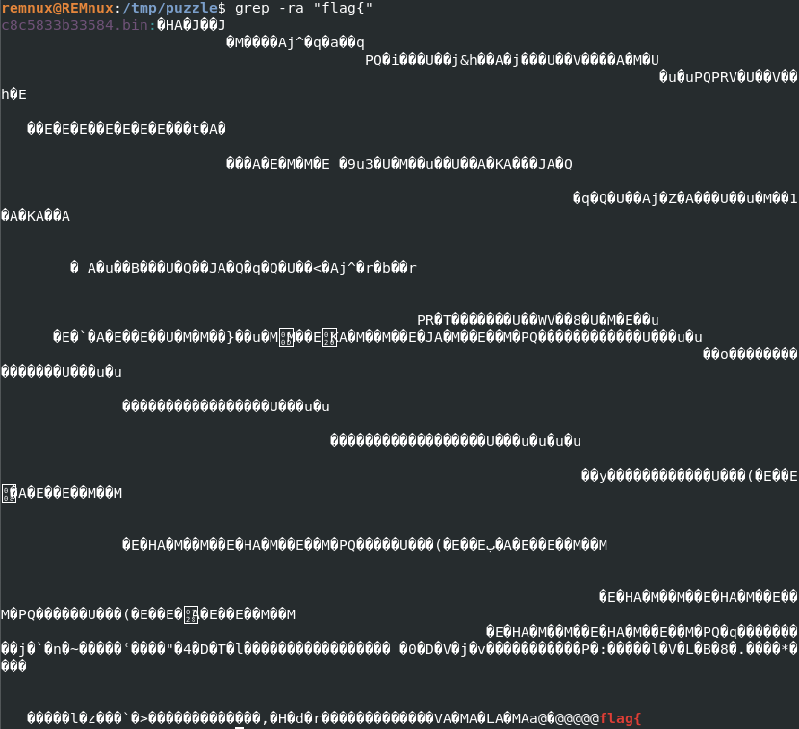
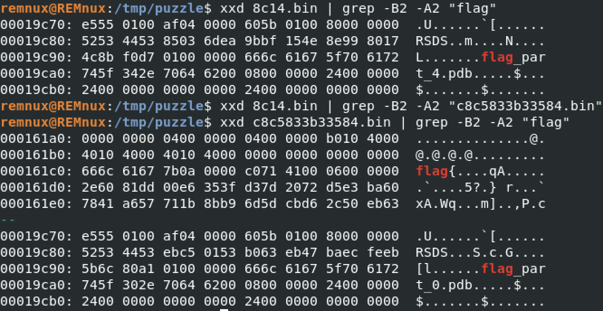
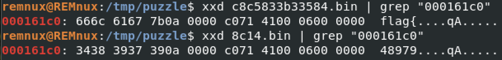
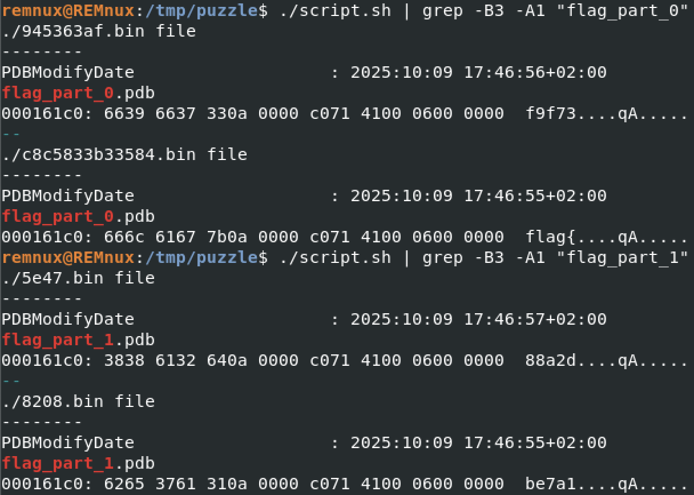

# Huntress CTF 2025 - 🔍 Puzzle Pieces Redux  

**CTF Name:** Huntress CTF 2025  
**Challenge name:** 🔍 Puzzle Pieces Redux  
**Challenge prompt:**  
> Well, I accidentally put my important data into a bunch of executables... just don't ask, okay?
> It was fine... until my cat Sasha stepped on my keyboard and messed everything up! OH NOoOoO00!!!!!111
> Can you help me recover my important data?

**Challenge category:** Forensics  
**Challenge points:** 10

* * *  

## Steps to solve  

After downloading and extracting the ZIP file, I found a bunch of `.bin` files:



Running file on them confirmed they were Windows PE32 binaries:



I ran naive recursive grep to search for the flag and discovered that all files contain "flag"?!



Further analysis allowed me to find out that all `.bin` files contain `flag_part_X` string:



To find the first part of the flag, I grepped for "flag{" part:



This way, I was able to find that `c8c5833b33584.bin` file contains first part of the flag.

Once I knew that, I decided to compare hex representation of the files:



Strangely enough, both files contained "flag_part_X" fragment at the same offsets. I used this knowledge to check whether the offset of the real flag part is also the same:



And indeed looks so!

At this moment I thought we are finished - just grep for each "flag_part_X" in an incremental order and extract this specific offset to combine flag parts into final flag. However, I noticed that for each part of the flag, there are two files matching every "flag_part_X"...


I had to find a way to filter these files, so that only proper parts will be visible to me. For that, I used `exiftool` to find if maybe there are some differences in file metadata:

```shell
remnux@REMnux:/tmp/puzzle$ exiftool c8c5833b33584.bin
ExifTool Version Number         : 13.38
File Name                       : c8c5833b33584.bin
[...]
Time Stamp                      : 2025:10:09 17:46:55+02:00
Image File Characteristics      : Executable, Large address aware, 32-bit
PE Type                         : PE32
[...]
Subsystem Version               : 6.0
Subsystem                       : Windows command line
Warning                         : Error processing PE resources
PDB Modify Date                 : 2025:10:09 17:46:55+02:00
PDB Age                         : 1
PDB File Name                   : flag_part_0.pdb
```

```shell
remnux@REMnux:/tmp/puzzle$ exiftool 945363af.bin
ExifTool Version Number         : 13.38
File Name                       : 945363af.bin
[...]
Time Stamp                      : 2025:10:09 17:46:56+02:00
Image File Characteristics      : Executable, Large address aware, 32-bit
PE Type                         : PE32
[...]
Subsystem Version               : 6.0
Subsystem                       : Windows command line
Warning                         : Error processing PE resources
PDB Modify Date                 : 2025:10:09 17:46:56+02:00
PDB Age                         : 1
PDB File Name                   : flag_part_0.pdb
```

Based on this output, I found out that file with known-good flag part ("flag{") had `Time Stamp` and `PDB Modify Date` lower values - meaning it was older from the two.

I used this knowledge to construct `script.sh` which would print `Time Stamp` value, "flag_part_X" fragment and real flag part for every `.bin` file. The output was satisfactory, but overwhelming - thus I decided to use grep on each fragment:



From each - I noted the older one and used it to construct the whole flag. It resulted in the following:

```
c8c5833b33584.bin: flag{
8208.bin: be7a1
7b217.bin: e6817
e1204.bin: d85d5
a4c71d6229e19b0.bin: 49f8b
24b429c2b4f4a3c.bin: 5abfa
53bc247952f.bin: f18ba
c54940df1ba.bin: 02}
```

Combining them yielded the correct flag.

**FLAG:** flag{be7a1e6817d85d549f8b5abfaf18ba02}  
