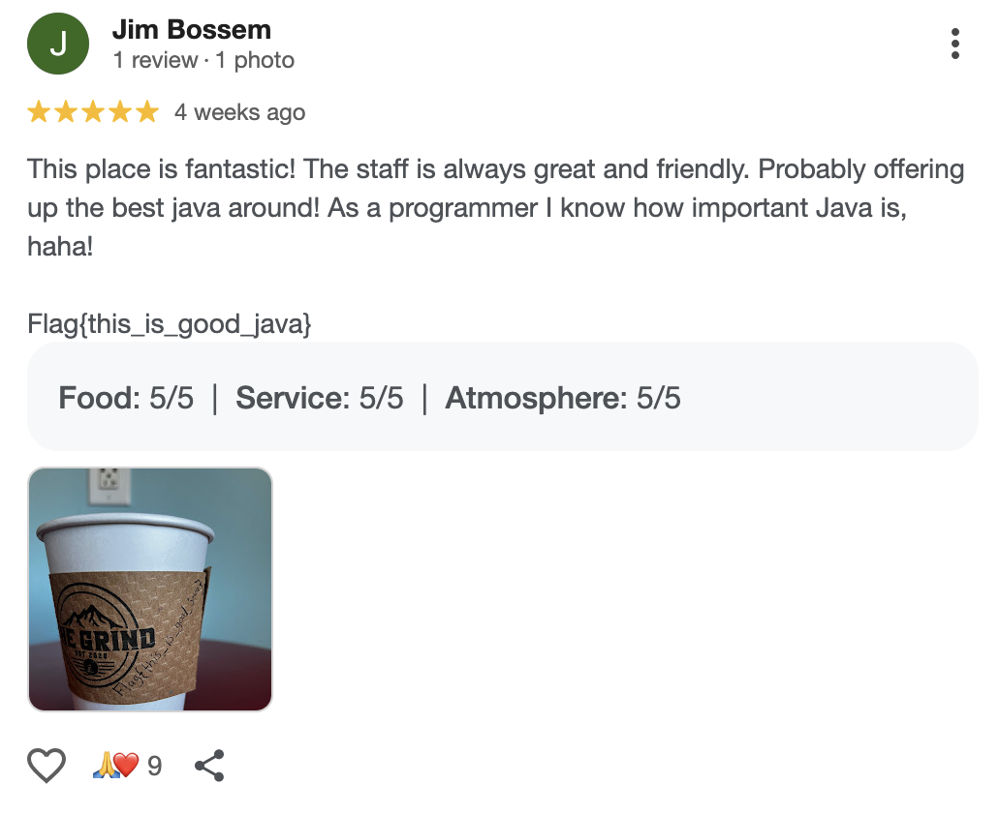

# Huntress CTF 2025 - 🕵️ Follow the Money - The Sequel  

**CTF Name:** Huntress CTF 2025  
**Challenge name:** 🕵️ Follow the Money - The Sequel  
**Challenge prompt:**  
```
WARNING

The initial Follow the Money challenge should be completed first before this challenge.
```

> Hey Support Team,
> Thanks for your help the other day! After seeing the way you handled yourself and gathered these details, I wanted to see if I could get a bit more help from you. I know you found their username the other day. See what you can do with that. I need you to find the town that this hacker lives in. I don't think the IR firm is doing enough. I want to have every piece of information we can find. Maybe we can pay a visit. Let me know what you find. Thanks!

```
IMPORTANT

This challenge DOES NOT require you to contact any businesses. This can be fully solved with publicly available information. Being that this is OSINT and public-facing, please DO NOT do anything to disrupt other CTF players or others that are not involved with the CTF.
```

```
IMPORTANT

This challenge uses a non-standard flag format.
```

**Challenge category:** OSINT  
**Challenge points:** 10

* * *  

## Steps to solve  

This challenge is a sequel to the previous one [Follow the Money](../Day%2021/Follow_the_Money.md), so we pick up right where we left off. The hacker's blog at https://n0trustx-blog.netlify.app/ was our starting point, along with checking their GitHub profile at https://github.com/N0TrustX/. From these, we gathered two key pieces of information: the attacker's username and email. I ran OSINT searches on both using https://osint.rocks and https://instantusername.com, but the results were not fully satisfactory.

Next, I hit X.com (Twitter) and searched the username. One account stood out:


Browsing their tweets, I found a few posts with images, with one interesting self-reply:

`"Just a quite place. No one will know. No one is going to come looking"`

The photo above became our first solid lead.

Running it through Google Reverse Image Search gave an exact match to a blog post about a spot in `Wytheville, Virginia`.

This gave us our first flag: `Wytheville`.

**FLAG:** Wytheville

For the second flag, I focused on a tweet that read:

`"Always review your local business. Really helps them out."`

This made me think the attacker left a review somewhere. I also noticed coffee-related tweet:

`"Working on some Java in this town. Pretty great Java."`

His reply to this, `"Anyway, back to the grind,"` further hinted at a coffee shop.

Googling best coffee in Wytheville led me to "The Grind" the top-rated cafe. I looked through 5-star reviews and found one by Jim Bossem:



The flag was hidden right there in the review: `Flag{this_is_good_java}`.

**FLAG:** Flag{this_is_good_java}  
