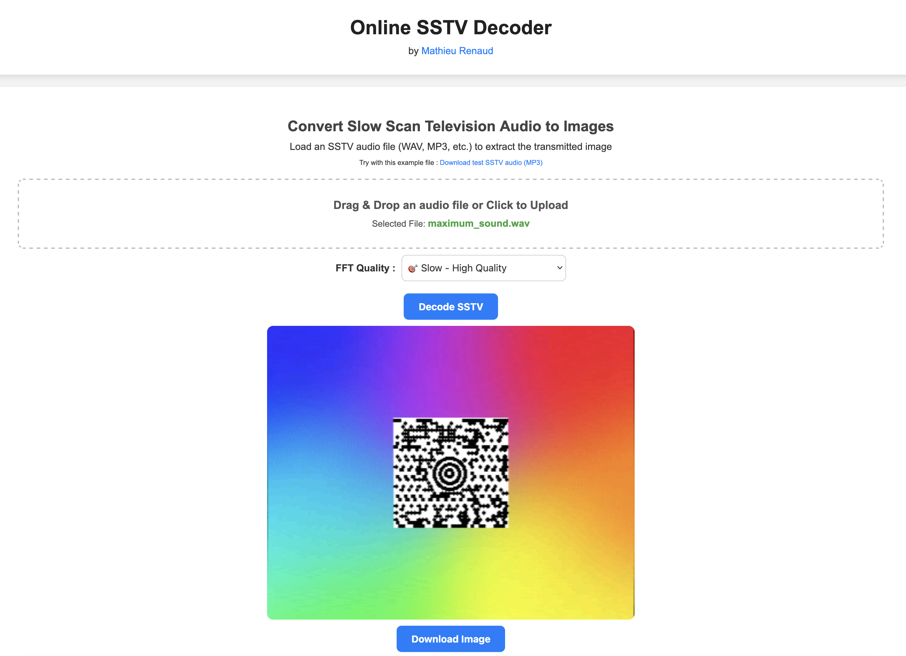
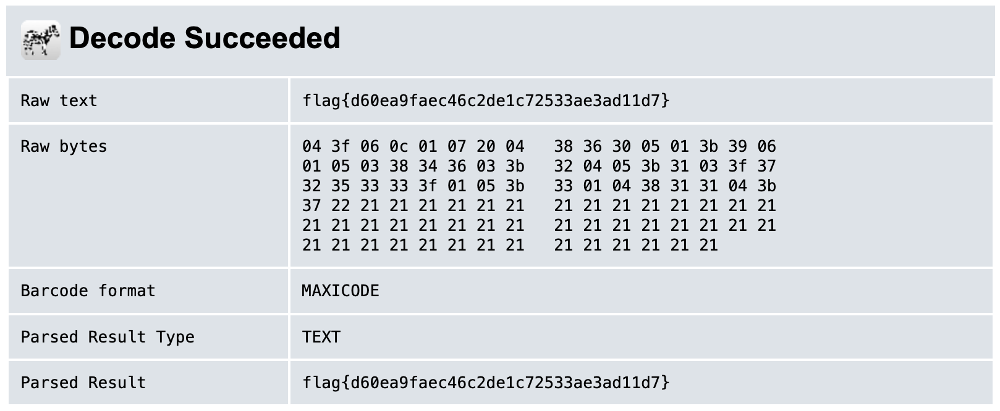

# Huntress CTF 2025 - 👶 Maximum Sound

**CTF Name:** Huntress CTF 2025  
**Challenge name:** 👶 Maximum Sound  
**Challenge prompt:**  
> Dang, this track really hits the target! It sure does get loud though, headphone users be warned!!  

**Challenge category:** Warmups  
**Challenge points:** 10  

* * *  

## Steps to solve  

The initial tones of the `WAV` file are very recognisable - but it doesn't mean that I recognised them...

After long hours of browsing - I finally found this YouTube video `https://www.youtube.com/watch?v=SffT9U8scBc`.

I knew I got it - now it was time to decode SSTV signal.

I used SSTV decoder `https://sstv-decoder.mathieurenaud.fr/` and recovered this image:

Additional investigation was required to identify such "QR code-like" image with "target" inside. Finally I found out that this type of "QR code" is called MAXICODE and can be too decoded online `https://zxing.org/w/decode`:  

**FLAG:** flag{d60ea9faec46c2de1c72533ae3ad11d7}
