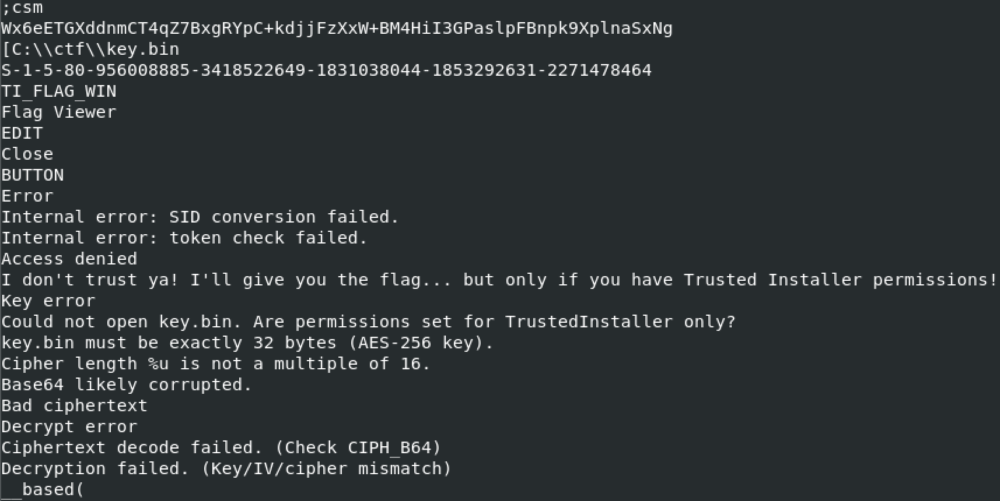
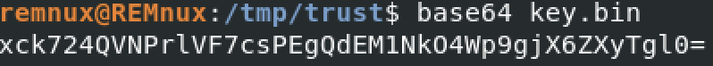
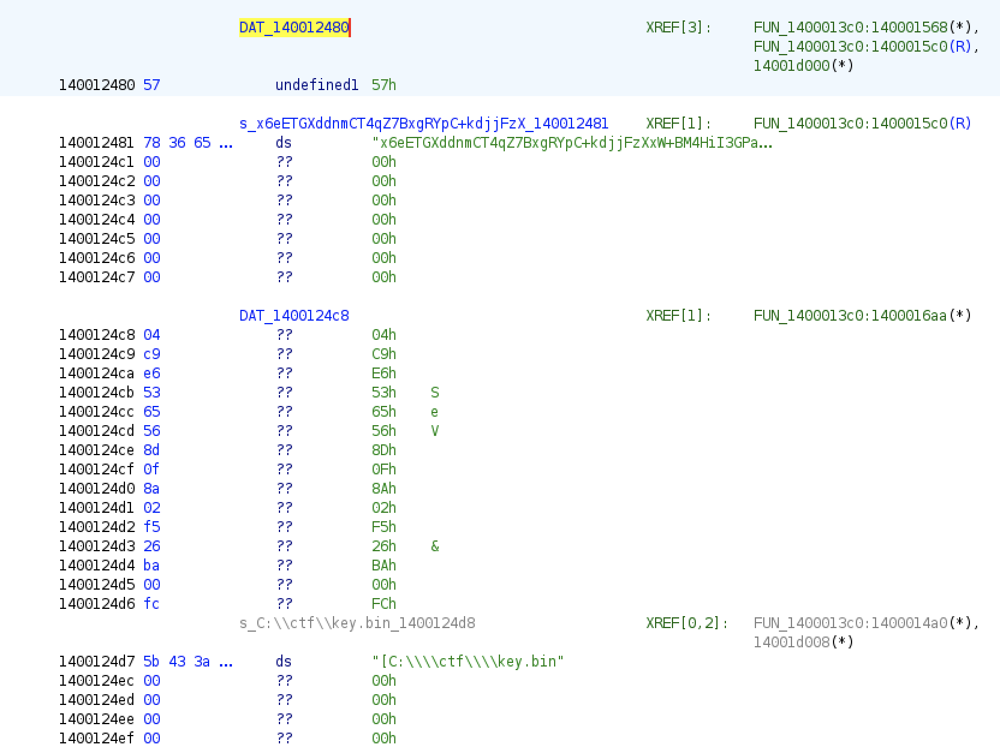
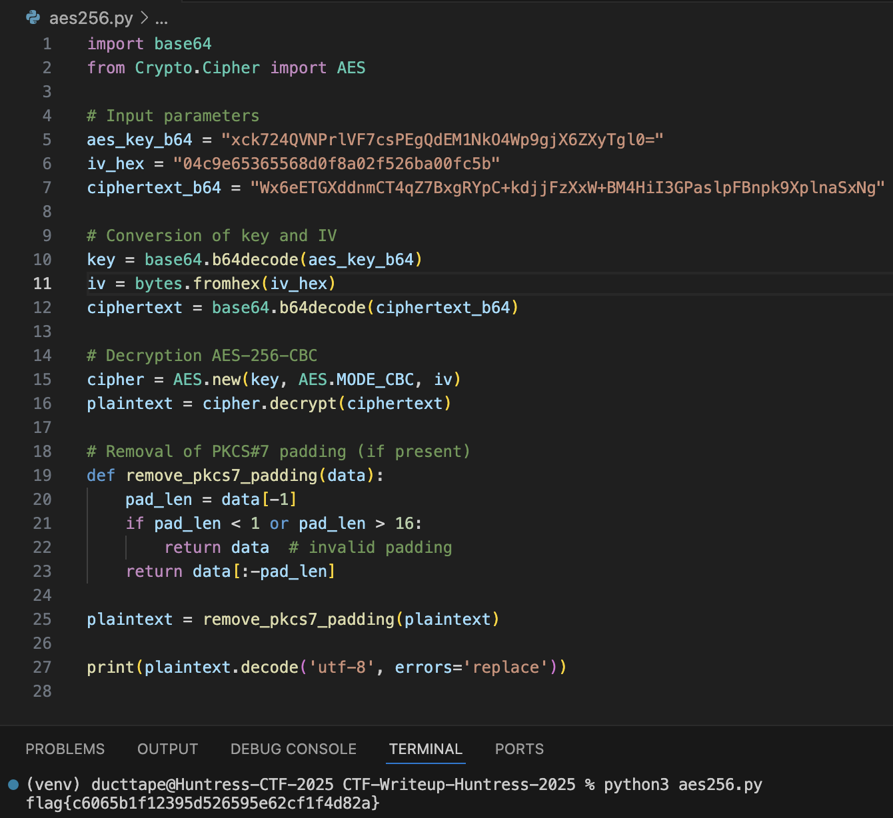

# Huntress CTF 2025 - 📦 Trust Me  

**CTF Name:** Huntress CTF 2025  
**Challenge name:** 📦 Trust Me  
**Challenge prompt:**  
> *C'mon bro, trust me! Just trust me!! Trust me bro!!!*  
> The TrustMe.exe program on this Windows desktop "doesn't trust me?"  
> It says it will give me the flag, but only if I "have the permissions of Trusted Installer"...?  

```  
If you are using the VPN, you can RDP to this challenge with:  

Username: Administrator  
Password: h$4#82PSK0BUBaf7  
```  

```  
NOTE  

This virtual machine does not have Internet access.  
```  

**Challenge category:** Miscellaneous  
**Challenge points:** 10  

* * *  

## Steps to solve  

In this challenge, we were given access to the CTF's instance of the Windows.  

Once RDP connection was established - `TrustMe.exe` could be found on the desktop. I downloaded the file for offline analysis onto my REMnux VM and run strings against it:  

  

Output above suggests that `TrustMe.exe` performs AES-256 decryption - `Wx6eETG...` and `C:\ctf\key.bin` are very likely to be used in the decryption phase.  

`C:\ctf\key.bin` was downloaded onto REMnux VM and static analysis confirmed that it is indeed binary data, that may be used as a key in AES-256 decryption. I base64-encoded the contents of this file, and saved it aside:  

  

To gain better understanding of the `TrustMe.exe` binary, I imported it into ghidra for decompilation.  

I won't bore you with multitude of the steps that I took to analyse the binary, but in the end I extracted function that is responsible for AES-256 decryption:  

```  
void FUN_1400013c0(void)  

{  
  byte bVar1;  
  undefined *puVar2;  
  int iVar3;  
  BOOL BVar4;  
  int iVar5;  
  uint uVar6;  
  FILE *_File;  
  size_t sVar7;  
  PUCHAR pUVar8;  
  PUCHAR pUVar9;  
  HANDLE hHeap;  
  PUCHAR pUVar10;  
  char *pcVar11;  
  PUCHAR pUVar12;  
  PUCHAR pUVar13;  
  int iVar14;  
  char *lpCaption;  
  PUCHAR pUVar15;  
  undefined auStackY_108 [32];  
  PSID local_d8;  
  BOOL local_d0 [2];  
  char *local_c8;  
  UCHAR local_c0 [40];  
  CHAR local_98 [128];  
  ulonglong local_18;  
  
  local_18 = DAT_14001d040 ^ (ulonglong)auStackY_108;  
  pUVar10 = (PUCHAR)0x0;  
  local_d8 = (PSID)0x0;  
  iVar3 = ConvertStringSidToSidA(PTR_s_S-1-5-80-956008885-3418522649-18_14001d010,&local_d8);  
  if (iVar3 == 0) {  
    MessageBoxA((HWND)0x0,"Internal error: SID conversion failed.","Error",0x10);  
  }  
  else {  
    local_d0[0] = 0;  
    BVar4 = CheckTokenMembership((HANDLE)0x0,local_d8,local_d0);  
    if (BVar4 == 0) {  
      LocalFree(local_d8);  
      MessageBoxA((HWND)0x0,"Internal error: token check failed.","Error",0x10);  
    }  
    else if (local_d0[0] == 0) {  
      LocalFree(local_d8);  
      MessageBoxA((HWND)0x0,  
                  "I don\'t trust ya! I\'ll give you the flag... but only if you have Trusted Instal ler permissions!"  
                  ,"Access denied",0x30);  
    }  
    else {  
      _File = (FILE *)FUN_140005220(PTR_s_C:\\ctf\\key.bin_14001d008,"rb");  
      if (_File == (FILE *)0x0) {  
        LocalFree(local_d8);  
        MessageBoxA((HWND)0x0,  
                    "Could not open key.bin. Are permissions set for TrustedInstaller only?",  
                    "Key error",0x10);  
      }  
      else {  
        sVar7 = fread(local_c0,1,0x20,_File);  
        FUN_1400050cc((int *)_File);  
        puVar2 = PTR_DAT_14001d000;  
        if (sVar7 == 0x20) {  
          pUVar8 = (PUCHAR)strlen(PTR_DAT_14001d000);  
          pUVar9 = (PUCHAR)_malloc_base((((ulonglong)pUVar8 >> 2) + 1) * 3);  
          pUVar12 = pUVar10;  
          pUVar13 = pUVar10;  
          if ((pUVar9 != (PUCHAR)0x0) &&  
             (iVar3 = -8, pUVar13 = pUVar9, pUVar15 = pUVar10, pUVar8 != (PUCHAR)0x0)) {  
            do {  
              bVar1 = pUVar15[(longlong)puVar2];  
              iVar14 = iVar3;  
              if ((bVar1 != 0x3d) &&  
                 ((0x20 < bVar1 || ((0x100002600U >> ((ulonglong)bVar1 & 0x3f) & 1) == 0)))) {  
                uVar6 = (uint)bVar1;  
                if (bVar1 - 0x41 < 0x1a) {  
                  iVar5 = -0x41;  
LAB_140001600:  
                  uVar6 = iVar5 + uVar6;  
                  if ((int)uVar6 < 0) goto LAB_140001642;  
                }  
                else {  
                  if (bVar1 - 0x61 < 0x1a) {  
                    iVar5 = -0x47;  
                    goto LAB_140001600;  
                  }  
                  if (bVar1 - 0x30 < 10) {  
                    iVar5 = 4;  
                    goto LAB_140001600;  
                  }  
                  if ((bVar1 - 0x2b & 0xfffffffd) == 0) {  
                    uVar6 = 0x3e;  
                  }  
                  else {  
                    if ((uVar6 != 0x2f) && (uVar6 != 0x5f)) goto LAB_140001642;  
                    uVar6 = 0x3f;  
                  }  
                }  
                uVar6 = (int)pUVar10 << 6 | uVar6;  
                pUVar10 = (PUCHAR)(ulonglong)uVar6;  
                iVar14 = iVar3 + 6;  
                if (-1 < iVar14) {  
                  pUVar12[(longlong)pUVar9] = (UCHAR)((int)uVar6 >> ((byte)iVar14 & 0x1f));  
                  pUVar12 = pUVar12 + 1;  
                  iVar14 = iVar3 + -2;  
                }  
              }  
LAB_140001642:  
              iVar3 = iVar14;  
              pUVar15 = pUVar15 + 1;  
            } while (pUVar15 < pUVar8);  
          }  
          if (((ulonglong)pUVar12 & 0xf) == 0) {  
            if (pUVar13 != (PUCHAR)0x0) {  
              if (pUVar12 != (PUCHAR)0x0) {  
                local_c8 = (char *)0x0;  
                local_d0[1] = 0;  
                iVar3 = FUN_1400017a0(local_c0,(undefined8 *)&DAT_1400124c8,pUVar13,(ULONG)pUVar12,  
                                      &local_c8,(uint *)(local_d0 + 1));  
                thunk_FUN_140006b00(pUVar13);  
                LocalFree(local_d8);  
                pcVar11 = local_c8;  
                if ((iVar3 == 0) && (local_c8 != (char *)0x0)) {  
                  FUN_140001000(local_c8);  
                  hHeap = GetProcessHeap();  
                  HeapFree(hHeap,0,pcVar11);  
                }  
                else {  
                  MessageBoxA((HWND)0x0,"Decryption failed. (Key/IV/cipher mismatch)",  
                              "Decrypt error",0x10);  
                }  
                goto LAB_14000177c;  
              }  
              thunk_FUN_140006b00(pUVar13);  
            }  
            LocalFree(local_d8);  
            lpCaption = "Decrypt error";  
            pcVar11 = "Ciphertext decode failed. (Check CIPH_B64)";  
          }  
          else {  
            wsprintfA(local_98,"Cipher length %u is not a multiple of 16.\nBase64 likely corrupted."  
                     );  
            lpCaption = "Bad ciphertext";  
            pcVar11 = local_98;  
          }  
          MessageBoxA((HWND)0x0,pcVar11,lpCaption,0x10);  
        }  
        else {  
          LocalFree(local_d8);  
          MessageBoxA((HWND)0x0,"key.bin must be exactly 32 bytes (AES-256 key).","Key error",0x10);  
        }  
      }  
    }  
  }  
LAB_14000177c:  
  FUN_140001ad0(local_18 ^ (ulonglong)auStackY_108);  
  return;  
}  
```  

This code can be also represented in more pleasant, human-comprehensible form:  

```  
void FUN_1400013c0(void)  
{  
    // Buffers and local variables  
    BYTE tempByte;  
    char *decryptedText = NULL;  
    UCHAR aesKey[32];           // 32 bytes AES-256 key  
    CHAR errorMsg[128];  
    size_t bytesRead;  
    FILE *keyFile;  
    PUCHAR decodedCiphertext = NULL;  
    PUCHAR base64Ciphertext;  
    PUCHAR decodeBuffer;  
    int decodeIndex = -8;  
    int bitCounter;  
    HANDLE heapHandle;  
    BOOL isMember[2];           // Token membership check  
    PSID sid = NULL;  
    ulonglong localxor;  
    
    // TrustedInstaller SID check  
    localxor = DAT_14001d040 ^ (ulonglong)&tempByte; // Stack canary protection  
    int convertResult = ConvertStringSidToSidA(PTR_s_S-1-5-80-956008885-3418522649-18_14001d010, &sid);  
    if (convertResult == 0) {  
        MessageBoxA(NULL, "Internal error: SID conversion failed.", "Error", MB_ICONERROR);  
        return;  
    }  

    // Check if the process has TrustedInstaller permissions  
    isMember[0] = FALSE;  
    BOOL checkResult = CheckTokenMembership(NULL, sid, isMember);  
    if (checkResult == 0) {  
        LocalFree(sid);  
        MessageBoxA(NULL, "Internal error: token check failed.", "Error", MB_ICONERROR);  
        return;  
    }  

    if (!isMember[0]) {  
        LocalFree(sid);  
        MessageBoxA(NULL,  
            "I don't trust ya! I'll give you the flag... but only if you have Trusted Installer permissions!",  
            "Access denied", MB_ICONWARNING);  
        return;  
    }  

    // Trying to open AES key file  
    keyFile = (FILE *)FUN_140005220(PTR_s_C:\\ctf\\key.bin_14001d008, "rb");  
    if (keyFile == NULL) {  
        LocalFree(sid);  
        MessageBoxA(NULL,  
            "Could not open key.bin. Are permissions set for TrustedInstaller only?",  
            "Key error", MB_ICONERROR);  
        return;  
    }  

    // Reading 32 bytes AES key from file  
    bytesRead = fread(aesKey, 1, 0x20, keyFile);  
    FUN_1400050cc((int *)keyFile); // Close file  

    if (bytesRead != 0x20) {  
        LocalFree(sid);  
        MessageBoxA(NULL, "key.bin must be exactly 32 bytes (AES-256 key).", "Key error", MB_ICONERROR);  
        return;  
    }  

    // Pointer to Base64 encoded ciphertext from global source  
    base64Ciphertext = PTR_DAT_14001d000;  
    size_t base64Length = strlen((char *)base64Ciphertext);  

    // Allocate buffer for decoded binary ciphertext  
    decodeBuffer = (PUCHAR)_malloc_base((((base64Length >> 2) + 1) * 3));  
    if (decodeBuffer == NULL) {  
        LocalFree(sid);  
        MessageBoxA(NULL, "Memory allocation failed.", "Error", MB_ICONERROR);  
        return;  
    }  

    PUCHAR writePtr = decodeBuffer;  
    bitCounter = -8;  
    PUCHAR readPtr = base64Ciphertext;  
    UINT bitBuffer = 0;  

    // Manual Base64 decode (skipping '=' and whitespace chars)  
    for (size_t i = 0; i < base64Length; i++, readPtr++) {  
        BYTE c = *readPtr;  
        if (c != '=') {  
            // Validate character in Base64  
            if (c > 0x20 && !((0x100002600U >> (c & 0x3f)) & 1)) {  
                UINT val;  
                if (c >= 'A' && c <= 'Z') val = c - 'A';  
                else if (c >= 'a' && c <= 'z') val = c - 'a' + 26;  
                else if (c >= '0' && c <= '9') val = c - '0' + 52;  
                else if (c == '+' || c == '-') val = 62;  
                else if (c == '/' || c == '_') val = 63;  
                else continue;  

                bitBuffer = (bitBuffer << 6) | val;  
                bitCounter += 6;  
                if (bitCounter >= 0) {  
                    *writePtr++ = (BYTE)((bitBuffer >> bitCounter) & 0xFF);  
                    bitCounter -= 8;  
                }  
            }  
        }  
    }  

    // Check if decoded ciphertext length is multiple of 16 (AES block size)  
    if (((uintptr_t)writePtr & 0xF) != 0) {  
        wsprintfA(errorMsg,  
            "Cipher length %u is not a multiple of 16.\nBase64 likely corrupted.",  
            (unsigned int)(writePtr - decodeBuffer));  
        MessageBoxA(NULL, errorMsg, "Bad ciphertext", MB_ICONERROR);  
        thunk_FUN_140006b00(decodeBuffer);  
        LocalFree(sid);  
        return;  
    }  

    // Decrypting the data  
    char *plainText = NULL;  
    unsigned int plainTextLen = 0;  

    int decryptResult = FUN_1400017a0(  
        aesKey,                // AES key  
        (undefined8 *)&DAT_1400124c8,  // IV - initialized globally  
        decodeBuffer,          // Decoded ciphertext buffer  
        (ULONG)(writePtr - decodeBuffer),    // Ciphertext length  
        &plainText,            // Output plaintext pointer  
        &plainTextLen          // Output plaintext length  
    );  

    thunk_FUN_140006b00(decodeBuffer);  
    LocalFree(sid);  

    if (decryptResult == 0 && plainText != NULL) {  
        FUN_140001000(plainText);  // Display decrypted text (e.g., flag)  
        heapHandle = GetProcessHeap();  
        HeapFree(heapHandle, 0, plainText);  
    } else {  
        MessageBoxA(NULL, "Decryption failed. (Key/IV/cipher mismatch)", "Decrypt error", MB_ICONERROR);  
    }  

    FUN_140001ad0(localxor ^ (ulonglong)&tempByte);  
}  
```  

Mapping the variables to the .rdata entries in ghidra allowed me to extract necessary values used to perform decryption:  

  

Based on these information, I prepared python AES-256 decryption script `./aes256.py`, that recovered the flag:  

  

**FLAG:** flag{c6065b1f12395d526595e62cf1f4d82a}  
