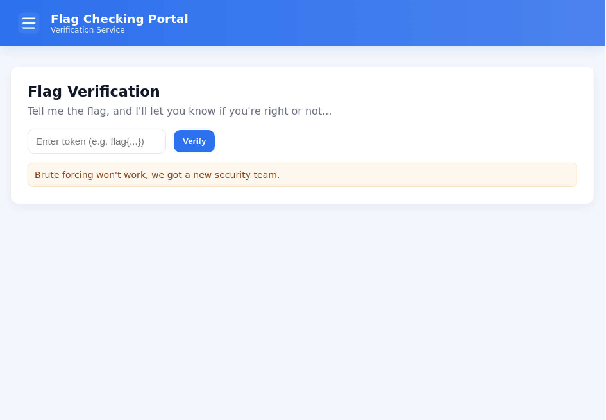
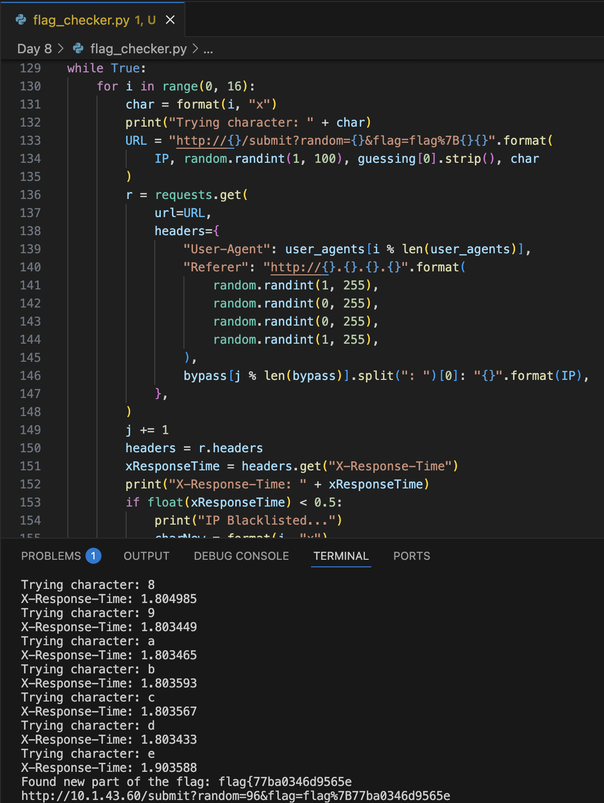
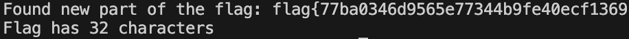

# Huntress CTF 2025 - 🌐 Flag Checker  

**CTF Name:** Huntress CTF 2025  
**Challenge name:** 🌐 Flag Checker  
**Challenge prompt:**  
> We've decided to make this challenge really straight forward. All you have to do is find out the flag!  
> Juuuust make sure not to trip any of the security controls implemented to stop brute force attacks...  

```  
NOTE  

Working this challenge may be difficult with the browser-based connection alone. We again recommend you use the direct IP address over the VPN connection.  
```  

**Challenge category:** Web  
**Challenge points:** 10  

* * *  

## Steps to solve  

In this challenge, we were given access to the CTF's web-instance:  

  

Once the users sends his own flag for check, he is notified whether it was correct:  

```  
Request:  

GET /submit?flag=flag%7B6 HTTP/1.1  
Host: 10.1.10.193  


Response:  

HTTP/1.1 200 OK  
Server: nginx/1.24.0 (Ubuntu)  
Date: Wed, 08 Oct 2025 22:16:59 GMT  
Content-Type: text/html; charset=utf-8  
Connection: keep-alive  
X-Response-Time: 0.501861  
Content-Length: 2451  

<!doctype html>  
<html lang="en">  
<head>  
  <meta charset="utf-8" />  
  <meta name="viewport" content="width=device -width,initial-scale=1" />  
  <title>Acme Internal Portal — Verification Service</title>  
[...]  
<main class="container">  
    <section class="card" role="main" aria-labelledby="page-title">  
      <p class="lead">Not Quite!</p>  

    </section>  
  </main>  


</body>  
</html>  
```  

Based on the response above, we can see that provided `flag{6` was incorrect `<p class="lead">Not Quite!</p>`.  

I tried sending `flag{7`, and the response was almost the same:  

```  
Request:  

GET /submit?flag=flag%7B7 HTTP/1.1  
Host: 10.1.10.193  


Response:  

HTTP/1.1 200 OK  
Server: nginx/1.24.0 (Ubuntu)  
Date: Wed, 08 Oct 2025 22:16:56 GMT  
Content-Type: text/html; charset=utf-8  
Connection: keep-alive  
X-Response-Time: 0.601997  
Content-Length: 2451  

<!doctype html>  
<html lang="en">  
<head>  
  <meta charset="utf-8" />  
  <meta name="viewport" content="width=device -width,initial-scale=1" />  
  <title>Acme Internal Portal — Verification Service</title>  
[...]  
<main class="container">  
    <section class="card" role="main" aria-labelledby="page-title">  
      <p class="lead">Not Quite!</p>  

    </section>  
  </main>  


</body>  
</html>  
```  

But not quite the same - `X-Response-Time` varied... - that meant that server logic is prone to the timing side-channel attack (where response time can result in disclosure of expected data).  

When correct character was provided at the end of the provided flag, the response time rose by 0.1 second (in comparison to other characters). I used this knowlege to automatically test all possible combinations (additionally implementing IP blocking bypasses) - the source code of this script can be found at `./flag_checker.py`:  

  

At the end of script runtime, I got:  

  

**FLAG:** flag{77ba0346d9565e77344b9fe40ecf1369}  
