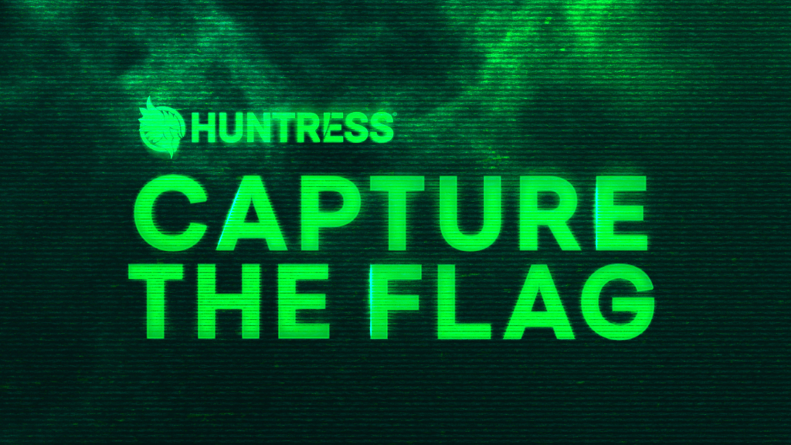

# CTF-Writeup-Huntress-2025

The Huntress CTF is an annual event that challenges participants with a series of intricate cybersecurity puzzles. Spanning across various domains such as digital forensics, threat intelligence, malware reverse engineering, and incident response, this CTF provides a realistic simulation of modern-day cyber threats. This repository documents my solutions and methodologies for each challenge presented during the 2025 competition.

## Daily Write-ups

Below is a list of links to the write-ups for each day of the competition.

<!-- *   Day 1 -->
*   [👶 Cover All Your Bases](./Day%2001/Cover_All_Your_Bases.md) - Warmups
*   [👶 Just a Tiny Bit](./Day%2001/Just_a_Tiny_Bit.md) - Warmups
*   [👶 QRception](./Day%2001/QRception.md) - Warmups
*   [👶 RFC 9309](./Day%2001/RFC_9309.md) - Warmups
*   [👶 Spam Test](./Day%2001/Spam_Test.md) - Warmups
*   [🐞 Verify You Are Human](./Day%2001/Verify_You_Are_Human.md) - Malware
<!-- *   Day 2 -->
*   [👶 OFA](./Day%2002/OFA.md) - Warmups
*   [🐞 Spaghetti](./Day%2002/Spaghetti.md) - Malware
<!-- *   Day 3 -->
*   [👶 Maximum Sound](./Day%2003/Maximum_Sound.md) - Warmups
*   [🐞 SANDY](./Day%2003/SANDY.md) - Malware
<!-- *   Day 4 -->
*   [🌐 ARIKA](./Day%2004/ARIKA.md) - Web
*   [👶 Snooze](./Day%2004/Snooze.md) - Warmups
<!-- *   Day 5 -->
*   [🌐 Sigma Linter](./Day%2005/Sigma_Linter.md) - Web
<!-- *   Day 6 -->
*   [🌐 Emotional](./Day%2006/Emotional.md) - Web
<!-- *   Day 7 -->
*   [📦 Trust Me](./Day%2007/Trust_Me.md) - Miscellaneous
<!-- *   Day 8 -->
*   [🌐 Flag Checker](./Day%2008/Flag_Checker.md) - Web
<!-- *   Day 9 -->
*   [🔎 Tabby's Date](./Day%2009/Tabbys_Date.md) - Forensics
<!-- *   Day 10 -->
*   [🐞 For Greatness](./Day%2010/For_Greatness.md) - Malware
<!-- *   Day 11 -->
*   [🔎 Trashcan](./Day%2011/Trashcan.md) - Forensics
<!-- *   Day 12 -->
*   [📦 Angler](./Day%2012/Angler.md) - Miscellaneous
<!-- *   Day 13 -->
*   [🔎 I Forgot](./Day%2013/I_Forgot.md) - Forensics
<!-- *   Day 14 -->
*   [🔎 Beyblade](./Day%2014/Beyblade.md) - Forensics
<!-- *   Day 15 -->
*   [📦 Phasing Through Printers](./Day%2015/Phasing_Through_Printers.md) - Miscellaneous
<!-- *   [Day 16 Write-up](./Day%2016/Writeup.md)
*   [Day 17 Write-up](./Day%2017/Writeup.md)
*   [Day 18 Write-up](./Day%2018/Writeup.md)
*   [Day 19 Write-up](./Day%2019/Writeup.md)
*   [Day 20 Write-up](./Day%2020/Writeup.md)
*   [Day 21 Write-up](./Day%2021/Writeup.md)
*   [Day 22 Write-up](./Day%2022/Writeup.md)
*   [Day 23 Write-up](./Day%2023/Writeup.md)
*   [Day 24 Write-up](./Day%2024/Writeup.md)
*   [Day 25 Write-up](./Day%2025/Writeup.md)
*   [Day 26 Write-up](./Day%2026/Writeup.md)
*   [Day 27 Write-up](./Day%2027/Writeup.md)
*   [Day 28 Write-up](./Day%2028/Writeup.md)
*   [Day 29 Write-up](./Day%2029/Writeup.md)
*   [Day 30 Write-up](./Day%2030/Writeup.md)
*   [Day 31 Write-up](./Day%2031/Writeup.md) -->
